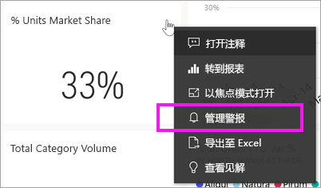
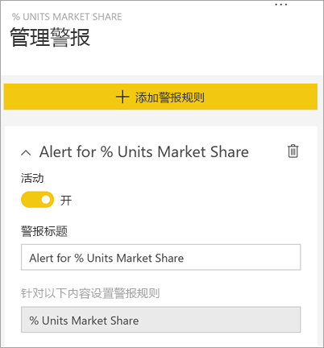
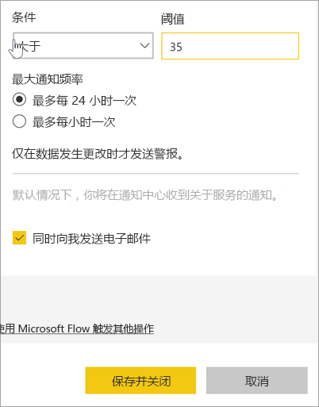
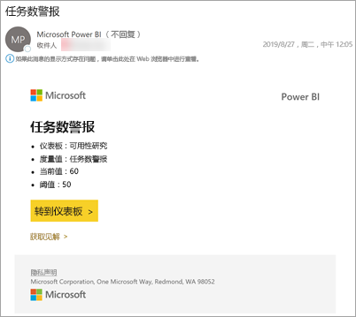
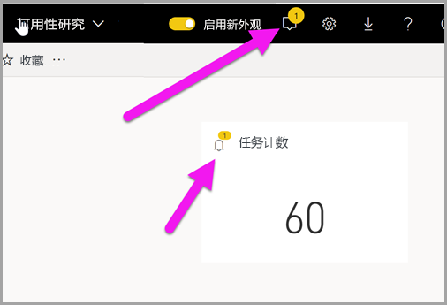
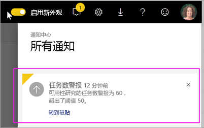
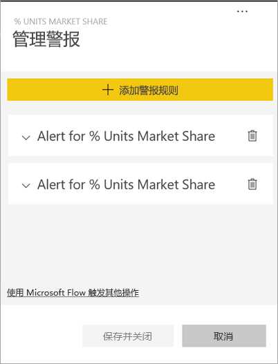
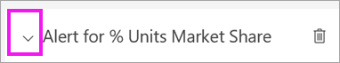
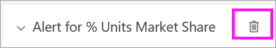
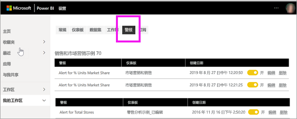

# 教程：在 Power BI 仪表板中设置仪表板警报

[!INCLUDE [power-bi-service-new-look-include](../includes/power-bi-service-new-look-include.md)]

设置警报，以便在仪表板中的数据更改超出或低于你设置的限制时通知你。 警报适用于仪表、KPI 和卡片。 此功能仍在不断演进，请参阅下面的[使用技巧和故障排除部分](#tips-and-troubleshooting)。

即使共享你的仪表板，也只有你可以看到自己设置的警报。 数据警报跨平台完全同步；可以在 [Power BI 移动应用](mobile/mobile-set-data-alerts-in-the-mobile-apps.md)和 Power BI 服务中设置和查看数据警报。 

> [!WARNING]
> 这些警报提供有关数据的信息。 如果你在移动设备上查看 Power BI 数据，而该设备之后被盗，建议使用 Power BI 服务来关闭所有警报。
> 

本教程涵盖以下方面。
> [!div class="checklist"]
> * 谁可以设置警报
> * 哪些视觉对象支持警报
> * 谁可以看到我的警报
> * 在 Power BI Desktop 和移动版上使用警报
> * 如何创建警报
> * 我在哪里可以看到警报

如果未注册 Power BI，请[免费注册](https://app.powerbi.com/signupredirect?pbi_source=web)后再进行操作。

此例使用“销售和营销”示例应用中的仪表板卡片磁贴。 此应用可从 [Microsoft AppSource](https://appsource.microsoft.com) 获取。 有关获取此应用的帮助，请参阅[安装和使用 Power BI 中的应用](end-user-app-view.md)。

1. 在仪表板仪表、KPI 或卡磁贴中，选择省略号图标。
   
   
2. 选择钟形图标  或“管理警报”，为“总存储”添加一个或多个警报   。

   

   
1. 在“管理警报”  窗格中，选择“+添加警报规则”  。  请确保滑块已设置为“开启”  ，并为警报提供一个标题。 标题有助于轻松识别警报。
   
   
4. 向下滚动，输入警报的详细信息。  在此示例中，我们将创建一个警报，以便在市场份额增加到 35 或更高时，每天通知我们一次。 警报将出现在我们的通知中心。 并且，我们还将收到 Power BI 发送的电子邮件。
   
   
5. 选择“保存并关闭”  。
 
   > [!NOTE]
   > 警报仅适用于刷新的数据。 数据刷新时，Power BI 会查看是否为该数据设置了警报。 如果数据已达到了警报的阈值，则会触发警报。 
   > 

## 接收警报
当被跟踪的数据到达一个你所设定的阈值时，将发生下列情况。 首先，Power BI 会检查自最后一个警报发出是否已超过 1 个小时或 24 个小时（具体取决于所选择的选项）。 只要数据超过阈值，你就会收到警报。

接下来，Power BI 将向通知中心发出警报（可选择以电子邮件形式发送）。 每个警报都包含数据的直接链接。 选择链接以查看相关的磁贴。  

1. 如果你已设置警报向你发送电子邮件，则你将在收件箱中找到如下内容。 这是我们在不同仪表板上设置的警报。此仪表板跟踪可用性团队完成的任务。
   
   
2. Power BI 会将消息添加到你的“通知中心”，并会对相应磁贴添加新的警报图标。 
   
   
3. 打开你的通知中心以查看警报详细信息。
   
    
   
  

## 管理警报

可通过多种方法管理警报：从仪表板磁贴本身、从 Power BI 设置菜单，以及在 [iPhone 上的 Power BI 移动应用](mobile/mobile-set-data-alerts-in-the-mobile-apps.md)或[适用于 Windows 10 的 Power BI 移动应用](mobile/mobile-set-data-alerts-in-the-mobile-apps.md)中各个磁贴。

### 从磁贴本身

1. 如果需要更改或删除磁贴的警报，请通过选择钟形图标 ，重新打开“管理警报”。  随即将显示为该磁贴设置的所有警报。
   
    。
2. 若要修改警报，请选择警报名称左侧的箭头。
   
    。
3. 若要删除警报，请选择警报名称右侧的垃圾桶。
   
      

### 从 Power BI 设置菜单

1. 从 Power BI 菜单栏选择齿轮图标。
   
    。
2. 在“设置”  下，选择“警报”  。
   
    
3. 你可以从此处打开和关闭警报，打开“管理警报”  窗口，以进行更改或删除警报。

## 提示和故障排除 

* 只能对仪表、KPI 和卡片设置警报。
* 如果无法为仪表、KPI 或卡片设置警报，请与系统管理员联系以获取帮助。 有时，警报已关闭或者对仪表板或对特定类型的仪表板磁贴不可用。
* 警报仅适用于刷新的数据。 它们不适用于静态数据。 Microsoft 提供的大多数示例都是静态的。 

## 清理资源
上面介绍了有关删除警报的说明。 简单来说，从 Power BI 菜单栏选择齿轮图标。 在“设置”下选择“警报”，   然后删除警报。

> [!div class="nextstepaction"]
> [在移动设备上设置数据警报](mobile/mobile-set-data-alerts-in-the-mobile-apps.md)

