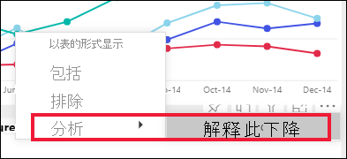
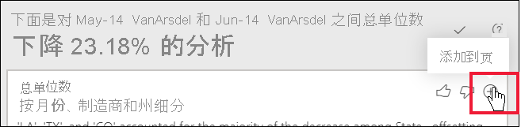

# 使用分析功能解释报表视觉对象中的波动（预览）

[!INCLUDE[consumer-appliesto-ynnn](../includes/consumer-appliesto-ynnn.md)]

在报表视觉对象中，你通常会看到值大幅上升又急剧下降的情况，并且想知道导致这种波动的原因。 借助 Power BI 服务中的“分析”功能，只需单击几下即可了解原因。

例如，请看下面的视觉对象，其中按“月份”*和 *“制造商”** 显示了总单位数。 VanArsdel 在竞争者中遥遥领先，但在 2014 年 6 月有一次陡降。 在这种情况下，你可以对数据进行研究，以帮助解释发生变化的原因。 

可以让 Power BI 服务解释视觉对象中出现的增长、下降或分布异常情况，并获得有关数据的快速、自动化且深入的分析。 只需右键单击数据点，然后选择“分析”>“解释此减少情况”（或者如果前一栏较低，则选择“解释此增长情况”），或“分析”>“查找此分配不同之处”，就可以在易用窗口中收到见解。

分析功能与上下文相关，并且以前一个数据点（例如上一栏或列）为基础。

> [!NOTE]
> 此功能处于预览状态，可能会发生更改。 见解功能默认启用并打开（无需勾选“预览”框来启用它）。

### 选择哪些因素和类别

在检查完各个列之后，Power BI 选择并显示最大相对贡献变化的列。 对于每个列，说明中都会标注具有最显著的贡献变化的值。 此外，还会标注实际增长和下降幅度最大的值。

若要查看 Power BI 生成的所有见解，请使用滚动条。 显示顺序是将最重要的贡献者排在最前面。 

## 使用见解
若要使用见解来解释视觉对象上出现的趋势，请右键单击条形图或折线图中的任意数据点，然后选择“分析”。 接着，选择显示的选项：“解释增长情况”、“解释下降情况”或“解释区别”。

然后，Power BI 针对数据运行其机器学习算法，并使用视觉对象和说明（介绍哪些类别对增长情况、下降情况或区别的影响最大）填充窗口。  本例中的第一个见解是一个瀑布图。

通过选择瀑布视觉对象底部的小图标，可以选择使见解显示为散点图、堆叠柱形图或功能区图。

使用页面顶部的“竖起拇指”和“拇指向下”图标，可以提供关于视觉对象和功能的反馈。  

如果报表处于“阅读”或“编辑”视图中，则可以将见解用于分析数据和创建可轻松添加到报表中的视觉对象。 如果已在“编辑”视图中打开报表，则会在拇指图标旁边看到一个加号图标。 选择加号图标，将见解作为新的视觉对象添加到报表中。 

## 返回结果的详细信息

见解返回的详细信息旨在突出两个时间段之间的不同之处，以帮助你了解它们之间的变化。  

可以将算法设想为采用模型中的所有其他列，计算该列在之前和之后的时间段的细分，确定该细分发生的变化量，然后返回那些变化最大的列。 例如，在上述瀑布图中已选择“州”，因为路易斯安那州、德克萨斯州和科罗拉多州在 6 月到 7 月之间的贡献值已降低 13% 至 19%，导致了总单位数的最大降幅。  

对于返回的每个见解，可以显示四个视觉对象。 其中三个视觉对象旨在突出两个时间段之间的贡献变化。 例如，用于解释从*第二季度*到*第三季度*的增长。 功能区图表显示所选数据点之前和之后的变化。

### 散点图

对于列（本例中为“州”）的每个值，散点图视觉对象显示第一个时间段的度量值（在 x 轴上）与第二个时间段的度量值（在 y 轴上）。 如果值增加，则数据点都在绿色区域中，如果值减小，则在红色区域中。 

虚线表示最佳匹配，此线上方的数据点增长的幅度超过总体趋势，而此线下方的数据点增长的幅度小于总体趋势。  

请注意，在任一时间段中值为空白的数据项都不会显示在散点图上。

### 百分比堆积柱形图

100% 堆积柱形图视觉对象显示所选数据点和上一个数据点占总数值 (100%) 的大小。 可以并排比较每个数据点的贡献值。 在本例中，工具提示显示所选“德克萨斯州”值的实际贡献值。 由于州列表很长，因此使用工具提示有助于查看详细信息。 通过使用工具提示，我们可以看到，德克萨斯州对总单位数百分比的贡献的差别不大（分别是 31% 和32%），但总单位数的实际值从 89 减少到 71。 请注意，Y 轴是一个百分比，而不是总数，每个列区段是一个百分比，而不是一个值。 

### 带状图

功能区图表视觉对象显示之前和之后的度量值。 当贡献者的排序发生变化时（例如，如果 LA 从排名第二的贡献者降至排名第十一），它对显示贡献变化特别有用。  尽管 TX 在顶部由较宽的区段表示，表示它在之前和之后是最重要的贡献者，但下降表示在选定的时期和之后，贡献值都下降了。

### 瀑布图

第四个视觉对象是瀑布图，可显示各时间段之间的实际增幅或降幅。 此视觉对象清楚地显示了 2014 年 6 月下降的一个主要贡献者（在本例中为“州”）。 而“州”对总单位数影响的细节表明，路易斯安那州、德克萨斯州和科罗拉多州的下降起了最重要的作用。      

 

## 注意事项和限制
由于这些见解是根据上一个数据点的变化得出的，因此在视觉对象中选择首个数据点时，这些见解不可用。 

并非所有视觉对象类型都支持“分析”功能。 

以下列表列出了目前无法使用“分析”-“解释增长/下降情况/区别”的所有情形：

* 前 n 个筛选器
* 包括/排除筛选器
* 度量值筛选器
* 非数值度量值
* 使用“值显示为”
* 筛选后的度量值：筛选后的度量值是指应用了特定筛选器的视觉对象级计算（例如，法国总销售额），用于见解功能创建的某些视觉对象
* X 轴上的类别列（根据列将排序定义为标量的情况除外）。 如果使用层次结构，则有效层次结构中的每一列必须与此条件相匹配

## 后续步骤
[瀑布图](../visuals/power-bi-visualization-waterfall-charts.md)    
[散点图](../visuals/power-bi-visualization-scatter.md)
[柱形图](../visuals/power-bi-report-visualizations.md)
[功能区图表](../visuals/desktop-ribbon-charts.md)
