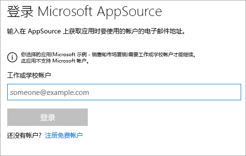
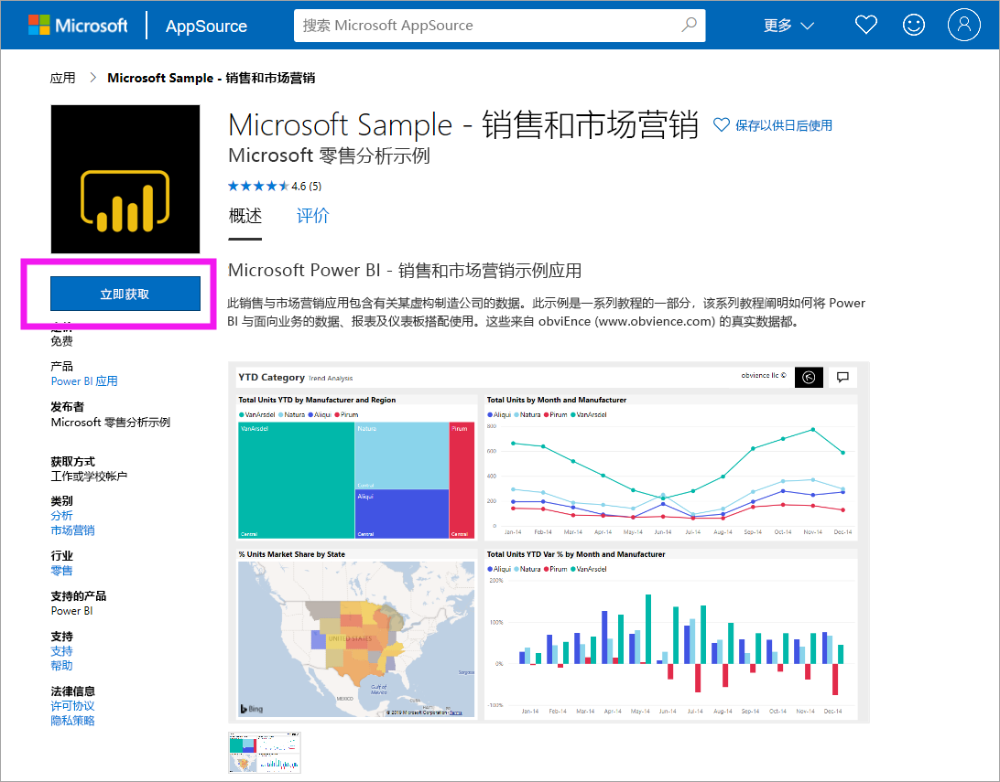
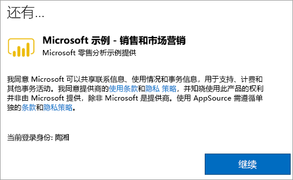

# 在 Power BI 服务中安装并使用示例销售和营销应用
了解了[如何获取 Power BI 内容的基本信息](end-user-app-view.md)后，接下来从 Microsoft AppSource (appsource.com) 获取营销和销售应用。 

## Microsoft AppSource (appsource.com)
下面是指向应用的链接：[营销和销售应用](https://appsource.microsoft.com/product/power-bi/microsoft-retail-analysis-sample.salesandmarketingsample?tab=Overview)。 选择此链接将在 Microsoft AppSource 上打开此应用的下载页面。 

1. 可能需要先登录，然后才能获取该应用。 使用用于 Power BI 的同一电子邮件地址登录。 

    

2. 选择“立即获取”  。 

    

3. 如果是首次登录到 AppSource，则需要同意使用条款。 

    

4. Power BI 服务随即打开。 确认要安装此应用。

    

5. 安装应用后，Power BI 服务将显示一条指示成功的消息。 选择“转到应用”  ，打开应用。 根据设计器创建应用的方式，将显示应用仪表板或应用报表。

    

    还可通过选择“应用”，然后选择“销售和营销”，直接从应用内容列表打开应用   。

    

6. 选择是浏览还是自定义和共享新的应用。 由于我们选择了 Microsoft 示例应用，因此先从浏览开始。 

    

7.  此时会打开新应用，其中包含一个仪表板。 应用设计器可以改为将应用设置为打开报表  。  

    

## 与应用中的仪表板和报表进行交互
花些时间浏览应用中的仪表板和报表数据。 可执行所有标准 Power BI 交互，如筛选、突出显示、排序和向下钻取。  仍然对仪表板和报表之间的区别感到有点困惑？  请阅读[有关仪表板的文章](end-user-dashboards.md)和[有关报表的文章](end-user-reports.md)。  

## 后续步骤
* [返回到应用概述](end-user-apps.md)
* [查看 Power BI 报表](end-user-report-open.md)
* [与你共享内容的其他方法](end-user-shared-with-me.md)
