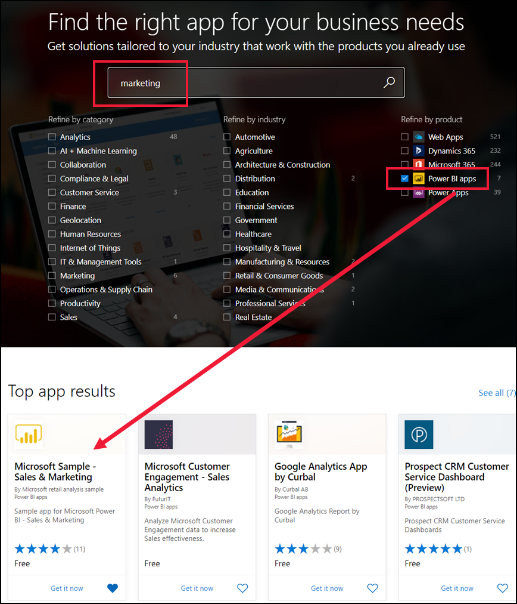
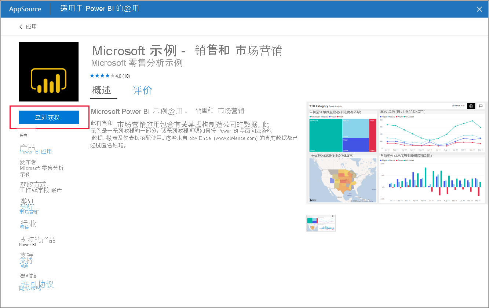
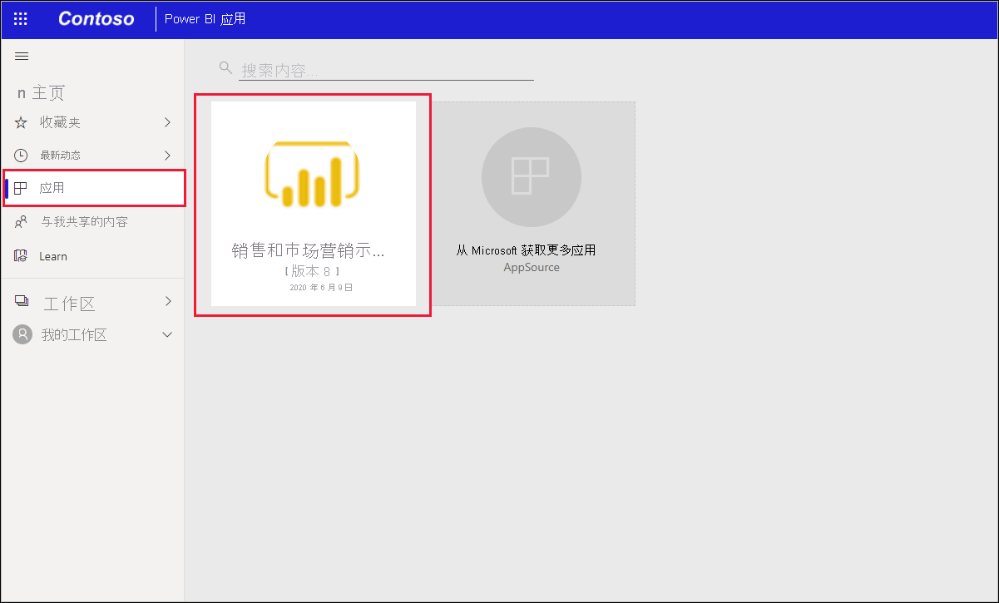
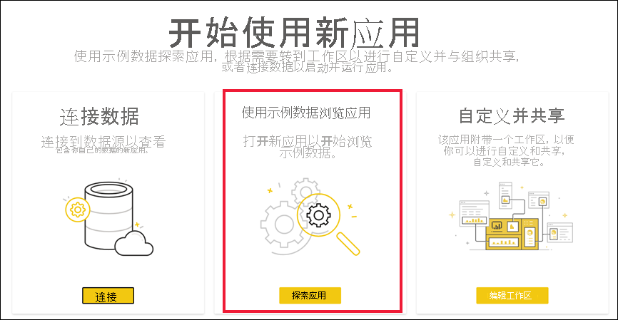
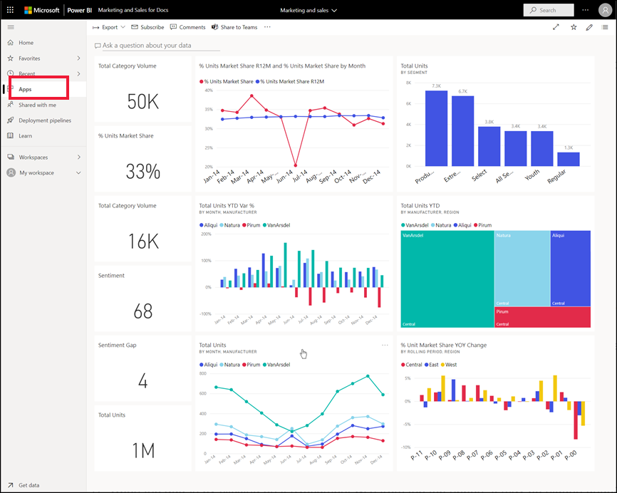

# 在 Power BI 服务中安装并使用示例销售和营销应用

[!INCLUDE[consumer-appliesto-yyny](../includes/consumer-appliesto-yyny.md)]

了解了[如何获取 Power BI 内容的基本信息](end-user-app-view.md)后，接下来使用 Microsoft AppSource 获取营销和销售应用。 

## 从 Microsoft AppSource 获取应用

1. 打开 [https://appsource.microsoft.com](https://appsource.microsoft.com)。

   

1. 在搜索框中，输入“营销”，并在“按产品优化”>“Power BI 应用”旁放置一个选中标记 。 

    

1. 选择“Microsoft 示例 - 销售和营销”的应用磁贴。 （可选）通读概述和评论，并查看图像。  然后，选择“立即获取”。

   

1. 确认要安装此应用。

   

5. 安装应用后，Power BI 服务将显示一条指示成功的消息。 选择“转到应用”，打开应用。 根据设计器创建应用的方式，将显示应用仪表板或应用报表。

    

    还可通过选择“应用”，然后选择“销售和营销”应用磁贴，直接从应用内容列表打开应用 。

    

6. 选择是连接自己的数据、使用示例数据进行探索，还是自定义和共享新应用。 由于我们选择了 Microsoft 示例应用，因此先从浏览开始。 

    

7.  此时会打开新应用，其中包含一个仪表板。 应用设计器可以改为将应用设置为打开报表。  

    

## 与应用中的仪表板和报表进行交互
花些时间浏览应用中的仪表板和报表数据。 可执行所有标准 Power BI 交互，如筛选、突出显示、排序和向下钻取。  仍然对仪表板和报表之间的区别感到有点困惑？  请阅读[有关仪表板的文章](end-user-dashboards.md)和[有关报表的文章](end-user-reports.md)。  

## 后续步骤
* [返回到应用概述](end-user-apps.md)    
* [查看 Power BI 报表](end-user-report-open.md)    
* [与你共享内容的其他方法](end-user-shared-with-me.md)
