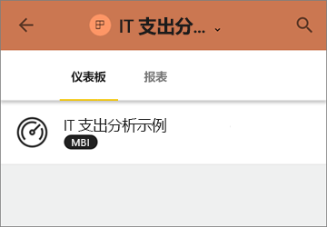

# 在 Power BI 中安装和使用包含仪表板和报表的应用
现在，[基本了解应用](end-user-apps.md)后，让我们学习如何打开应用并与之交互。 

## 获取新应用的方式
请记住，有几种方式都可用于获取新应用。 报表设计者同事可以在 Power BI 帐户中自动安装应用，或者向你发送指向某一应用的直接链接。 并且，你可以转到 AppSource 并从公司内部和外部搜索可用应用。 

在移动设备上的 Power BI 中，只能通过直接链接（而不是 AppSource）安装应用。 如果应用作者自动安装应用，将能够在你的应用列表中看到它。

### 通过直接链接安装应用
自行安装新应用的最简单方法是通过电子邮件从应用作者处获取直接链接。  

**在计算机上** 

选择电子邮件中的链接后，将在浏览器中打开 Power BI 服务 ([https://powerbi.com](https://powerbi.com))。 确认要安装应用后，Power BI 会打开应用登陆页面。

**在 iOS 或 Android 移动设备上** 

在移动设备上选择电子邮件中的链接后，应用会自动安装，并打开移动应用中的应用内容列表。 

### 从 Microsoft AppSource 获取应用
还可以从 Microsoft AppSource 中查找并安装应用。 仅显示可以访问的应用（即应用作者向你或每个人授予了权限）。

1. 依次选择“应用” > “获取应用”。 
   
     
2. 在 AppSource 的“我的组织”下，可以进行搜索以缩小结果范围，并查找所需的应用。
   
     
3. 选择“立即获取”，将它添加到应用内容列表中。 

## 与应用中的仪表板和报表进行交互
现在你可以浏览仪表板中的数据和应用中的报表。 有权执行所有标准 Power BI 交互，如筛选、突出显示、排序和向下钻取。 还可以从表或报表中的其他视觉对象[将数据导出到 Excel](end-user-export-data.md)。 阅读如何[与 Power BI 中的报表进行交互](end-user-reading-view.md)。 

## 后续步骤
* [适用于外部服务的 Power BI 应用](end-user-connect-to-services.md)
* 是否有任何问题? [尝试咨询 Power BI 社区](http://community.powerbi.com/)

