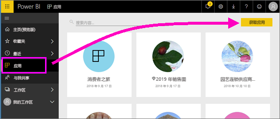
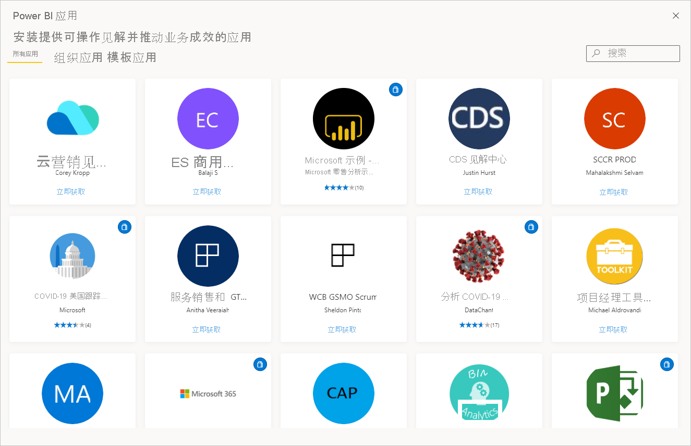
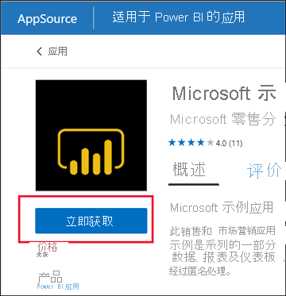
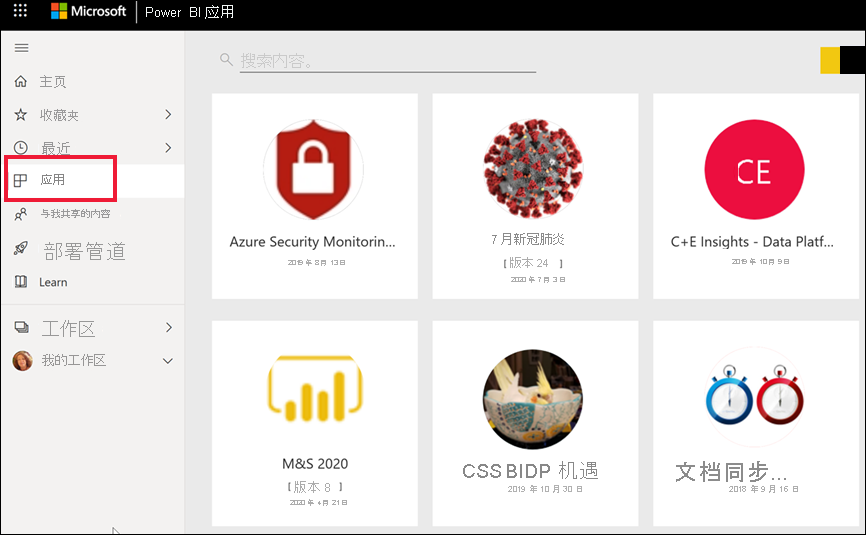
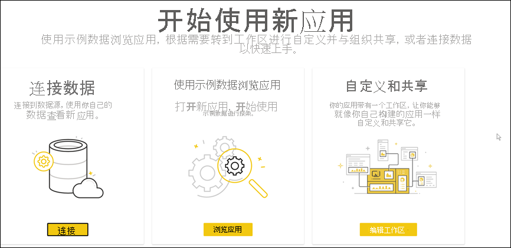
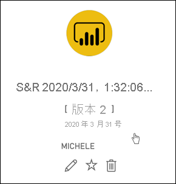
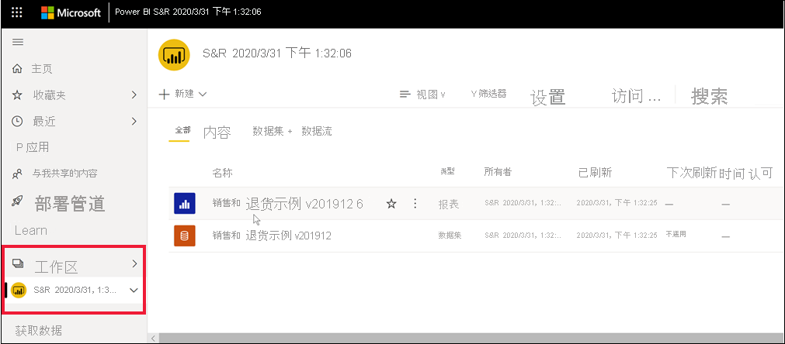
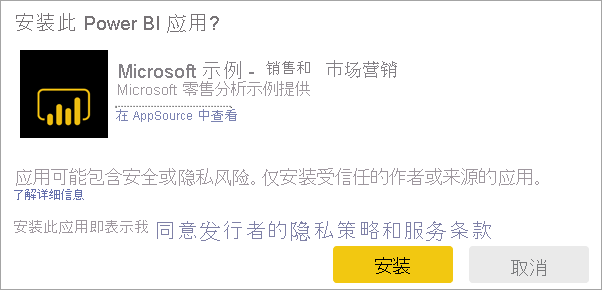
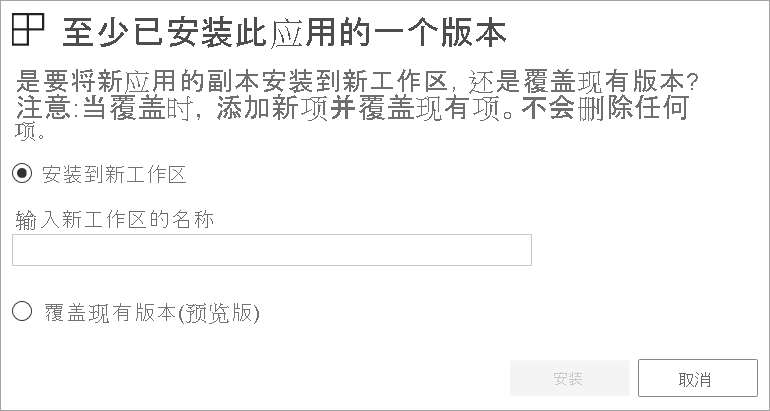

# 在 Power BI 中安装和使用包含仪表板和报表的应用

[!INCLUDE[consumer-appliesto-ynny](../includes/consumer-appliesto-ynny.md)]

[!INCLUDE [power-bi-service-new-look-include](../includes/power-bi-service-new-look-include.md)]

现在，[基本了解应用](end-user-apps.md)后，让我们学习如何打开应用并与之交互。 

## 获取新应用的方式
可通过以下几种方式来获取新应用：
* 可以从 Power BI 服务中的 Power BI 应用商店获取应用。
* 可以使用从应用设计者那里收到的应用的直接链接。 
* 组织中的应用设计者可以在你的 Power BI 帐户中自动安装应用。

在 Power BI 移动版中，只能通过直接链接来安装应用。 如果应用设计者自动安装应用，将能够在你的应用列表中看到它。

## 应用和许可证
并非所有 Power BI 用户都可以查看应用并与之交互。 
- 如果你有免费许可证，则可以打开存储在高级容量中并已与你共享的应用。  
- 如果你有 Pro 许可证，则可以打开已与你共享的应用。

因此，如果无法打开应用，请与管理员或支持人员联系。 有关许可的详细信息，请参阅 [Power BI 许可](end-user-license.md)。

## 从 Power BI 应用商城获取应用

可以从 Power BI 应用商城中查找和安装应用。 在应用商城中，可以同时获取组织应用和模板应用。

- 组织应用可供组织中的 Power BI 用户使用。 这些应用还包括预先构建的仪表板和报表，你可以按原样使用，也可以进行自定义和共享。 你的组织可能有用于跟踪销售额、衡量绩效或分析招聘成功率的应用。
- 模板应用提供预先构建的仪表板和报表，你可以使用它们连接到多种用于运行 SalesForce、Microsoft Dynamics 和 Google Analytics 等业务的服务。

1. 如果尚未登录，请[登录 Power BI 服务](./end-user-sign-in.md)。 

1. 打开 Power BI 服务后，选择“应用”>“获取应用”。 

    

1. 此时将打开 Power BI 应用商城。

   

   有三个选项卡可供你使用：
   * 所有应用 - 浏览模板应用和可供你使用的所有组织应用。 模板应用通过其磁贴右上角的购物袋图标进行区分。
   * 组织应用 - 浏览已与你共享的组织应用。 
   * 模板应用 - 浏览在 AppSource 上托管的模板应用。

   或者，可以使用搜索框来获取经筛选的应用。 键入应用的部分名称或类别（如财务、分析、市场营销等），可以更轻松地找到所需的项。 

   搜索框对打开的选项卡很敏感 - 只返回所选类型的应用。 如果“所有应用”选项卡处于打开状态，则会返回组织应用和模板应用。 当组织应用和模板应用同名时，这可能会造成混淆。 请记住，模板应用磁贴的右上角有一个购物袋图标。

找到所需的应用时，选择“立即获取”进行安装。

   

* 如果要安装组织应用，则会立即将其添加到应用列表。
* 如果要安装模板应用，你将转到 AppSource 中的模板应用产品/服务。 请参阅[示例](end-user-app-marketing.md)，了解如何从 Power BI 应用商城下载和安装示例模板应用。 应用已安装，它还提供一个同名的工作区。

   > [!NOTE]
   > 如果你使用的是免费用户许可证，则可以下载应用，但无法查看它们，除非你升级到 Power BI Pro 帐户或应用存储在高级容量中。 有关详细信息，请参阅[业务用户的许可证](end-user-license.md)。

## 通过直接链接安装应用
还可以通过应用设计器发送的电子邮件中的直接链接来安装组织应用。  

**在计算机上** 

选择电子邮件中的链接后，Power BI 服务 ([https://app.powerbi.com](https://app.powerbi.com)) 将在浏览器中打开应用。 

**在 iOS 或 Android 移动设备上** 

在移动设备上选择电子邮件中的链接后，应用会自动安装，并在移动应用中打开。 可能需要首先登录。 

## 与应用中的仪表板和报表进行交互
花些时间浏览应用中的仪表板和报表数据。 可执行所有标准 Power BI 交互，如筛选、突出显示、排序和向下钻取。  仍然对仪表板和报表之间的区别感到有点困惑？  请阅读[有关仪表板的文章](end-user-dashboards.md)和[有关报表的文章](end-user-reports.md)。  

### 打开应用

你已安装一个应用，或从同事那里接收了某个应用。 若要查看该应用，请从导航窗格中选择“应用”，以打开应用内容列表。

将鼠标悬停在应用上，并选择该应用以将其打开。 根据具体的应用，你可能会收到与以下类似的提示：

如需查看关于选择哪个选项的指导，请参阅[安装模板应用](../connect-data/service-template-apps-install-distribute.md)。

将鼠标悬停在应用上以查看详细信息，并选择应用卡片，将应用打开。

应用随即打开。 每个应用都将显示不同的布局、视觉对象、颜色和选项。 但所有应用都有一些常见功能。

1. 应用的名称和上次更新时间。 选择下拉箭头以查找所有者和帮助联系人。
1. 选择 Power BI 返回到[主页](end-user-home.md)。
1. 操作栏。 
1. 报表页画布。
1. 应用导航窗格。  应用名称下面是报表页列表。 选择报表名称即可打开报表。 我们当前已打开“退货率”页面。 
1. 选择箭头，展开“筛选器”窗格。

你还可以浏览关联的工作区。 [了解工作区](end-user-workspaces.md) 选择 Power BI（数字 2）以返回到“主页”并选择“工作区”  。 

## 更新应用 

应用设计者可能会时不时发布其应用的新版本。 获取新版本的方式取决于收到原始版本的方式。 

* 如果是从组织获取的应用，则新版本的更新完全透明（不必执行任何操作）。 

* 如果是从 AppSource 获取的应用，则下次打开应用时，会看到一个通知横幅。 通过通知可以了解新版本已可用。 

    1. 选择“获取”进行更新。  

        <!-- -->

    2. 当系统提示安装更新的应用时，选择“安装”。 

         

    3. 由于已具有此应用的某个版本，因此需决定是替换现有版本还是在新工作区中安装更新的应用。   

         

     > [!NOTE] 
     > 安装新版本会覆盖可能对报表和仪表板所做的任何更改。 若要保留更新的报表和仪表板，可以在安装前用其他名称或位置保存它们。 

    4. 安装更新版本后，选择“更新应用”以完成更新过程。 

## 注意事项和疑难解答

- Power BI 管理员可以打开和关闭安装应用的功能。 如果需要启用此功能，请与你的 IT 部门或支持人员联系。    
- 要使用应用，你需要 Pro 许可证或将应用存储在高级共享容量中。 [了解许可证](end-user-license.md)。

## 后续步骤
* [返回到应用概述](end-user-apps.md)
* [查看 Power BI 报表](end-user-report-open.md)
* [与你共享内容的其他方法](end-user-shared-with-me.md)

