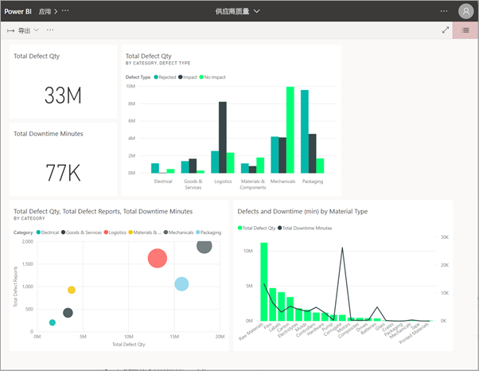
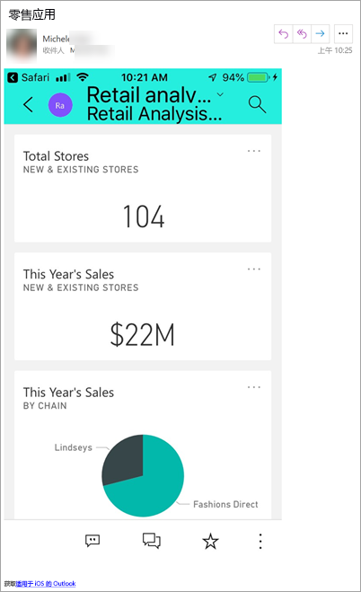
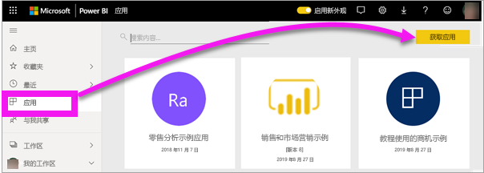
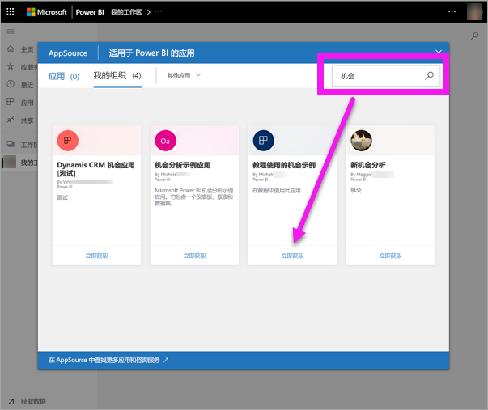
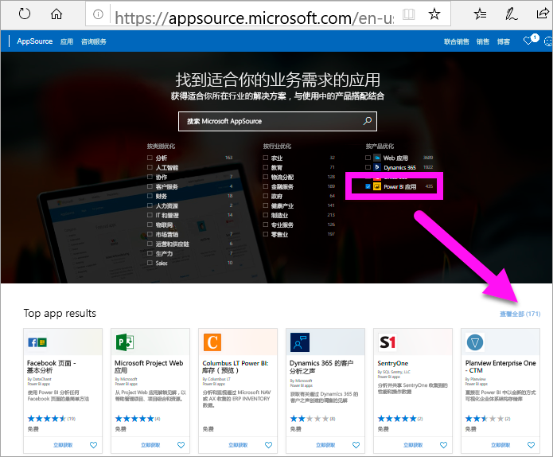
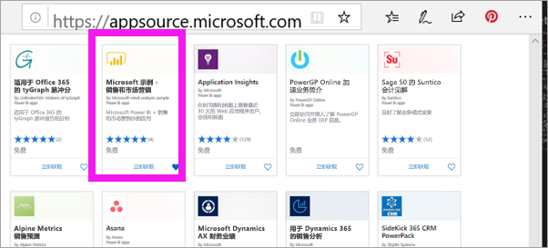
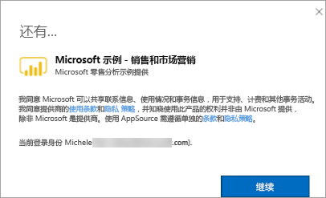
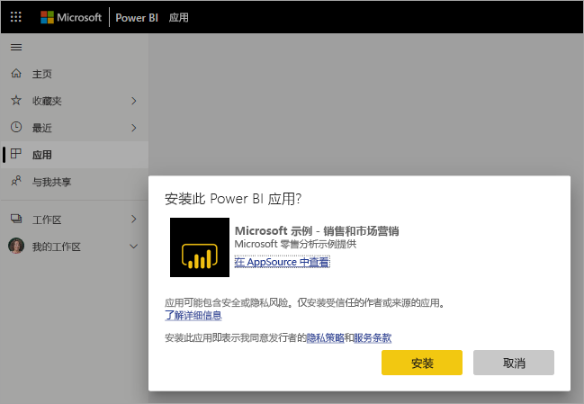
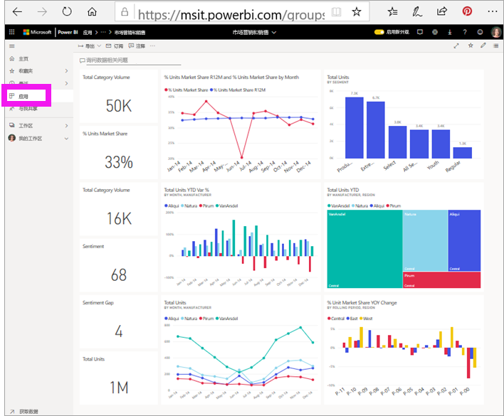

# 在 Power BI 中安装和使用包含仪表板和报表的应用

[!INCLUDE [power-bi-service-new-look-include](../includes/power-bi-service-new-look-include.md)]

现在，[基本了解应用](end-user-apps.md)后，让我们学习如何打开应用并与之交互。 

## 获取新应用的方式
有几种方式都可用于获取新应用。 报表设计者同事可以在 Power BI 帐户中自动安装应用，或者向你发送指向某一应用的直接链接。 而你可以转到 AppSource 并从公司内部和外部的应用程序设计器中搜索可用应用。 

在移动设备上的 Power BI 中，只能通过直接链接（而不是 AppSource）安装应用。 如果应用设计者自动安装应用，将能够在你的应用列表中看到它。

## 通过直接链接安装应用
自行安装新应用的最简单方法是从应用程序设计器中通过电子邮件获取直接链接。  

**在计算机上** 

选择电子邮件中的链接后，Power BI 服务 ([https://powerbi.com](https://powerbi.com)) 将在浏览器中打开应用。 

**在 iOS 或 Android 移动设备上** 

在移动设备上选择电子邮件中的链接后，应用会自动安装，并在移动应用中打开。 可能需要首先登录。 

## 从 Microsoft AppSource 获取应用
还可以从 Microsoft AppSource 中查找并安装应用。 仅显示可以访问的应用（即应用作者向你或每个人授予了权限）。

1. 选择“应用”  > “获取应用”   。 
   
        
2. 在 AppSource 的“我的组织”  下，可以进行搜索以缩小结果范围，并查找所需的应用。
   
    
3. 选择“立即获取”，将它添加到应用内容列表中  。 

## 从 Microsoft AppSource 网站 (https://appsource.microsoft.com) 获取应用
在此示例中，我们将打开一个 Microsoft 示例应用。 在 AppSource 上，可找到用于运行业务的许多服务的应用。  这些服务包括 Salesforce、Microsoft Dynamics、Google Analytics、GitHub、Zendesk、Marketo 等。 若要了解详细信息，请参阅[用于 Power BI 的服务的应用](../service-connect-to-services.md)。 

1. 在浏览器中，打开 https://appsource.microsoft.com ，然后选择“Power BI 应用”  。

    

2. 选择“查看全部”  以显示 AppSource 上当前可用的所有 Power BI 应用的列表。 滚动或搜索名为“Microsoft 示例 - 销售和营销”的应用  。

    

3. 选择“立即获取”  并同意使用条款。

    

4. 确认要安装此应用。

    

5. 安装应用后，Power BI 服务将显示一条指示成功的消息。 选择“转到应用”  ，打开应用。 根据设计器创建应用的方式，将显示应用仪表板或应用报表。

    

    还可通过选择“应用”，然后选择“销售和营销”，直接从应用内容列表打开应用   。

    

6. 选择是浏览还是自定义和共享新的应用。 由于我们选择了 Microsoft 示例应用，因此先从浏览开始。 

    

7.  此时会打开新应用，其中包含一个仪表板。 应用程序设计器  可以改为将应用设置为打开报表。  

    

## 与应用中的仪表板和报表进行交互
花些时间浏览应用中的仪表板和报表数据。 可执行所有标准 Power BI 交互，如筛选、突出显示、排序和向下钻取。  仍然对仪表板和报表之间的区别感到有点困惑？  请阅读[有关仪表板的文章](end-user-dashboards.md)和[有关报表的文章](end-user-reports.md)。  

## 后续步骤
* [返回到应用概述](end-user-apps.md)
* [查看 Power BI 报表](end-user-report-open.md)
* [与你共享内容的其他方法](end-user-shared-with-me.md)
