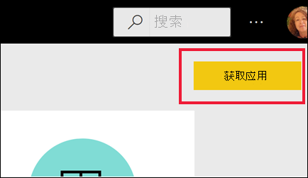
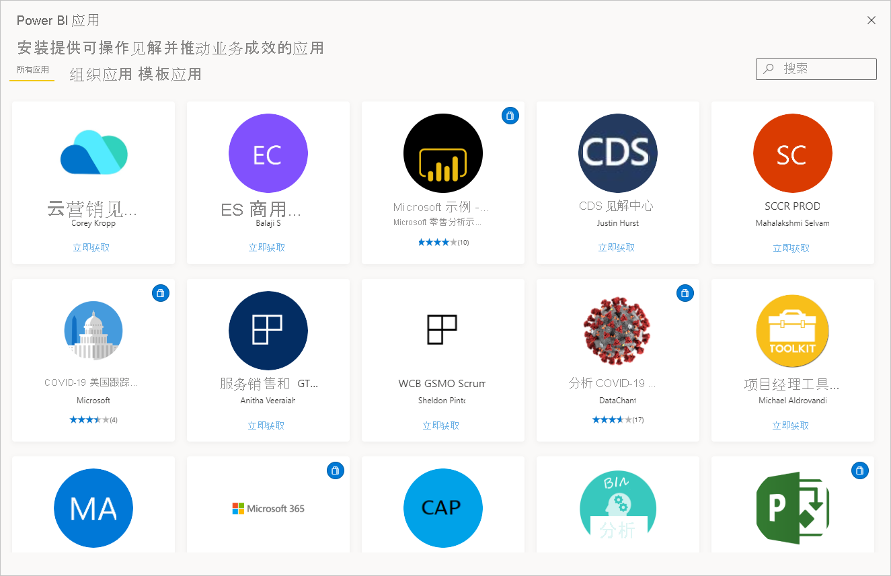
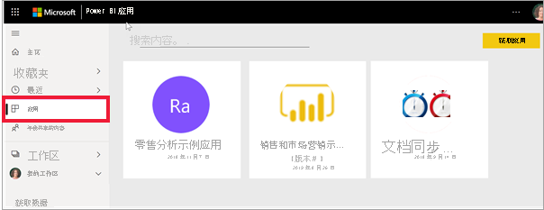

# Power BI 中的“应用”

[!INCLUDE[consumer-appliesto-ynny](../includes/consumer-appliesto-ynny.md)]

[!INCLUDE [power-bi-service-new-look-include](../includes/power-bi-service-new-look-include.md)]

## 什么是 Power BI 应用？
应用是一种将相关仪表板和报表组合在一个地方的 Power BI 内容类型。 应用可以将一个或多个仪表板和一个或多个报表捆绑在一起。 应用由 Power BI 设计者创建，他们会与同事分发和共享应用。 设计者可以通过多种方式共享应用。 若要了解详细信息，请参阅下面的“获取新应用”部分。 

## 应用设计者和应用用户 
根据你的角色，如果你是设计者，则可创建应用供你自己使用或与同事共享。 或者，如果你是业务用户，则可接收和下载其他人创建的应用。 本文适用于业务用户。

查看和打开应用需要特定权限。 接收方必须具有 Power BI Pro 许可证，或者应用必须在称为“高级容量”的特殊类型的云存储中与接收方共享。 若要了解有关许可证和高级容量的详细信息，请参阅 [Power BI 服务的许可证](end-user-license.md)。

## 应用的优点
应用为设计者提供了一种一次共享不同类型的内容的简单方法。 应用设计者创建仪表板和报表并将其绑定到一个应用。 然后，设计者将该应用发布到业务用户可访问的位置并与之共享 。 由于相关的仪表板和报表绑定在一起，因此你可以更轻松地在 Power BI 服务 ([https://powerbi.com](https://powerbi.com)) 和移动设备上查找和安装。 安装应用后，无需记住许多不同仪表板或报表的名称，因为它们已全部汇总到应用、浏览器或移动设备中。

借助应用，只要应用作者发布更新，就会自动看到变化。 作者还可以控制数据的计划刷新频率，这样就不必担心要不断更新了。 

<!-- add conceptual art -->
## 获取新的应用
可通过以下几种方式来获取新应用。 你可以搜索、查找和安装应用，应用设计者可以与你共享应用。 

### 从 Power BI 应用市场中查找和安装应用
查找应用的一种方法是从 Power BI“应用”屏幕中选择“获取应用” 。 

浏览 Power BI 应用市场中的应用列表，直到找到要安装的应用。 从仅适用于公司人员的“组织应用”中进行选择，或者从由 Microsoft 和社区提供并供任何 Power BI 用户进行安装的“模板应用”中进行选择 。 

还有其他几种获取应用的方法。 下面列出了一些方法。 但有关获取和浏览应用的详细分步说明，请参阅[打开应用并与之交互](end-user-app-view.md)。

* 应用设计者可以在 Power BI 帐户中自动安装应用，下次打开 Power BI 服务时，就可在“应用”内容列表中看到此新应用。 
* 应用设计人员可通过电子邮件向你发送应用的直接链接。 选择此链接将在 Power BI 服务中打开该应用。
* 在移动设备上的 Power BI 中，你只能通过直接链接（而不是应用市场）安装应用。 如果应用作者自动安装应用，将能够在你的应用列表中看到它。 

应用在“应用”内容列表中进行整理。 只需选择“应用”即可显示应用。 将鼠标悬停在应用上可查看上次更新日期和所有者。 

## 后续步骤
* [打开某一应用并与之交互](end-user-app-view.md)
* [共享内容的其他方法](end-user-shared-with-me.md)

