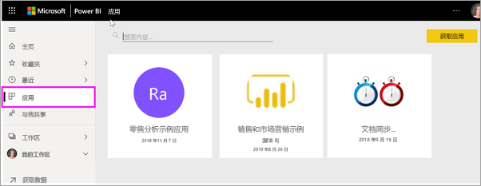

# Power BI 中的“应用”

[!INCLUDE[consumer-appliesto-ynny](../includes/consumer-appliesto-ynny.md)]

[!INCLUDE [power-bi-service-new-look-include](../includes/power-bi-service-new-look-include.md)]

## 什么是 Power BI 应用？
应用是一种将相关仪表板和报表组合在一个地方的 Power BI 内容类型。 应用可以将一个或多个仪表板和一个或多个报表捆绑在一起。 应用由 Power BI 设计者创建，他们会与像你一样的使用者分发和共享应用。 

应用在“应用”内容列表中进行整理。 只需选择“应用”即可显示应用。 将鼠标悬停在应用上可查看上次更新日期和所有者。 

> [!NOTE]
> 必须有 Power BI Pro 许可证，才能使用应用功能。 [查找许可证类型](end-user-license.md)

## 应用设计者和应用使用者
根据你的角色，如果你是设计者，则可创建应用供你自己使用或与同事共享。 或者，如果你是使用者，则可接收和下载其他人创建的应用。 本文适用于应用使用者。

## 应用的优点
应用提供了一种一次共享不同类型的内容的简单方法。 应用设计者创建仪表板和报表并将其绑定到一个应用。 然后，设计者将该应用发布到使用者可访问的位置并与之共享。 由于相关的仪表板和报表绑定在一起，因此你可以更轻松地在 Power BI 服务 ([https://powerbi.com](https://powerbi.com)) 和移动设备上查找和安装。 安装应用后，无需记住许多不同仪表板或报表的名称，因为它们已全部汇总到应用、浏览器或移动设备中。

借助应用，只要应用作者发布更新，就会自动看到变化。 作者还可以控制数据的计划刷新频率，这样就不必担心要不断更新了。 

<!-- add conceptual art -->
## 获取新的应用
可以通过多种不同的方式获取应用。 下面列出了一些方法。  但有关获取和浏览应用的详细分步说明，请参阅[打开应用并与之交互](end-user-app-view.md)。

- 应用设计者可以在 Power BI 帐户中自动安装应用，下次打开 Power BI 时，就可在“应用”内容列表中看到此新应用。 
- 应用设计人员可通过电子邮件向你发送应用的直接链接。 选择此链接将在 Power BI 中打开该应用。
- 在移动设备上的 Power BI 中，只能通过直接链接（而不是 AppSource）安装应用。 如果应用作者自动安装应用，将能够在你的应用列表中看到它。
- 可以在 [AppSource](https://appsource.microsoft.com) 中搜索应用。 AppSource 包含由公司内部和外部的报表设计者发布的应用。 例如，可以在 AppSource 上找到已使用服务的应用，例如 Google Analytics、GitHub 或 Microsoft Dynamics。 还可找到用于了解 Power BI 的示例应用。  

## 下一步
* [打开某一应用并与之交互](end-user-app-view.md)
* [共享内容的其他方法](end-user-shared-with-me.md)

