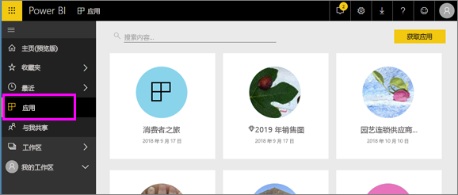

# Power BI 中的“应用”
## 什么是 Power BI 应用？
应用是一种将相关仪表板和报表组合在一个地方的 Power BI 内容类型。 应用可以将一个或多个仪表板和一个或多个报表捆绑在一起。 应用由 Power BI 设计者创建，他们会与像你一样的使用者分发和共享应用。 

应用在“应用”内容列表中进行整理。

> [!NOTE]
> 必须有 Power BI Pro 许可证，才能使用应用功能。 <!-- add link to how to figure out your license -->

## 应用设计者和应用使用者
根据你的角色，你可能会创建应用（设计者）供你自己使用或与同事共享。 或者，你可能会接收并下载其他人创建的应用（使用者）。 本文适用于应用使用者。

## 应用的优点
可以在 Power BI 服务 ([https://powerbi.com](https://powerbi.com)) 和移动设备上轻松找到并安装应用。 安装应用后，无需记住许多不同仪表板的名称，因为它们已全部汇总到应用、浏览器或移动设备中。

借助应用，只要应用作者发布更新，就会自动看到变化。 作者还可以控制数据的计划刷新频率，这样就不必担心要不断更新了。 

<!-- add conceptual art -->
## 获取新的应用
可以通过多种不同的方式获取应用。 
- 应用作者可以在 Power BI 帐户中自动安装应用，下次打开 Power BI 时，你将在“应用”内容列表中看到此新应用。 
- 应用作者可以通过电子邮件向你发送指向某一应用的直接链接。 选择此链接将在 Power BI 中打开该应用。
- 你可以在 AppSource 中搜索应用，并且可以在其中看到所有可访问的应用。 AppSource 包含由公司内部和外部的报表设计者发布的应用。 例如，可以在 AppSource 上找到已使用服务的应用，例如 Google Analytics、GitHub 或 Microsoft Dynamics。 
- 在移动设备上的 Power BI 中，只能通过直接链接（而不是 AppSource）安装应用。 如果应用作者自动安装应用，将能够在你的应用列表中看到它。

## 下一步
* [打开某一应用并与之交互](end-user-app-view.md)

