# 面向 Power BI 服务使用者的基本概念

若要更好地理解本文，需要已阅读 [Power BI 概述](../power-bi-overview.md)，并将自己定位为 Power BI 使用者。 使用者接收来自同事的 Power BI 内容，例如仪表板和报表。 使用者使用 Power BI 服务（即网站版 Power BI）。

你肯定听说过“Power BI Desktop”这个词，或仅听说过“Desktop”。 它是设计人员  使用的独立工具，设计人员生成仪表板和报表并与你共享。 请务必要知道还有其他 Power BI 工具。 只要你是使用者，就只能使用 Power BI 服务。 本文仅适用于 Power BI 服务。

## 术语和概念

本文不是 Power BI 的简介，也不是动手教程。 相反，这是一篇概述性文章，将帮助你熟悉 Power BI 术语和概念。 它将介绍行话和行业态势。 有关 Power BI 服务及其导航的导览，请转到[快速入门 - Power BI 服务的基本操作](end-user-experience.md)。

## 首次打开 Power BI 服务

大多数 Power BI 使用者获得 Power BI 服务是因为：1) 他们的公司购买许可证；2) 管理员将许可证分配给像你这样的员工。

首先，打开浏览器，并输入“app.powerbi.com”  。 首次打开 Power BI 服务时，你会看到如下所示的屏幕：

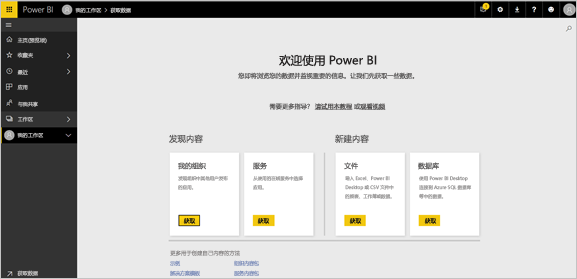

使用 Power BI 时，可对每次打开网站时看到的内容进行个性化设置。 例如，一些人希望 Power BI 打开到“主页”  ，而另一些人则希望先看到最常用仪表板。 别担心，本文将指导你如何个性化设置体验。

- [Power BI 主页和全局搜索简介](https://powerbi.microsoft.com/blog/introducing-power-bi-home-and-global-search)

- [Power BI 服务中的特色仪表板](end-user-featured.md)

不过，在进一步深入探讨前，先来回顾一下构成 Power BI 服务的构建基块。

_______________________________________________________

## Power BI 内容

### 构建基块介绍

对于 Power BI 使用者，五个构建基块分别为：可视化效果、仪表板、报表、应用和数据集。 它们有时也称为 Power BI 内容  。 内容  位于工作区中。 典型工作流包含所有构建基块：Power BI 设计人员  （下图中黄色所示）从数据集  收集数据，将数据引入 Power BI 以供分析，创建满是突出显示相关事实和见解的可视化效果  的报表  ，将可视化效果从报表固定到仪表板，并与像你这样的使用者  （下图中黑色所示）共享报表和仪表板。 设计人员  以应用  或其他类型共享内容的形式共享报表和仪表板。

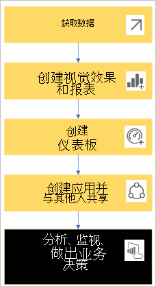

最基本的概念：

-  可视化效果（或视觉对象  ）是由 Power BI 设计人员  生成的一种图表。 视觉对象显示报表  和数据集  中的数据。 设计者通常在 Power BI Desktop 中生成视觉对象  。

    有关详细信息，请参阅[与报表、仪表板和应用中的视觉对象交互](end-user-visualizations.md)。

-  数据集  是数据容器。 例如，它可能是世界卫生组织提供的 Excel 文件。 也可能是客户公司拥有的数据库，也可能是 Salesforce 文件。  

-  仪表板  是一个包含交互式视觉对象、文本和图形的屏幕。 仪表板在一个屏幕上收集最重要的指标，以便呈现某个事实或回答某个问题。 仪表板内容来自一个或多个报表以及一个或多个数据集。

    有关详细信息，请参阅[适用于 Power BI 服务使用者的仪表板](end-user-dashboards.md)。

-  报表  由一个或多个报表页的交互式视觉对象、文本和图形组成。 Power BI 是在一个数据集的基础之上生成报表。 通常情况下，此服务将报表页整合到一起，以处理主要关注领域或回答一个问题。

    有关详细信息，请参阅 [Power BI 中的报表](end-user-reports.md)。

-  应用  是设计人员  捆绑和共享相关仪表板和报表的一种方式。 使用者自动接收某些应用，亦可搜索由同事或社区创建的其他应用  。 例如，你已使用的外部服务（如 Google Analytics（分析）和 Microsoft Dynamics CRM）也提供 Power BI 应用。

要明确的是，如果你是新用户且是首次登录 Power BI，则看不到仪表板、应用或报表。

_______________________________________________________

## 数据集

数据集是设计者导入或连接后用于生成报表和仪表板的数据的集合   。 作为使用者，你不会直接与数据集交互，但仍有必要了解它们如何融入更大的全局。  

每个数据集都表示一个数据源。 例如，数据源可以是 OneDrive 上的 Excel 工作簿、本地 SQL Server Analysis Services 表格数据集或 Salesforce 数据集。 Power BI 支持多种不同的数据源。

在设计人员与你共享应用后，你就可以看到设计人员在应用中添加了哪些数据集。

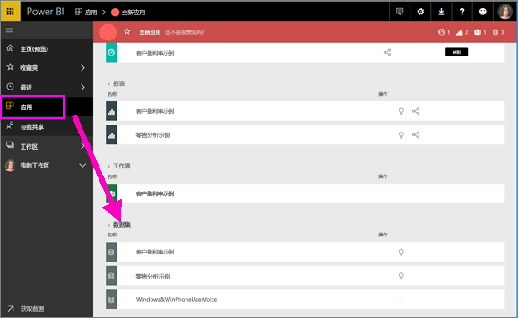

一个数据集...

- 可以被报表设计人员反复用来创建仪表板和报表

- 可用于创建许多不同的报表

- 来自一个数据集的视觉对象可以显示在许多不同的仪表板上

  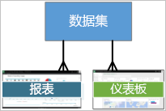

此外，设计人员还可以使用其他工作区中的数据集，在自己的工作区中创建内容（报表、仪表板）。 Power BI 使用引用数据集图标来显示此类数据集：

接下来了解下一个构建基块 - 可视化效果。

_______________________________________________________

## 可视化效果

可视化效果（亦称为“视觉对象”）显示 Power BI 已发现的数据见解。 借助可视化效果，可以更轻松地理解见解，因为相较于满是数字的电子表格，大脑理解图片的速度更快。

在 Power BI 中，可能会遇到的一些可视化效果包括，瀑布图、彩带图、树状图、饼图、漏斗图、卡片、散点图和仪表：

   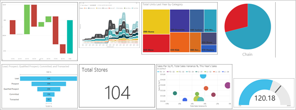

请参阅 [Power BI 随附的可视化效果完整列表](../power-bi-visualization-types-for-reports-and-q-and-a.md)。

社区也提供可视化效果，它们称为“自定义视觉对象”  。 如果收到的报表含不知道的视觉对象，它可能是自定义视觉对象。 如果需要在理解自定义视觉对象方面寻求帮助，请查找报表或仪表板设计人员  的姓名，并与之联系。

报表中的一个可视化效果...

- 可以在同一报表中多次出现

- 可以显示在许多不同的仪表板上

_______________________________________________________

## 报表

Power BI 报表是一页或多页可视化效果、图形和文本。 报表中所有可视化对象来自单个数据集。 设计者与[阅读视图中与报表交互](end-user-reading-view.md)的使用者共享报表    。

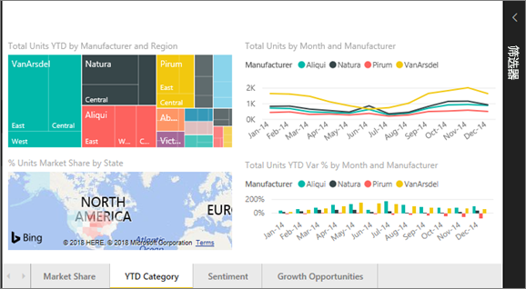

一个报表...

- 可以与多个仪表板关联（从这一个报表固定的磁贴可以显示在多个仪表板上）。

- 只能使用一个数据集中的数据进行创建。  

- 可以属于多个应用。

  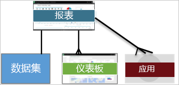

_______________________________________________________

## 仪表板

仪表板代表一个自定义视图，其中包含基础数据集的某个子集。 设计者单独或作为应用的一部分生成仪表板并与使用者共享   。 仪表板是一个包含磁贴  、图形和文本的画布。

  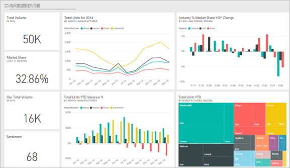

磁贴呈现设计者固定（例如，从报表固定到仪表板）的视觉对象   。 每个固定的磁贴显示 Power BI 从数据集创建并固定到相应仪表板的[可视化效果](end-user-visualizations.md)。 磁贴还可以包含整个报表页面，并且可以包含实时传送视频流数据或视频。 设计人员  可通过多种方式向仪表板添加磁贴。 添加方法太多了，本概述性文章无法一一介绍。 若要了解详细信息，请参阅 [Power BI 中的仪表板磁贴](end-user-tiles.md)。

使用者无法编辑仪表板。 但可以进行添加注释、查看相关数据、将其设置为收藏项、订阅等操作。

仪表板有什么用途？  以下仅介绍几个用途：

- 快速查看制定决策所需的全部信息

- 监视与业务相关的最重要信息

- 确保所有同事的进度相同；查看和使用相同的信息

- 监视业务、产品、业务部门或市场营销活动等的运行状况

- 为了创建更大仪表板的个性化视图（所有指标都很重要）

**一个**仪表板...

- 可以显示来自许多不同数据集的可视化对象

- 可以显示来自许多不同报表的可视化对象

- 可以显示从其他工具（例如 Excel）固定的可视化对象

  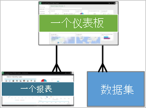

_______________________________________________________

## 应用

这些仪表板和报表集合将相关内容组织到一个包中。 Power BI 设计者生成仪表板和报表并与个人、团体、整个组织或公众共享  。 作为使用者，你可以确信自己和同事使用的数据相同（即一个受信任的真实数据版本）。

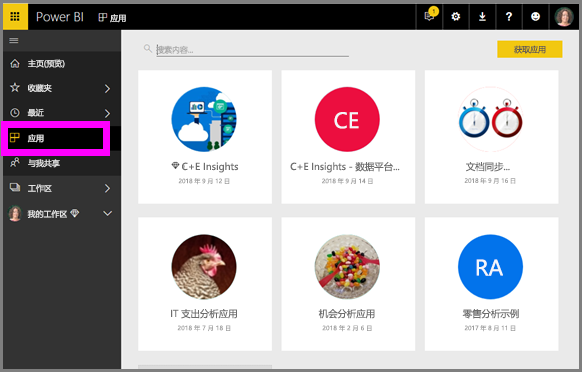

可以在 [Power BI 服务](https://powerbi.com)和移动设备上轻松找到并安装应用。 安装应用后，无需记住许多不同仪表板的名称。 它们已全部汇总到一个应用、你的浏览器或移动设备中。

此应用由三个相关的仪表板和三个相关的报表组成一个应用。

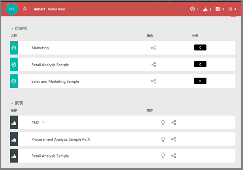

借助应用，只要应用作者发布更新，就会自动看到变化。 作者还可以控制 Power BI 刷新数据的频率计划。 你不必担心数据更新问题。

可以通过多种不同的方式获取应用：

- 应用设计人员可以在你的 Power BI 帐户中自动安装应用。

- 应用设计人员可以向你发送应用的直接链接。

- 你可以在 [Microsoft AppSource](https://appsource.microsoft.com/marketplace/apps?product=power-bi) 中搜索应用，在其中可以看到所有可用应用。

在移动设备上的 Power BI 中，只能通过直接链接（而不是 AppSource）安装应用。 如果应用设计者自动安装应用，将能够在你的应用列表中看到它。

安装应用后，立即从“应用”列表中选择它，并选择要先打开并浏览的仪表板或报表。

希望本文能让你了解构成面向使用者的 Power BI 服务的构建基块。

## 后续步骤

- 查看[词汇表](end-user-glossary.md)并为其添加书签

- [导览 Power BI 服务](end-user-experience.md)

- 阅读[专为使用者所写的 Power BI 概述](end-user-consumer.md)

- 观看视频，Will 在其中回顾了基本概念，并导览了 Power BI 服务。

    <iframe width="560" height="315" src="https://www.youtube.com/embed/B2vd4MQrz4M" frameborder="0" allowfullscreen></iframe>
