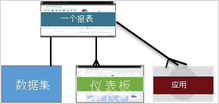

# Power BI 服务使用者的基本概念

## Power BI 使用者和设计者
本文假设你已阅读 [Power BI 概述](../power-bi-overview.md)并确定自己为 Power BI 使用者。 使用者接收来自同事的 Power BI 内容，例如仪表板和报表。 使用者使用 Power BI 服务，该服务其实就是网站版 Power BI。 

毫无疑问，你会听到“Power BI Desktop”或“Desktop”一词，这是指与你一起生成和共享仪表板和报表的设计者所使用的独立工具。 请务必知晓，还有其他 Power BI 工具，但只要你是使用者，就只能使用 Power BI 服务。 且本文仅适用于 Power BI 服务。 

## 术语和概念
本文不是 Power BI 的简介，也不是动手教程。 而是一篇概述文章，旨在帮助你熟悉 Power BI 术语和概念。 教你术语并帮助你了解相关情况。 有关 Power BI 服务及其导航的介绍，请访问[学习](end-user-experience.md)。

## 第一次打开 Power BI 服务
大多数 Power BI 使用者获得 Power BI 服务的方式是 1）他们的公司购买许可证；2）管理员将这些许可证分配给像你这样的员工。 

要开始使用，只需打开浏览器并输入“app.powerbi.com”即可。 第一次打开 Power BI 服务时，会看到如下图所示内容。

使用 Power BI 时，可对每次打开网站时看到的内容进行个性化设置。  例如，有的人希望 Power BI 打开主页，而有的人希望首先看到常用仪表板。 别担心，我们会教你如何执行此操作。 
- [主页预览](https://powerbi.microsoft.com/blog/introducing-power-bi-home-and-global-search)    
- [将内容设置为精选](end-user-featured.md) 

但在进一步深入之前，让我们回顾一下构成 Power BI 服务的构建基块吧。

## Power BI 内容
### 构建基块介绍
对于 Power BI 使用者，5 个构建块为：可视化效果、仪表板、报表、应用和数据集。 它们有时也称为 Power BI 内容。 内容在工作区中。 典型工作流涉及上述所有构建基块：Power BI 设计者（下图中黄色所示）从数据集收集数据，将其引入 Power BI 进行分析，创建突出相关事实和见解的所有可视化效果的报表，将可视化效果从报表固定到仪表板，并以应用或其他类型的共享内容的形式与像你这样的使用者（下图中黑色所示）共享报表和仪表板。 

基本概念如下。 
*  可视化效果（或视觉对象）是 Power BI 设计者使用报表和数据集中的数据生成的一类图表。 设计者通常在 Power BI Desktop 中生成视觉对象。 

    有关详细信息，请参阅 [Power BI 使用者的可视化效果](end-user-visualizations.md)

*  数据集就是数据容器。 例如，它可能是世界卫生组织的 Excel 文件、公司拥有的客户数据库或者 Salesforce 文件。  

*  仪表板是一个包含交互式视觉对象、文字和图形的屏幕。 仪表板在一个屏幕上收集最重要的指标，以便呈现某个事实或回答某个问题。 仪表板内容来自一个或多个报表以及一个或多个数据集。

    有关详细信息，请参阅 [Power BI 使用者仪表板](end-user-dashboards.md)

*  报表由含交互式视觉对象、文字和图形的一个或多个页面组成。 报表以单个数据集为基础。 通常报表将多个页面组织起来，每个页面提供一个主要关注领域的信息或解答一个问题。

    有关详细信息，请参阅 [Power BI 使用者报表](end-user-reports.md)

*  应用是设计者捆绑和共享相关仪表板和报表的方式。 使用者自动接收某些应用，亦可搜索由同事或社区创建的其他应用。 例如，可能已使用的外部服务（如 Google Analytics 和 Microsoft Dynamics CRM）也提供 Power BI 应用。

要明确的是，如果你是新用户且是第一次登录 Power BI，则没有仪表板、应用或报表。 
_______________________________________________________

## 数据集
数据集是设计者导入或连接后用于生成报表和仪表板的数据的集合。 作为使用者，你不会直接与数据集交互，但了解它们的工作原理大有裨益。  

每个数据集表示一个数据源，例如，OneDrive 上的 Excel 工作簿，或本地 SSAS 表格数据集或 Salesforce 数据集。 支持多种不同的数据源。

设计者与你共享应用时，你可以看到应用中包含哪些数据集。 

**一个**数据集...

* 可以反复使用
* 可以用于多种不同的报表
* 可以在多种不同的仪表板上显示该数据集的可视化效果
  
  

接下来了解下一个构建基块 - 可视化效果。
__________________________________________________________

## 可视化
可视化效果（亦称为“视觉对象”）显示已发现的数据见解。 借助可视化效果，可以更轻松地解读见解，因为相较于满是数字的电子表格，大脑理解图片的速度更快。

在 Power BI 中可能遇到的一些可视化效果包括：瀑布图、彩带图、树形图、饼图、漏斗图、卡片、散点图和仪表。 请参阅 [Power BI 随附的可视化效果完整列表](../power-bi-visualization-types-for-reports-and-q-and-a.md)。

   

社区也提供可视化效果，它们称为自定义视觉对象。 如果收到的报表含不知道的视觉对象，它可能是自定义视觉对象。 如果在解读自定义视觉对象方面需要帮助，请<!--[look up the name of the report or dashboard *designer*](end-user-owner.md)-->查找报表或仪表板设计者的名字并与之联系。

报表中的可视化效果

* 可以通过复制/粘贴的方式在同一报表中反复使用。
* 可以在多个不同的仪表板上使用
__________________________________________________
## 报表
Power BI 报表是一页或多页可视化效果、图形和文本。 报表中所有可视化对象来自单个数据集。 设计者与[阅读视图中与报表交互](end-user-reading-view.md)的使用者共享报表。

**一个**报表...

* 可以与多个仪表板关联（从该报表固定的磁贴可以显示在多个仪表板上）。
* 是使用来自一个数据集的数据创建的。  
* 可以是多个应用的一部分
  
  

________________________________________________

## 仪表板
仪表板代表一个自定义视图，其中包含基础数据集的某个子集。 设计者单独或作为应用的一部分生成仪表板并与使用者共享。 仪表板是包含磁贴、图形和文本的画布。 

  

磁贴呈现设计者固定（例如，从报表固定到仪表板）的视觉对象。  固定的每个磁贴均显示一个从数据集创建并固定到该仪表板的[可视化效果](end-user-visualizations.md)。 磁贴还可以包含整个报表页面，并且可以包含实时传送视频流数据或视频。 设计者可通过多种方法可将磁贴添加到仪表板中，本概述主题不一一介绍。 若要了解详细信息，请参阅 [Power BI 中的仪表板磁贴](end-user-tiles.md)。 

使用者不能编辑仪表板。 但可以进行添加注释、查看相关数据、将其设置为收藏项、订阅等操作。 

仪表板有什么用途？  以下仅介绍几个用途：

* 为了快速查看做出决策所需的所有信息
* 为了监视有关业务的最重要信息
* 为了确保同一页面上的所有同事均查看和使用相同的信息
* 为了监视业务、产品、业务部门或市场营销活动的运行状况。
* 为了创建更大仪表板的个性化视图（所有指标都很重要）

**一个**仪表板...

* 可以显示来自许多不同数据集的可视化对象
* 可以显示来自许多不同报表的可视化对象
* 可以显示在其他工具（例如 Excel）中固定的可视化对象
  
  

________________________________________________

## 应用
这些仪表板和报表集合将相关内容组织到一个包中。 Power BI 设计者生成仪表板和报表并与个人、团体、整个组织或公众共享。 使用者可以确信能与同事使用相同的数据（单个版本的真实可信的数据）。 

可以在 Power BI 服务 (https://powerbi.com)) 和移动设备上轻松找到并安装应用。 安装应用后，无需记住许多不同仪表板的名称，因为它们已全部汇总到应用、浏览器或移动设备中。 

此应用由三个相关的仪表板和三个相关的报表组成一个应用。

借助应用，只要应用作者发布更新，就会自动看到变化。 作者还可以控制数据的计划刷新频率，这样就不必担心要不断更新了。

可以通过多种不同的方式获取应用。 应用设计者可以在 Power BI 帐户中自动安装应用，或向你发送应用的直接链接，而你也可以在 Microsoft AppSource（其中可以看到你可以访问的所有应用）中搜索应用。 在移动设备上的 Power BI 中，只能通过直接链接（而不是 AppSource）安装应用。 如果应用设计者自动安装应用，将能够在你的应用列表中看到它。

安装应用后，只需从应用列表中选择它，然后选择要打开并要首先浏览的仪表板或报表。   

希望本文能让你了解构成使用者的 Power BI 服务的构建基块。 

## 后续步骤
- 查看[词汇表](end-user-glossary.md)并为其添加书签    
- [Power BI 服务教程](end-user-experience.md)演示
- 阅读[专为使用者所写的 Power BI 概述](end-user-consumer.md)    
- 观看视频，视频中 Will 回顾基本概念并提供 Power BI 服务的教程。 <iframe width="560" height="315" src="https://www.youtube.com/embed/B2vd4MQrz4M" frameborder="0" allowfullscreen></iframe>