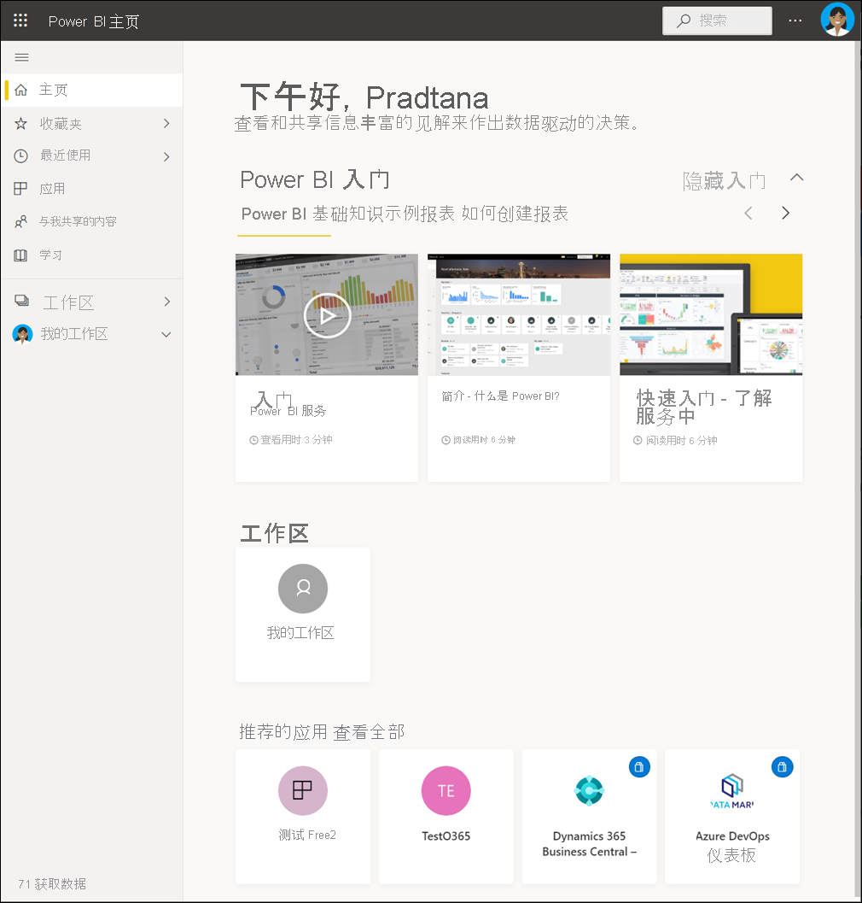

# 面向 Power BI 服务使用者的基本概念

[!INCLUDE[consumer-appliesto-ynnm](../includes/consumer-appliesto-ynnm.md)]

[!INCLUDE [power-bi-service-new-look-include](../includes/power-bi-service-new-look-include.md)]

本文假设你已阅读 [Power BI 概述](../fundamentals/power-bi-overview.md)，并将自己定位为 [Power BI 企业用户](end-user-consumer.md)。 企业用户接收来自同事的 Power BI 内容，例如仪表板、报表和应用。 企业用户使用 Power BI 服务 (app.powerbi.com)，该服务是 Power BI 基于网站的版本。

接收来自他人的内容需要满足以下条件之一：
- Power BI Pro 用户许可证
- 你的组织要拥有一个 Power BI Premium 订阅，并从 Power BI Premium 容量与你共享内容。 [查看许可证和订阅类型](end-user-license.md)。

你肯定听说过“Power BI Desktop”这个词，或仅听说过“Desktop”。 它是设计人员使用的独立工具，设计人员生成仪表板和报表并与你共享。 请务必要知道还有其他 Power BI 工具。 只要你是企业用户**，就只能使用 Power BI 服务。 本文仅适用于 Power BI 服务。

## 术语和概念

本文不是 Power BI 的简介，也不是动手教程。 相反，这是一篇概述性文章，将帮助你熟悉 Power BI 术语和概念。 它将介绍行话和行业态势。 有关 Power BI 服务及其导航的导览，请转到[快速入门 - Power BI 服务的基本操作](end-user-experience.md)。

## 首次打开 Power BI 服务

大多数 Power BI 企业用户获得 Power BI 服务是因为：1) 他们的公司购买许可证；2) 管理员将许可证分配给员工。

首先，打开浏览器，并输入“app.powerbi.com”。 首次打开 Power BI 服务时，你会看到如下所示的屏幕：

使用 Power BI 服务时，可对每次打开网站时看到的内容进行个性化设置。 例如，一些人希望 Power BI 打开到“主页”，而另一些人则希望先看到最常用仪表板。 别担心，这两篇文章将指导你如何个性化设置体验。

- [Power BI 主页和全局搜索简介](https://powerbi.microsoft.com/blog/introducing-power-bi-home-and-global-search)

- [Power BI 服务中的特色仪表板](end-user-featured.md)

不过，在进一步深入探讨前，先来回顾一下构成 Power BI 服务的构建基块。

_______________________________________________________

## Power BI 内容

### 构建基块介绍

对于 Power BI 企业用户，五个构建基块分别为：可视化效果、仪表板、报表、应用和数据集 。 它们有时也称为 Power BI 内容 **** 。 内容位于工作区中 **** 。 典型工作流包含所有构建基块：Power BI 设计者（下图中黄色所示）从数据集收集数据，将数据引入 Power BI 以供分析，创建满是突出显示相关事实和见解的可视化效果的报表，将可视化效果从报表固定到仪表板，并与像你这样的企业用户（下图中黑色所示）共享报表和仪表板。 设计者以仪表板、报表或应用的形式共享它们。

最基本的概念：

-  可视化效果（或视觉对象）是由 Power BI 设计人员生成的一种图表 **** 。 视觉对象显示报表和数据集中的数据。 设计者通常在 Power BI Desktop 中生成视觉对象。

    有关详细信息，请参阅[与报表、仪表板和应用中的视觉对象交互](end-user-visualizations.md)。

-  数据集是数据容器。 例如，它可能是世界卫生组织提供的 Excel 文件。 也可能是客户公司拥有的数据库，也可能是 Salesforce 文件。 数据集由设计者管理。

-  仪表板是一个包含交互式视觉对象、文本和图形的屏幕。 仪表板在一个屏幕上收集最重要的指标，以便呈现某个事实或回答某个问题。 仪表板内容来自一个或多个报表以及一个或多个数据集。

    有关详细信息，请参阅[适用于 Power BI 服务企业用户的仪表板](end-user-dashboards.md)。

-  报表由一个或多个报表页的交互式视觉对象、文本和图形组成。 Power BI 是在一个数据集的基础之上生成报表。 通常情况下，设计者将报表页整合到一起，以处理主要关注领域或回答一个问题。

    有关详细信息，请参阅 [Power BI 中的报表](end-user-reports.md)。

-  应用是设计人员捆绑和共享相关仪表板和报表的一种方式。 企业用户自动接收某些应用，亦可搜索由同事或社区创建的其他应用。 例如，你已使用的外部服务（如 Google Analytics 和 Microsoft Dynamics CRM）提供现成可用的应用。

要明确的是，如果你是新用户且是首次登录 Power BI 服务，则可能看不到仪表板、应用或报表。

_______________________________________________________

## 数据集

数据集是设计者导入或连接后用于生成报表和仪表板的数据的集合。 作为企业用户，你不会直接与数据集交互，但仍有必要了解它们如何融入更大的全局。  

每个数据集都表示一个数据源。 例如，数据源可以是 OneDrive 上的 Excel 工作簿、本地 SQL Server Analysis Services 表格数据集或 Salesforce 数据集。 Power BI 支持多种不同的数据源。

当设计者与你共享应用时，你可以通过打开“相关内容”来查找正在使用的数据集。  你无法添加或更改数据集中的任何内容。 但是，如果设计者提供权限，你将能够下载报表、查找[数据中的见解](end-user-insights.md)，甚至基于数据集[创建自己的报表](../create-reports/service-report-create-new.md)。  

一个数据集...

- 可以被报表设计人员反复用来创建仪表板和报表

- 可用于创建许多不同的报表

- 来自一个数据集的视觉对象可以显示在许多不同的仪表板上

  

接下来了解下一个构建基块 - 可视化效果。

_______________________________________________________

## 可视化效果

可视化效果（亦称为“视觉对象”）显示 Power BI 发现的数据见解。 借助可视化效果，可以更轻松地理解见解，因为相较于满是数字的电子表格，大脑理解图片的速度更快。

在 Power BI 中会遇到的一些可视化效果包括：瀑布图、彩带图、树状图、饼图、漏斗图、卡片、散点图和仪表。

   

请参阅 [Power BI 随附的可视化效果完整列表](end-user-visual-type.md)。

社区也提供特殊可视化效果，它们称为“自定义视觉对象”。 如果收到的报表含不知道的视觉对象，它可能是自定义视觉对象。 如果需要在理解自定义视觉对象方面寻求帮助，请查找报表或仪表板设计人员的姓名，并与之联系。 从顶部菜单栏中选择标题即可获得联系信息。

报表中的一个可视化效果...

- 可以在同一报表中多次出现

- 可以显示在许多不同的仪表板上

_______________________________________________________

## 报表

Power BI 报表是一页或多页可视化效果、图形和文本。 报表中所有可视化对象来自单个数据集。 设计者单独或作为应用的一部分生成报表并与他人共享。  通常情况下，企业用户[在阅读视图中与报表进行交互](end-user-reading-view.md)。

一个报表...

- 可以与多个仪表板关联（从该报表固定的磁贴可以显示在多个仪表板上）。

- 只能使用一个数据集中的数据进行创建。  

- 可以属于多个应用。

  

_______________________________________________________

## 仪表板

仪表板代表一个自定义图形视图，其中包含基础数据集的某个子集。 设计者单独或作为应用的一部分生成仪表板并与企业用户共享。 仪表板是一个包含磁贴、图形和文本的画布。

  

磁贴呈现设计者固定（例如，从报表固定到仪表板）的视觉对象 。 每个固定的磁贴显示设计器从数据集创建并固定到相应仪表板的[可视化效果](end-user-visualizations.md)。 磁贴还可以包含整个报表页面，并且可以包含实时传送视频流数据或视频。 设计者可通过多种方法可将磁贴添加到仪表板中，本概述文章不一一介绍。 若要了解详细信息，请参阅 [Power BI 中的仪表板磁贴](end-user-tiles.md)。

企业用户无法编辑仪表板。 但可以进行添加注释、查看相关数据、将其设置为收藏项、订阅等操作。

仪表板有什么用途？  下面列出了部分重构：

- 为了快速查看做出决策所需的所有信息

- 为了监视有关业务的最重要信息

- 为了确保同一页面上的所有同事均查看和使用相同的信息

- 监视业务、产品、业务部门或市场营销活动等的运行状况

- 为了创建更大仪表板的个性化视图（所有指标都很重要）

**一个** 仪表板...

- 可以显示来自许多不同数据集的可视化对象

- 可以显示来自许多不同报表的可视化对象

- 可以显示从其他工具（例如 Excel）固定的可视化对象

  

_______________________________________________________

## “应用”

这些仪表板和报表集合将相关内容组织到一个包中。 Power BI 设计者在工作区生成仪表板和报表并将应用与个人、团体、整个组织或公众共享。 作为企业用户，你可以确信自己和同事使用的信息相同（即一个受信任的真实数据版本）。

有时，应用的工作区本身是共享的，并且可能有多人同时协作和更新工作区和应用。 你可以对应用执行操作的范围取决于你被授予的权限和访问权限。

> [!NOTE]
> 使用应用需要 Power BI Pro 许可证或将应用工作区存储在高级容量中。 [了解许可证](end-user-license.md)。

可以在 [Power BI 服务](https://powerbi.com)和移动设备上轻松找到并安装应用。 安装应用后，无需记住许多不同仪表板和报表的名称。 它们已全部汇总到一个应用、你的浏览器或移动设备中。

此应用由两个仪表板和两个报表组成一个应用。 如果选择报表名称右侧的箭头，则会看到组成该报表页的列表。

无论何时更新应用，你都会自动看到更改。 设计者还可以控制 Power BI 刷新数据的频率计划。 你不必担心数据更新问题。

可以通过多种不同的方式获取应用：

- 应用设计人员可以在你的 Power BI 帐户中自动安装应用。

- 应用设计人员可以向你发送应用的直接链接。

- 你可以在 Power BI 服务中搜索组织或社区中可用的应用。 你也可以访问 [Microsoft AppSource](https://appsource.microsoft.com/marketplace/apps?product=power-bi)，在该处可以看到所有可用应用。

在移动设备上的 Power BI 中，只能通过直接链接（而不是 AppSource）安装应用。 如果应用设计者自动安装应用，将能够在你的应用列表中看到它。

安装应用后，立即从“应用”列表中选择它，并选择要先打开并浏览的仪表板或报表。

希望本文能让你了解构成面向企业用户的 Power BI 服务的构建基块。

## 后续步骤

- 查看[词汇表](end-user-glossary.md)并为其添加书签

- [导览 Power BI 服务](end-user-experience.md)

- 阅读[专为企业用户所写的 Power BI 概述](end-user-consumer.md)

- 观看视频，Will 在其中回顾了基本概念，并导览了 Power BI 服务。

    <iframe width="560" height="315" src="https://www.youtube.com/embed/B2vd4MQrz4M" frameborder="0" allowfullscreen></iframe>
