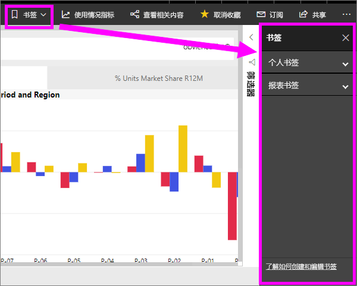
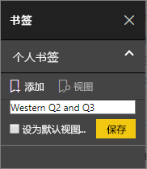
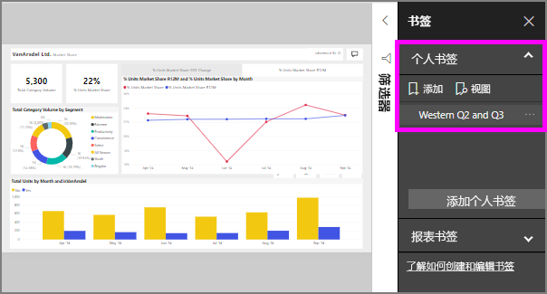

# 什么是书签？
书签捕获当前配置的报表页上，包括筛选器、 切片器和视觉对象的状态视图。 当选择一个书签时，Power BI 将返回到该视图。 有两种类型的书签-你自己和创建的报表创建的那些*设计器*。

## 在 Power BI 中使用书签共享见解和创建情景 
有许多用于书签的用途。 假设你发现感兴趣的见解并想要保留它--创建一个书签，以便可以稍后返回。 需要将保留并想要保留您当前的工作，请创建一个书签。 您甚至可以使的书签的报表，以便每次您的默认视图返回，请先打开报表页视图。 

此外可以创建集合的书签，对其进行排列的顺序，并随后单步执行每个演示文稿来突出显示一系列呈现一个情景的见解中的书签。  

## 使用书签
若要打开书签窗格，请选择**书签**菜单栏中。 若要返回到原始的已发布视图的报表，请选择**重置为默认值**。

### 报表书签
如果报表*设计器*包含报表的书签，您会发现它们下**报告书签**标题。 

选择一个书签以转到该报表视图。 

### 个人书签

创建书签时，以下元素将与书签一起保存：

* 当前页
* 筛选器
* 切片器（包括下拉列表或列表等切片器类型）和切片器状态
* 视觉对象选择状态（如交叉突出显示筛选器）
* 排序顺序
* 钻取位置
* 可见性（对象可见性，使用“选择”  窗格）
* 任何可见对象的“焦点”或“聚焦”  模式

配置报表页，确保它在书签中的显示效果符合自己的要求。 按照所需方式排列报表页和视觉对象后，选择“书签”  窗格中的“添加”  ，添加一个书签。 在此示例中，我们添加了一些筛选器区域和日期。 

**Power BI**创建书签，并为其提供一个通用名称或输入一个名称。 你可以*重命名*，*删除*，或*更新*选择书签名称旁边的省略号，然后从显示的菜单中选择操作的书签。

一个书签后，您可以通过中的书签，只需选择显示它**书签**窗格。 

<!--
## Arranging bookmarks
As you create bookmarks, you might find that the order in which you create them isn't necessarily the same order you'd like to present them to your audience. No problem, you can easily rearrange the order of bookmarks.

In the **Bookmarks** pane, simply drag-and-drop bookmarks to change their order, as shown in the following image. The yellow bar between bookmarks designates where the dragged bookmark will be placed.

The order of your bookmarks can become important when you use the **View** feature of bookmarks, as described in the next section. 

-->

## 以幻灯片形式放映书签
若要显示或顺序查看书签，，选择**视图**从**书签**窗格，可以开始一张幻灯片。

在“查看”  模式下，有几项功能值得注意：

1. 书签名称显示在画布底部的书签标题栏中。
2. 书签标题栏中的箭头可用于移到下一个或上一个书签。
3. 可以退出“查看”  模式，具体方法为选择“书签”  窗格中的“退出”  ，或选择书签标题栏中的“X”  。 

在“查看”  模式下，可以关闭“书签”  窗格（单击此窗格上的“X”），为演示文稿提供更多空间。 同时，在“查看”  模式下，所有视觉对象都可以进行交互和交叉突出显示，就像在其他情况下与它们交互时一样。 

<!--
## Visibility - using the Selection pane
With the release of bookmarks, the new **Selection** pane is also introduced. The **Selection** pane provides a list of all objects on the current page and allows you to select the object and specify whether a given object is visible. 

You can select an object using the **Selection** pane. Also, you can toggle whether the object is currently visible by clicking the eye icon to the right of the visual. 

When a bookmark is added, the visible status of each object is also saved based on its setting in the **Selection** pane. 

It's important to note that **slicers** continue to filter a report page, regardless of whether they are visible. As such, you can create many different bookmarks, with different slicer settings, and make a single report page appear very different (and highlight different insights) in various bookmarks.

## Bookmarks for shapes and images
You can also link shapes and images to bookmarks. With this feature, when you click on an object, it will show the bookmark associated with that object. This can be especially useful when working with buttons; you can learn more by reading the article about [using buttons in Power BI](desktop-buttons.md). 

To assign a bookmark to an object, select the object, then expand the **Action** section from the **Format Shape** pane, as shown in the following image.

Once you turn the **Action** slider to **On** you can select whether the object is a back button, a bookmark, or a Q&A command. If you select bookmark, you can then select which of your bookmarks the object is linked to.

There are all sorts of interesting things you can do with object-linked bookmarking. You can create a visual table of contents on your report page, or you can provide different views (such as visual types) of the same information, just by clicking on an object.

When you are in editing mode you can use ctrl+click to follow the link, and when not in edit mode, simply click the object to follow the link. 

## Bookmark groups

Beginning with the August 2018 release of **Power BI Desktop**, you can create and use bookmark groups. A bookmark group is a collection of bookmarks that you specify, which can be shown and organized as a group. 

To create a bookmark group, hold down the CTRL key and select the bookmarks you want to include in the group, then click the ellipses beside any of the selected bookmarks, and select **Group** from the menu that appears.

**Power BI Desktop** automatically names the group *Group 1*. Fortunately, you can just double-click on the name and rename it to whatever you want.

With any bookmark group, clicking on the bookmark group's name only expands or collapses the group of bookmarks, and does not represent a bookmark by itself. 

When using the **View** feature of bookmarks, the following applies:

* If the selected bookmark is in a group when you select **View** from bookmarks, only the bookmarks *in that group* are shown in the viewing session. 

* If the selected bookmark is not in a group, or is on the top level (such as the name of a bookmark group), then all bookmarks for the entire report are played, including bookmarks in any group. 

To ungroup bookmarks, just select any bookmark in a group, click the ellipses, and then select **Ungroup** from the menu that appears. 

Note that selecting **Ungroup** for any bookmark from a group takes all bookmarks out of the group (it deletes the group, but not the bookmarks themselves). So to remove a single bookmark from a group, you need to **Ungroup** any member from that group, which deletes the grouping, then select the members you want in the new group (using CTRL and clicking each bookmark), and select **Group** again. 
-->

## 限制和注意事项
这一版“书签”功能有一些限制和注意事项  。

* 大多数自定义视觉对象应该能够与书签很好地配合使用。 如果在使用书签和自定义视觉对象时遇到问题，请与该自定义视觉对象的创建者联系，并要求他们向视觉对象添加书签支持。 
* 如果在创建书签后在报表页上添加视觉对象，此视觉对象将以默认状态显示。 也就是说，如果在之前创建书签的页面中引入切片器，此切片器将在默认状态下运行。
* 创建书签后，如果移动视觉对象，书签中也会予以反映。 
* 通常情况下，您的书签不会受到影响如果报表*设计器*更新或重新发布报表。 但是，如果在设计器报表，如删除一个书签，通过使用字段进行主要更改然后你将收到一条错误消息下一次尝试打开该书签。 

<!--
## Next steps
spotlight?
-->
