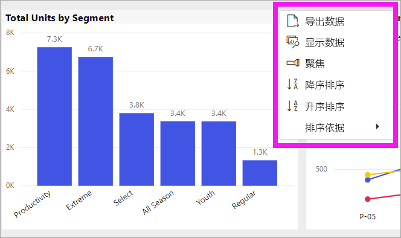
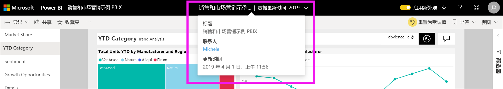

# 更改 Power BI 报表中的图表排序方式

[!INCLUDE [power-bi-service-new-look-include](../includes/power-bi-service-new-look-include.md)]

在 Power BI 服务中，你可以更改视觉对象的外观，方法是按不同的数据字段对其进行排序。 通过更改视觉对象的排序方式，可以突出显示想要表达的信息，并确保视觉对象反映相关趋势（或重点）。

无论使用数值数据（如销售数据）还是文本数据（如州名），都可按所需的方式对可视化进行排序，并将其设置为所需的外观。 Power BI 对排序提供了很大的灵活性，并提供了快速菜单供你使用。 在任何视觉对象上，选择“更多操作”(…)，然后选择要排序的字段  。

仪表板上的视觉对象无法进行排序。但在 Power BI 报表中，你可以按图表中类别名称的字母顺序，或者每个类别的数值对大多数可视化效果排序。 例如，下图按类别“商店名称”的字母顺序排序。 

可以轻松地将排序依据从类别（商店名称）更改为值（每平方英尺销售额）。

1. 选择“更多操作”(…)，然后选择“排序依据”>“每平方英尺销售额”   。
2. 如有必要，再次选择“更多选项”(…) 和“降序排序”   。 用于排序的字段以粗体显示，并带有一条黄色条。

   

> [!NOTE]
> 并非所有视觉对象都可以进行排序。 例如，以下视觉对象无法排序：树状图、地图、着色地图、散点图、仪表图、卡片图、瀑布图。

## 保存对排序顺序的更改
Power BI 报表可保留你对筛选器、切片器、排序和其他数据视图的更改。 因此，如果离开报表并在稍后返回，会保存你的更改。  如果想要将更改还原为报表设计者的设置，请选择上方菜单栏中的“重置为默认值”  。 

但是，如果“重置为默认值”按钮灰显，则表示设计者已禁用保存（保留）更改的功能  。

## 使用其他条件排序
有时候，你想使用不同的字段（不包括在视觉对象中）或其他条件对视觉对象排序。  例如，你可能想按月份（而不是字母顺序）排序，或者按整个数值而不是数字排序（例如 0、1、9、20，而不是 0、1、20、9）。  报表设计器将能够更新数据集以启用此类排序。 通过从标题栏中选择报表名称，可以找到设计者的联系信息。

## 后续步骤
[Power BI 报表中的可视化对象](end-user-visualizations.md)的详细信息。

[Power BI - 基本概念](end-user-basic-concepts.md)
