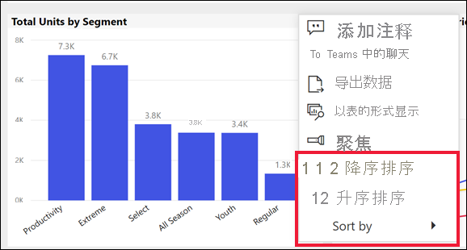
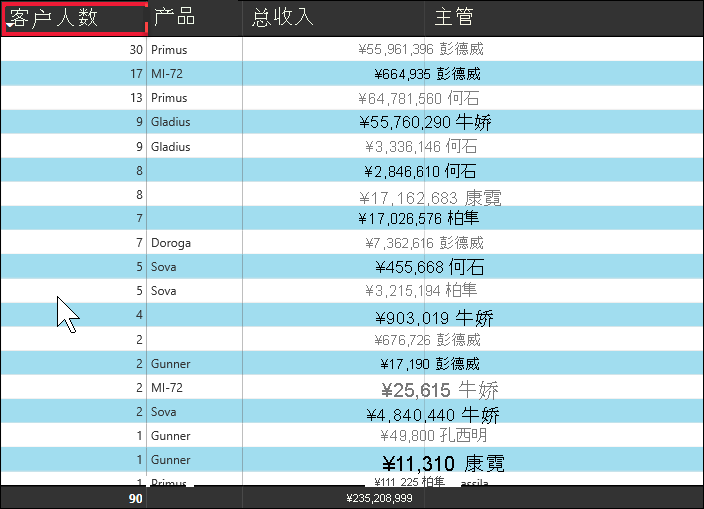
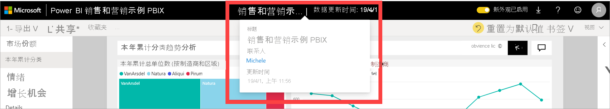

# 更改 Power BI 报表中的图表排序方式

[!INCLUDE[consumer-appliesto-ynnn](../includes/consumer-appliesto-ynnn.md)]

> [!IMPORTANT]
> **本文适用于对报表或数据集没有编辑权限以及仅在 Power BI 的联机版本（Power BI 服务）中工作的 Power BI 用户。如果你是报表设计人员或管理员或所有者，则本文可能没有你所需的全部信息。请转为参阅[在 Power BI Desktop 中按列排序](../create-reports/desktop-sort-by-column.md)** 。

在 Power BI 服务中，你可以更改视觉对象的外观，方法是按不同的数据字段对其进行排序。 通过更改视觉对象的排序方式，可以突出显示想要表达的信息。 无论使用的是数值数据（如销售数据）还是文本数据（如省/市/自治区名），都可按所需的方式对视觉对象进行排序。 Power BI 对排序提供了很大的灵活性，并提供了快速菜单供你使用。 

无法对仪表板上的视觉对象进行排序。 但在 Power BI 报表中，你可以一次根据一个字段（有时两个）对大多数视觉对象进行排序。 对于某些类型的视觉对象，排序不可用：树状图、仪表、地图等。 

## 开始使用

若要开始使用，请打开已创建或已与你共享的任何报表。 选择（可以进行排序的）视觉对象，然后选择“更多操作”(...)。有三个排序选项：“降序排序”、“升序排序”和“排序依据”  。 
    

### 按字母顺序或数字顺序排序

视觉对象可以按视觉对象中类别名称的字母顺序或者每个类别的数值对图表排序。 例如，下图按 X 轴类别商店“名称”的字母顺序排序。

若要将排序依据从类别（商店名称）更改为值（每平方英尺销售额），请选择“更多操作”(...)，然后选择“排序依据”。 选择视觉对象中使用的数字值。  此示例中，我们选择的是 **“Sales Per Sq Ft”** 。

如有必要，请在升序和降序之间更改排序顺序。  再次选择“更多选项”(…)，然后选择“降序排序”或“升序排序”  。 用于排序的字段以粗体显示，并带有一条黄色条。

   

> [!NOTE]
> 并非所有视觉对象都可以进行排序。 例如，以下视觉对象无法排序：树状图、地图、着色地图、散点图、仪表图、卡片图、瀑布图。

## 按多个列排序
此表中的数据按“客户属性”进行排序。  我们之所以知道是因为“数量”一词下的小箭头。 箭头向下，意味着按降序对列进行排序。

若要将更多列添加到排序顺序，请按 Shift 并单击在排序顺序中下一个要添加的列标题。 例如，如果单击“客户数量”，然后按 Shift 并单击“总收入”，则首先按客户对表进行排序，然后按收入排序。 红色轮廓显示排序顺序已更改的区域。

如果在同一列上再次按 Shift 并单击，则会更改该列的排序方向（升序、降序）。 此外，如果按 Shift 并单击之前已添加到排序顺序的列，则会将该列移到排序顺序后面。

## 保存对排序顺序的更改
Power BI 报表可保留你对筛选器、切片器、排序和其他数据视图的更改 -- 即使是在[阅读视图](end-user-reading-view.md)中工作也是如此。 因此，如果离开报表并在稍后返回，系统会保存你的排序更改。  如果想要将更改还原为报表设计者的设置，请选择上方菜单栏中的“重置为默认值”。 

但是，如果“重置为默认值”按钮灰显，则表示设计者已禁用保存（保留）更改的功能。

## 注意事项和疑难解答

### 使用其他条件排序
有时候，你想使用不同的字段（不包括在视觉对象中）或其他条件对视觉对象排序。  例如，你可能想按月份顺序（而不是字母顺序）排序，或者按整个数值而不是数字排序（例如 0、1、9、20，而不是 0、1、20、9）。  

只有设计该报表的人员才能进行这些更改。 选择标题栏中的报表名称，可以找到设计者的联系信息。

如果你是设计人员并且对内容具有编辑权限，请参阅 [Power BI Desktop 中的按列排序](../create-reports/desktop-sort-by-column.md)，以了解如何更新数据集并启用此类排序。

## 后续步骤
[Power BI 报表中的可视化对象](end-user-visualizations.md)的详细信息。

[Power BI - 基本概念](end-user-basic-concepts.md)
