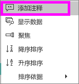
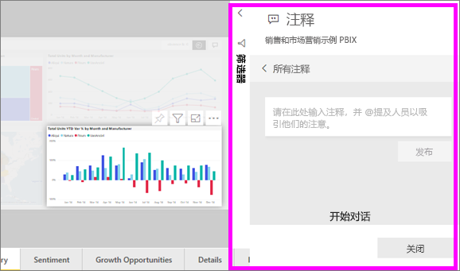
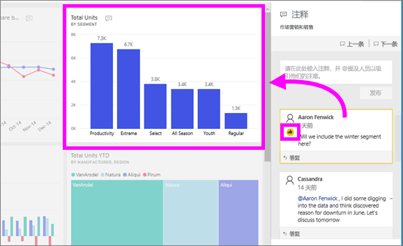

# 将注释添加到仪表板或报表
添加个人注释或与你的同事启动仪表板或报表有关的对话。 注释功能只是使用者可与他人协作的方式之一   。 

## 如何使用注释功能
可以添加注释，对整个仪表板、 仪表板上的单个视觉对象、 报表页和报表页上的单个视觉对象。 添加一般注释或针对特定的同事的注释。  

当向报表添加注释时，Power BI 会捕获当前的筛选器和切片器值。 这意味着，当选择或响应的注释，报表页或报表视觉对象可能会更改以显示筛选器和切片器选择第一个注释时处于活动状态的添加。  

为什么这很重要？ 假设一个同事应用的筛选器，显示感兴趣的见解，他想要与团队共享。 不包含所选的筛选器，该注释可能没有意义。 

### 将一般注释添加到仪表板或报表
用于将注释添加到仪表板或报表过程十分相似。 在此示例中，我们使用仪表板。 

1. 打开 Power BI 仪表板或报表，然后选择**注释**图标。 这将打开“注释”对话框。

    

    在这里，我们可以看到仪表板创建者已经添加了常规注释。  有权访问此仪表板的任何人员都可以看到此注释。

    

2. 若要进行答复，请选择“答复”，输入答复内容，然后选择“发布”   。  

    

    默认情况下，Power BI 会将答复定向到启动注释线程的同事，在本例中为 Aaron F。 

    

 3. 如果你想要添加注释不是现有主题的一部分，上限文本字段中输入您的评论。

    

    此仪表板的注释现在如下所示。

    

### 将注释添加到特定的仪表板或报表视觉对象
除了将注释添加到整个仪表板或整个报表页，可以将注释添加到单个仪表板磁贴和个别报表视觉对象中。 过程类似，并且我们在此示例中使用报表。

1. 将鼠标悬停在视觉对象上，并选择省略号 (...)。    
2. 从下拉列表中，选择“添加注释”  。

      

3.  **注释**对话框将打开，并且在页上的其他视觉对象将灰显。此视觉对象没有任何注释。 

      

4. 键入注释，然后选择“发布”  。

      

    - 在报表页上，选择一个视觉对象，进行注释突出显示该视觉对象 （见上文）。

    - 在仪表板的图表图标  可以让我们知道一条注释已绑定到特定的视觉对象。 将应用于整个仪表板的注释没有特殊的图标。 选择图表图标会突出显示在仪表板上的相关视觉对象。

        

5. 选择“关闭”返回仪表板或报表。 

### 通过使用 @ 符号引起同事的注意
无论创建仪表板、 报表、 磁贴或视觉注释，抓取同事的注意通过使用"\@"符号。  当您键入"\@"符号，Power BI 将打开一个下拉列表，其中您可以搜索并选择从你的组织的个人。 任何以“\@”符号开头的经过验证的名称都会以蓝色字体显示。 

下面是我与可视化效果设计人员  的对话。 他使用 @ 符号确保我可以看到这条注释。 我知道这个注释是给我的。 当我在 Power BI 中打开此应用仪表板时，我从标头中选择“注释”  。  “注释”窗格随即会显示我们的对话。

  

## 后续步骤
返回[使用者的可视化效果](end-user-visualizations.md)    
<!--[Select a visualization to open a report](end-user-open-report.md)-->
