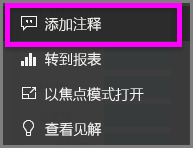
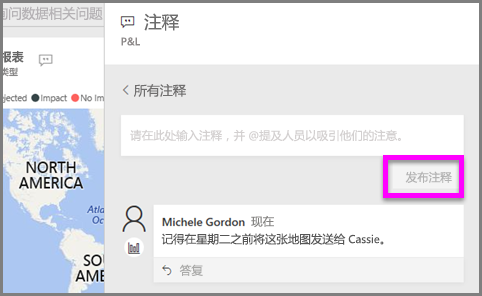
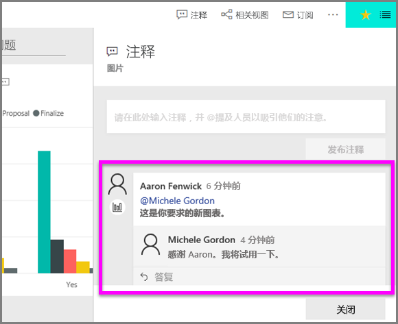

# 将注释添加到可视化效果
添加个人注释或与同事开始有关可视化效果的对话。 注释功能只是使用者与可视化效果进行交互的方式之一。 

## 如何使用注释功能

1. 将鼠标悬停在可视化效果上，并选择省略号 (...)。    
2. 从下拉列表中，选择“添加注释”。

      

3.  键入注释，然后选择“发布注释”。 这是给我自己的一条注释，其中有拼写错误。

      

4. 下面是我与可视化效果设计人员的对话。 他使用 @ 符号确保我可以看到这条注释。 我知道这个注释是给我的。 当我在 Power BI 中打开此应用仪表板时，我从标头中选择“注释”。 “注释”窗格随即会显示我们的对话。 

      

5. 单击“关闭”返回仪表板或报表。

## 后续步骤
返回[使用者的可视化效果](end-user-visualizations.md)    
<!--[Select a visualization to open a report](end-user-open-report.md)-->