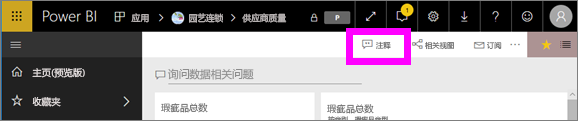
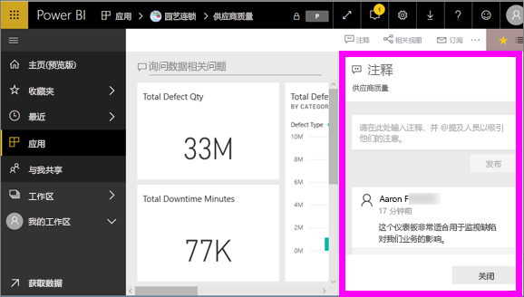
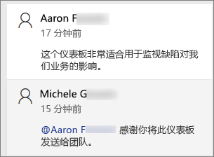
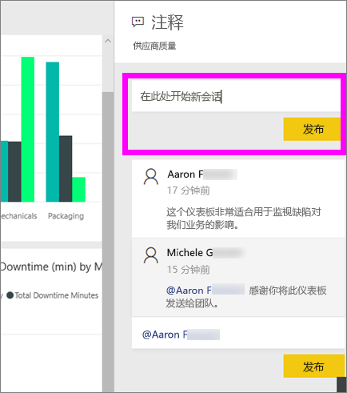
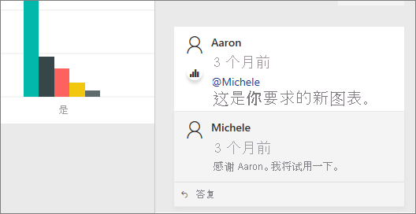
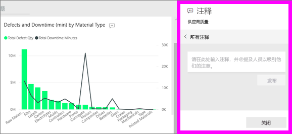
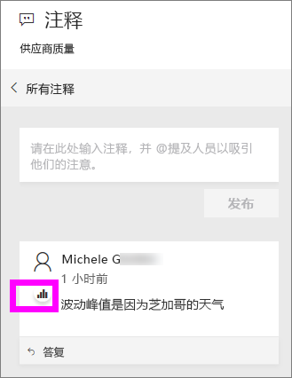
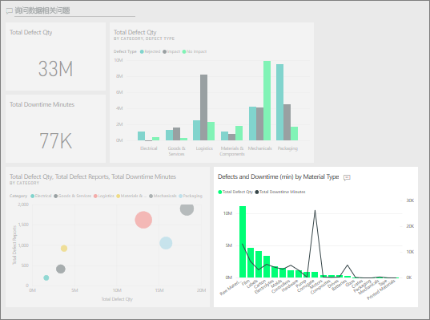

# 将注释添加到仪表板
添加个人注释或与同事开始有关仪表板的对话。 注释功能只是使用者可与他人协作的方式之一。 

## 如何使用注释功能
可将注释添加到整个仪表板或仪表板上的单个视觉对象。 添加常规注释或针对特定同事的注释。  

### 添加常规仪表板注释
1. 打开 Power BI 仪表板，然后选择“注释”图标。 这将打开“注释”对话框。

    

    在这里，我们可以看到仪表板创建者已经添加了常规注释。  有权访问此仪表板的任何人员都可以看到此注释。

    

2. 若要进行答复，请选择“答复”，输入答复内容，然后选择“发布”。  

    

    默认情况下，Power BI 会将答复定向到启动注释线程的同事，在本例中为 Aaron F。 

    

 3. 如果要添加不属于现有线程的仪表板注释，请在上面部分的文本字段中输入注释。

    

    此仪表板的注释现在如下所示。

    

### 向特定仪表板视觉对象添加注释
1. 将鼠标悬停在视觉对象上，并选择省略号 (...)。    
2. 从下拉列表中，选择“添加注释”。

      

3.  这将打开“注释”对话框。 此视觉对象没有任何注释。 

      

4. 键入注释，然后选择“发布”。

      

    图表图标  让我们知道此注释已与特定视觉对象相关联。 选择图标以突出显示仪表板上的相关视觉对象。

    

5. 选择“关闭”返回仪表板或报表。

### 通过使用 @ 符号引起同事的注意
无论是创建仪表板注释还是对特定视觉对象进行注释，都可以通过使用“@”符号来吸引同事的注意。  当键入“@”符号时，Power BI 会打开一个下拉菜单，你可以在其中搜索并从组织中选择单个人员。 任何以“@”符号开头的经过验证的名称都会以蓝色字体显示。 

下面是我与可视化效果设计人员的对话。 他使用 @ 符号确保我可以看到这条注释。 我知道这个注释是给我的。 当我在 Power BI 中打开此应用仪表板时，我从标头中选择“注释”。 “注释”窗格随即会显示我们的对话。

  

## 后续步骤
返回[使用者的可视化效果](end-user-visualizations.md)    
<!--[Select a visualization to open a report](end-user-open-report.md)-->