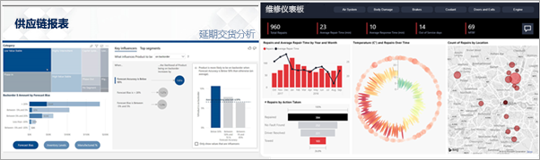

# 面向使用者的 Power BI 服务

[!INCLUDE[consumer-appliesto-ynny](../includes/consumer-appliesto-ynny.md)]

在数据文化的世界里，业务决策基于事实，而不是观点。 你需要数据来做出这些决策，而你的同事不会让你失望。     
 
他们向你发来了各种类型的报表、电子表格、包含图表的电子邮件，甚至是打印的讲义。 数据堆积如山时，就难以快速找到所需的信息，并且你担心可能不会使用最新的信息。  
 

## 面向使用者的 Power BI 服务

使用 Power BI，工作更轻松，也更有效。 所有这些数据都会转化为图表和图形，以便更直观地显示你的数据。 数据见解并不是较长的列表或多个表，而是多彩且醒目的视觉对象，可通过这些视觉对象了解数据中的见解。 

 
只需在浏览器或移动设备上打开 Power BI 服务。 你和你的同事即可通过相同的受信任仪表板和报表工作，自动更新和刷新，因此使用的内容始终都是最新的。   

由于这不是静态内容，因此你可以进行深入研究、寻找趋势、见解和其他商业智能。 切分内容并对内容进行切片，甚至使用自己的话语向其提问。 或者，不采取任何操作，让数据发现你感兴趣的见解、在数据更改时向你发送警报并按所设置的计划向你发送电子邮件。 任何时间、任何设备、云中或本地的所有数据。 而 Power BI 可以执行的操作远不止这些。 

## 我是 Power BI“使用者”吗？

使用 Power BI 交互的方式取决于你的工作角色。 最终用户或使用者可从同事那里接收内容（仪表板、报表和应用）。 可使用网页版或移动版 Power BI 服务（称为 Power BI 服务）查看此内容并与之交互，以做出业务决策。 
   
但使用者无法访问 Power BI 的全部功能，这没关系，因为你的工作不是构建仪表板和报表。 而是使用 Power BI 服务进行分析、监控、探索并做出决策。 

毫无疑问，你会听到“Power BI Desktop”或“Desktop”一词，这是指与你一起生成和共享仪表板和报表的设计者所使用的独立工具。  请务必知晓，还有其他 Power BI 工具，但只要你是使用者，就只能使用 Power BI 服务。 

由于处理的是“共享”内容，所以需要 Power BI Pro 或 Premium 许可证。 [我有哪种许可证？](end-user-license.md)

## 安全地与内容交互 
进行筛选、切片、订阅和导出时，不要担心 — 你的工作不会影响基础数据集或原始共享内容（仪表板、报表和应用）。  

请记住，不能损坏数据。  Power BI 是一个探索和试验的好位置，不用担心会损坏任何内容。  
 
这并不意味着无法保存更改 — 可以保存。 但这些更改只会影响你的内容视图。 还原为原始默认视图如同单击按钮一样简单。  

## 后续步骤

[导览面向使用者的 Power BI 服务](end-user-reading-view.md)    
[面向使用者的 Power BI 服务培训](https://docs.microsoft.com/learn/paths/consume-data-with-power-bi/)    
[面向 Power BI 使用者的术语和概念](end-user-basic-concepts.md)    

