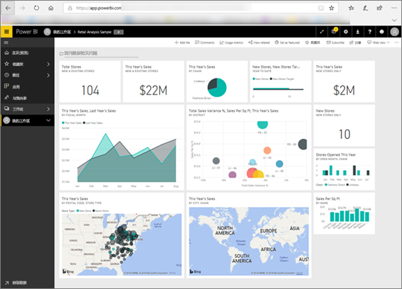

<!-- fold this topic into existing topics -->
# 面向使用者的 Power BI
使用 Power BI 交互的方式取决于你的工作角色。 作为最终用户或使用者，你就是从同事那里接收仪表板、报表和应用的人。 你使用 Power BI 服务审核此内容并与之交互以制定业务决策。

如果你是 Power BI 新手，我们建议你先阅读 [Power BI 概述](../power-bi-overview.md)。 你将从中了解构成 Power BI 的工具集。

作为使用者，你将无法访问 Power BI 的全部功能，这没关系，因为你的工作不是构建仪表板和报表。 你的工作是使用 Power BI 进行分析、监控、探索和决策。

阅读针对使用者的文章时，你将学习术语，了解 Power BI 服务，弄清楚如何导航到内容，然后学习如何与内容进行交互。  让我们开始吧！

## 后续步骤

[面向 Power BI 使用者的术语和概念](end-user-basic-concepts.md)

<!-- [Get started guide for *consumers*] -->
[Power BI 服务入门](../service-get-started.md)

