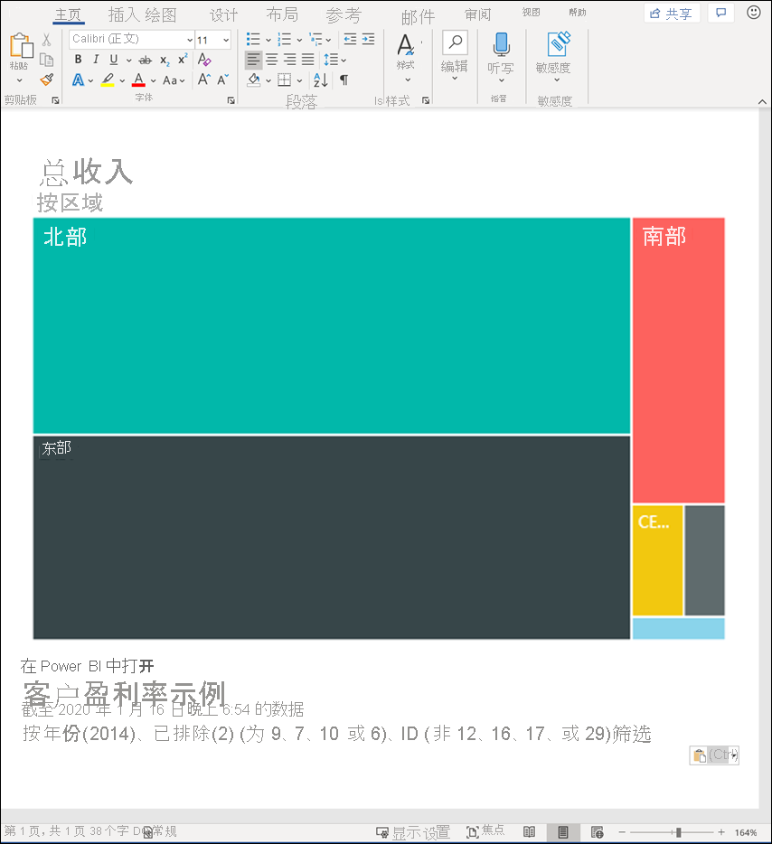
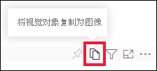
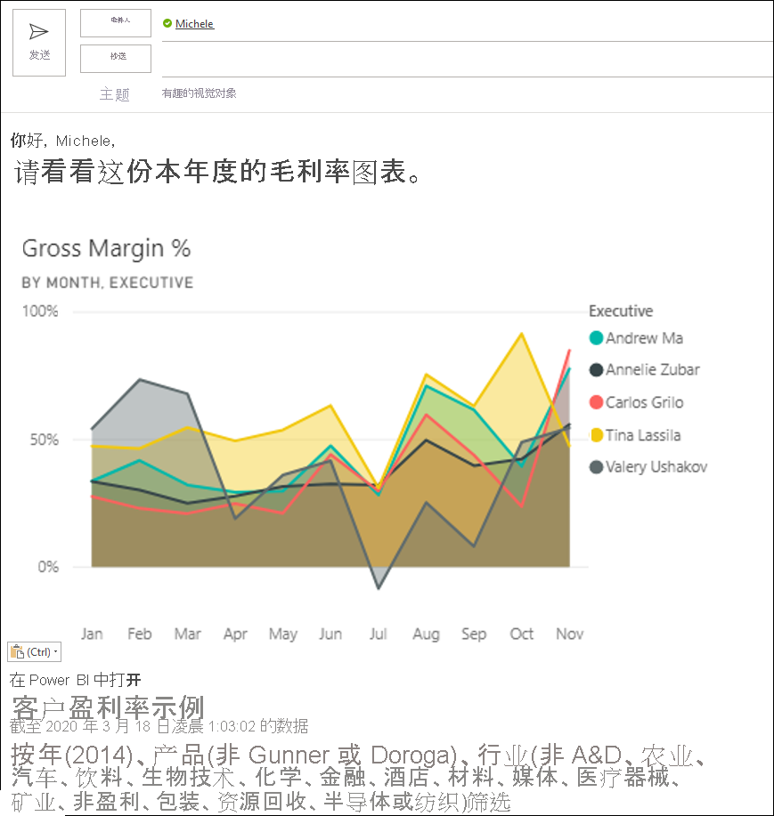
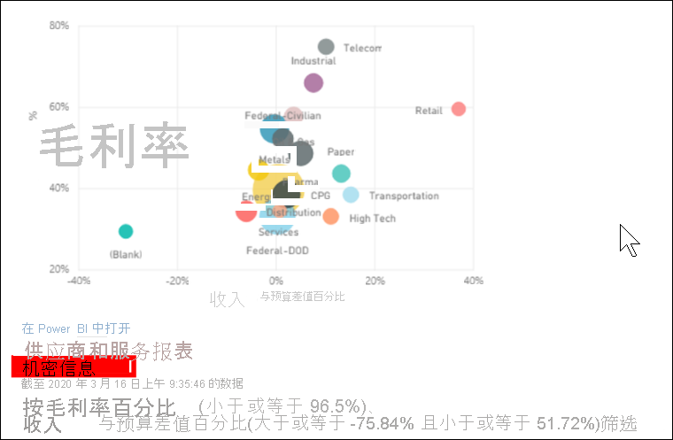
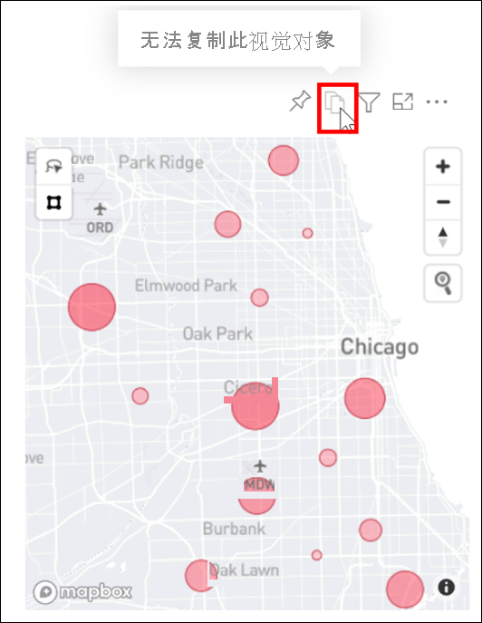

# 将视觉对象作为图像复制到剪贴板

[!INCLUDE[consumer-appliesto-yyyn](../includes/consumer-appliesto-yyyn.md)]

是否曾经想要分享 Power BI 报表或仪表板中的图像？ 现在你可以复制可视化对象并将其粘贴到其他支持粘贴的应用程序中。 

复制视觉对象的静态图像时，你将获得视觉对象的副本以及元数据。 这包括：
* 返回到 Power BI 报表或仪表板的链接
* 报表或仪表板的标题
* 注意图像是否包含机密信息
* 上次更新时间戳
* 应用于视觉对象的筛选器

### 从仪表板磁贴复制

1. 导航到要从中复制的仪表板。

2. 从视觉对象右上角，选择“更多操作(...)”，然后选择“将视觉对象复制为图像” 。 

    

3. “你的视觉对象可以复制了”对话框出现时，请选择“复制到剪贴板” 。

    

4. 复制视觉对象后，请按 Ctrl + V 或单击右键 > 单击“粘贴”，将其粘贴到另一个应用程序中。 在下面的屏幕截图中，我们将视觉对象粘贴到 Microsoft Word 中。 

    

### 从报表视觉对象中复制 

1. 导航到要从中复制的报表。

2. 从视觉对象右上角，选择“将视觉对象复制为图像”图标。 

    

3. “你的视觉对象可以复制了”对话框出现时，请选择“复制到剪贴板” 。

    

4. 复制视觉对象后，请按 Ctrl + V 或单击右键 > 单击“粘贴”，将其粘贴到另一个应用程序中。 在下面的屏幕截图中，我们已将视觉对象粘贴到电子邮件中。

    

5. 如果报表应用了数据敏感度标签，则在选择复制图标时，会收到警告。  

    

    此外，敏感度标签将添加到粘贴的可视对象下方的元数据中。 

    

## 注意事项和疑难解答

   

问：为什么对视觉对象禁用了“复制”图标？    
答：我们目前支持本机 Power BI 视觉对象和认证自定义视觉对象。 对某些视觉对象的支持有限，其中包括： 
- ESRI 和其他映射视觉对象 
- Python 视觉对象 
- R 视觉对象 
- PowerApps    

答：IT 部门或 Power BI 管理员可以关闭复制视觉对象的功能。

问：为什么我的视觉对象无法正确粘贴？    
答：自定义视觉对象和动画视觉对象有一些限制。 

## 后续步骤
有关 [Power BI 报表中的可视化效果](end-user-visual-type.md)的详细信息

更多问题？ [尝试参与 Power BI 社区](https://community.powerbi.com/)

