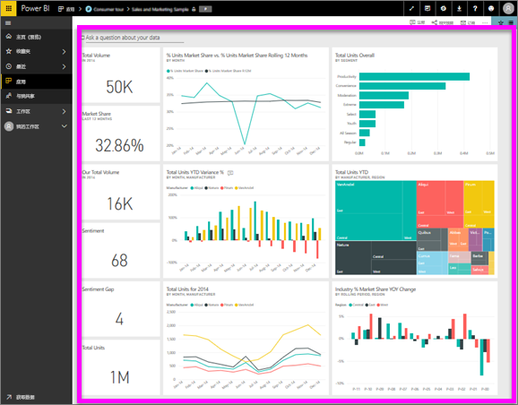

# 查看仪表板
Power BI 使用者需要花费大量时间查看仪表板。 仪表板旨在突出显示基础报表和数据集中的特定信息。 Power BI 使用者利用这些信息进行跟踪、监视、解答问题、测试等，并制定数据驱动型业务决策。

共享仪表板和查看共享仪表板都需要 Power BI Pro。

## 打开仪表板

|              |         |
|------------|--------------------------------|
|      |可以从 Power BI 服务中的多个位置打开仪表板。   只需查找此仪表板图标。 确定  仪表板后，打开它很简单 - 选中它，仪表板就会填充  你的 Power BI 画布。 |
|                    |          |

可在左侧导航栏中的所有容器中找到仪表板。 
- **主页**（预览）
- **收藏夹** - 如果已[将某个仪表板设置为收藏内容](end-user-favorite.md)
- **最近使用** - 如果最近访问过某个仪表板
- **应用** - 大多数应用都同时包含仪表板和报表
- **与我共享** - 如果同事[与你共享了仪表板](end-user-shared-with-me.md)
- **我的工作区** - 如果已下载任何 [Power BI 示例](../sample-datasets.md)

## 后续步骤
* 通过参观我们的[示例仪表板](../sample-tutorial-connect-to-the-samples.md)之一，轻松了解仪表板的使用。
* 了解[仪表板磁贴](end-user-tiles.md)，以及当你选择一个磁贴时将发生的情况。