# Power BI 可视化效果中的钻取模式

本文介绍了如何在 Microsoft Power BI 服务和 Power BI Desktop 的可视化效果中向下钻取。 Power BI 报表支持多个数据层次结构，以便你最大限度地深入了解数据。 对数据点使用向下钻取和向上钻取，可以深入了解数据的详细信息。 甚至可以在外形规格小的移动设备上充分利用钻取功能。

## 需要具有层次结构才能进行钻取

如果可视化效果有层次结构，就可以向下钻取来显示其他详细信息。 例如，你可能有一个可视化效果，该可视化效果按由运动、专业和事件组成的层次结构查看奥运会奖牌数。 默认情况下，可视化效果将按运动（体操、滑冰、水上项目等）显示奖牌数。 不过，由于它有层次结构，因此选择其中一个可视化效果元素（如条形、折线或气泡）会显示越来越详细的信息。 选择“**水上运动**”元素可以查看游泳、潜水和水球的数据。  选择“**潜水**”元素可以查看跳板、跳台和双人跳水活动项目的详细信息。

可以向你拥有的报表添加层次结构，但不能向与你共享的报表添加层次结构。
不确定哪个 Power BI 可视化效果有层次结构？ 请将鼠标悬停在可视化效果之上。 如果在顶角看到下面这些钻取控件，表明可视化效果有层次结构。

    
   

日期是层次结构的唯一类型。 向可视化效果添加日期字段时，Power BI 自动添加包含年、季度、月和天的时间层次结构。 有关详细信息，请参阅[可视化效果层次结构和向下钻取行为](../guided-learning/visualizations.yml?tutorial-step=18)，或观看下面的视频。

<iframe width="560" height="315" src="https://www.youtube.com/embed/MNAaHw4PxzE?list=PL1N57mwBHtN0JFoKSR0n-tBkUJHeMP2cP" frameborder="0" allowfullscreen></iframe>

> [!NOTE]
> 若要了解如何使用 Power BI Desktop 创建层次结构，请观看视频[如何创建和添加层次结构](https://youtu.be/q8WDUAiTGeU)。

## 先决条件

1. 在 Power BI 服务或 Power BI Desktop 中，可视化效果必须有层次结构，你才能进行钻取。

1. 若要跟着本教程一起操作，请打开[零售分析示例](../sample-datasets.md)。 创建研究以下字段的树状图  可视化效果：

    | 井 | 字段 |
    | ---- | ----- |
    | 值 |销售额 \|\_ 今年总销售单位数 |
    | 组 | 商店 \|\_ 区域 \|\_ 城市 \|\_ 邮政编码 \|\_ 名称

    该树状图具有一个层次结构，它由区域、城市、邮政编码和城市名称所组成。 每个区域均包含一个或多个城市，而每个城市均包含一个或多个邮政编码等。 默认情况下，此可视化效果仅显示区域数据，因为列表中的第一个字段是“区域”  。

    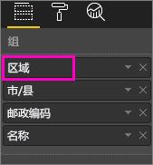

1. 了解不同钻取图标如何协同工作可能会造成混淆。 接下来，将把此树状图筛选为仅显示两个较小区域：KY 和 TN   。 选择树状图，在“视觉对象级别筛选器”下展开“区域”，并选择“KY”和“TN”     。

    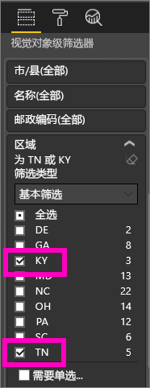

    现在，树状图中仅显示两个区域。

    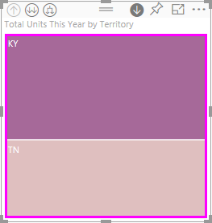

## 使用钻取功能的三种方式

其中包含多个选项，可访问针对有层次结构的可视化效果的向下钻取、向上钻取及展开功能。 本文介绍如何使用下面的第一个选项。 了解向下钻取和展开的基础知识后，就会知道使用钻取功能的全部三种方式。 它们都完成同样的任务。 试一试，并选出你最喜欢的一种方式。

- 将鼠标悬停在可视化效果上，可查看并使用图标。  

    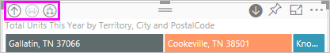

- 右键单击可视化效果，可显示并使用菜单。

    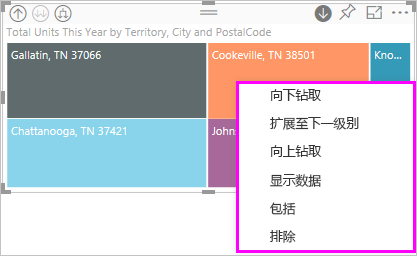

- 在 Power BI 菜单栏上，选择“浏览”按钮  。

   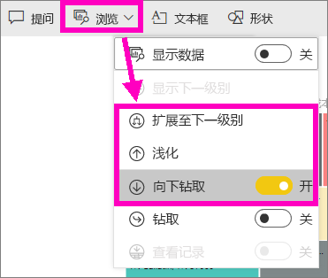

## 钻取路径

### 向下钻取

可通过多种方法来深入了解你的可视化效果。 向下钻取  可转到层次结构中的下一个级别。 如果查看的是“区域”  级别，可以依次向下钻取到城市级别、邮政编码级别和名称级别。 在这一路径中每向前一步，都会显示出新的信息。

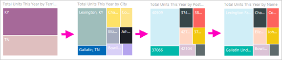

### 展开

**展开**可向当前视图添加一个额外的层次结构级别。 因此，如果查看的是“区域”  级别，可展开并向树状图添加城市、邮政编码和名称详细信息。 在这一路径中每向前一步，都会显示相同的信息并添加一级新的信息。

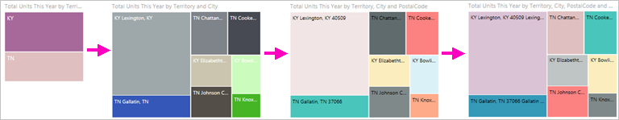

还可以选择是一次向下钻取或展开一个字段，还是一次性向下钻取或展开所有字段。

## 一次性向下钻取所有字段

1. 从显示 KY 和 TN 数据的树状图顶层开始。 选择某个句柄并向右拖动，以扩大树状图。

    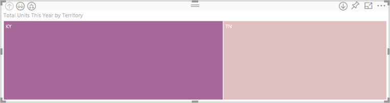

1. 若要一次性向下钻取所有字段  ，请选择可视化效果左上角的双箭头 。 该树状图现在显示了肯塔基州和田纳西州的城市数据。

    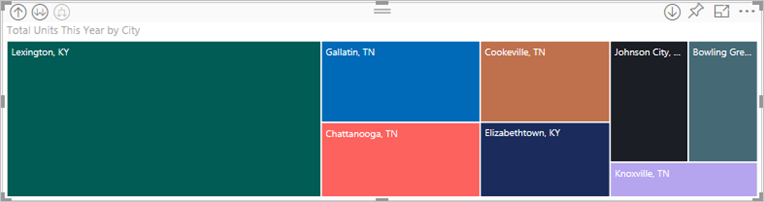

1. 再向下钻取一次，以钻取到层次结构的邮政编码级别。

    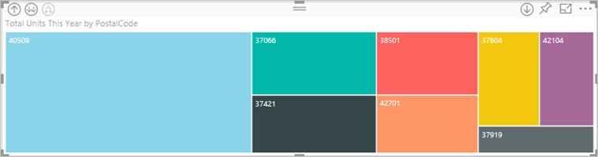

1. 要向上钻取，请选择可视化效果左上角的向上箭头 。

## 逐一向下钻取字段

此方法使用向下钻取图标，该图标显示在可视化效果本身的右上角。

1. 选择向下钻取图标以启用向下钻取： 。

    现在，可以逐一向下钻取字段  。

    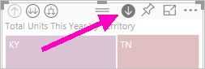

    如果不启用向下钻取，选择可视化效果元素（如条形、气泡或叶）不会向下钻取， 而是会交叉筛选报表页上的其他图表。

1. 选择“TN”  对应的叶。 此时，树状图显示田纳西州有商店的全部城市。

    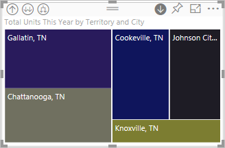

1. 此时可以：

    1. 继续向下钻取田纳西州。

    1. 向下钻取田纳西州的特定城市。

    1. 改为展开（请参阅下面的“一次性展开所有字段”  ）。

    让我们继续逐一向下钻取字段。  选择“诺克斯维尔，TN”  。 此时，树状图显示诺克斯维尔市商店的邮政编码。

    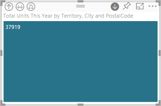

    请注意，标题随向下钻取和再次向上钻取而进行更改。

## 全部展开和逐一展开

拥有仅显示邮政编码的树状图并不能获取丰富信息。  因此，让我们展开层次结构中的下一级别。  

1. 当树状图处于活动状态时，选择“向下展开”  图标 。 此时，树状图显示层次结构的两个级别：邮政编码级别和商店名称级别。

    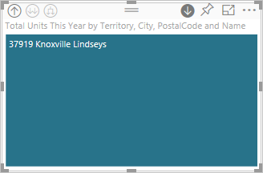

1. 若要查看田纳西州全部四个级别层次结构的数据，请选择向上钻取箭头，直到钻取到树状图的第二个级别，即“今年总销售单位数(按区域和城市)”  。

    

1. 请确保向下钻取仍处于启用状态 ， 并选择“向下展开”  图标 。 此时，树状图显示一些其他详细信息。 它不仅显示州和城市，现在还显示邮政编码。

    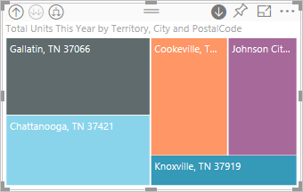

1. 再选择“向下展开”  图标一次，以在树状图中显示田纳西州全部四个级别层次结构的详细信息。 将鼠标悬停在叶节点上，可查看更多详细信息。

    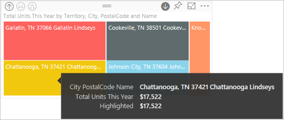

## 钻取筛选其他视觉对象

在钻取模式下工作时，需要决定向下钻取和扩展如何影响页面上的其他可视化效果。

默认情况下，钻取不会筛选报表中的其他视觉对象。 可以在 Power BI Desktop 和 Power BI 服务中启用此功能。

1. 在 Desktop 中，选择“格式”选项卡，并选择“钻取筛选其他视觉对象”复选框   。

    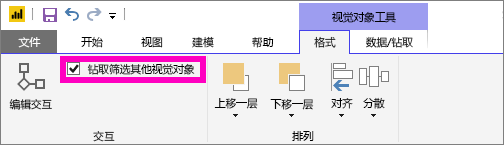

1. 现在，如果在有层次结构的可视化效果中向下钻取、向上钻取或展开，相应操作会筛选报表页上的其他视觉对象。

    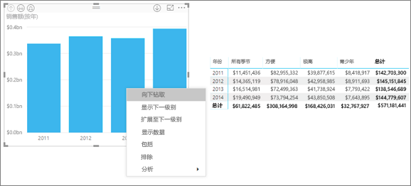

    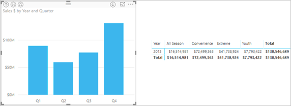

> [!NOTE]
> 若要在 Power BI 服务中启用此功能，请在顶部菜单栏中依次选择“视觉对象交互”   > “钻取筛选其他视觉对象”  。
>
> 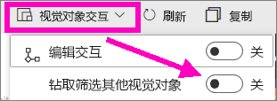

## 了解层次结构轴和层次结构组

可以将层次结构轴和层次结构组视为可以用来增加和减少要查看的数据的粒度的机制。 任何可以分入类别和子类别的数据都能有层次结构，包括日期和时间。

可以在 Power BI 中创建有层次结构的可视化效果，具体方法是选择一个或多个要添加到“轴”  井或“组”  井的数据字段。 然后，将要作为数据字段检查的数据添加到“值”  井中。 可以通过可视化效果的左上角和右上角是否显示“钻取模式”  图标，判断数据是否有层次结构。

实际上，考虑这两种类型分层数据会很方便：

- 日期和时间数据 - 如果具有日期/时间数据类型的数据字段，则已经具有分层数据。 Power BI 会自动为所有数据字段创建层次结构。 可以将这些值分析到 [DateTime](https://msdn.microsoft.com/library/system.datetime.aspx) 结构中。 仅需将一个“日期/时间”字段添加到“轴”或“组”井。  

- 分类数据 - 如果 Power BI 从包含子集合的集合派生数据，或有多行共用公共值的数据，表明数据有层次结构。

Power BI 支持展开一个子集或所有子集。 可以向下钻取数据以查看每个级别的一个子集，也可以向下钻取以同时查看每个级别的所有子集。 例如，可以向下钻取特定年份，或沿着层次结构查看每年的所有结果。

还可以同样方式向上钻取。

以下各节介绍从最高视图、中间视图和最低视图向下钻取。

### 分层数据和时间数据

对于此示例：

1. 跟着[零售分析示例](../sample-datasets.md)一起操作，并创建研究以下字段的堆积柱形图可视化效果：

    | 井 | 字段 |
    | ---- | ----- |
    | 轴 | 时间 \|\_ 月份 |
    | 值 | 销售额 \|\_ 总销售额 |

    即使轴数据字段为“月份”，它仍在“轴”井中创建“年份”。    这是因为 Power BI 为它读取的所有值提供完整的日期/时间结构。 层次结构的顶部显示年份的数据。

    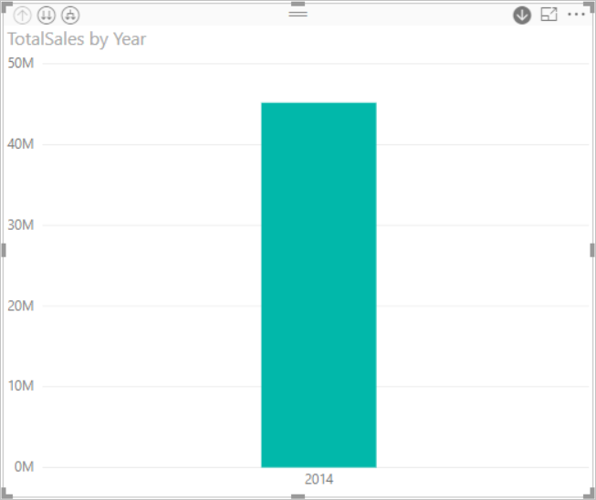

1. 启用向下钻取模式后，选择图表中的条形，以向下钻取到层次结构的下一个级别。 此时，你会看到三个条形，分别显示季度数据。

1. 然后，从左上角图标中，选择“展开层次结构的所有下一个级别”  。

1. 再执行一次此操作，以展开到层次结构的最低级别，即显示每月的结果。

    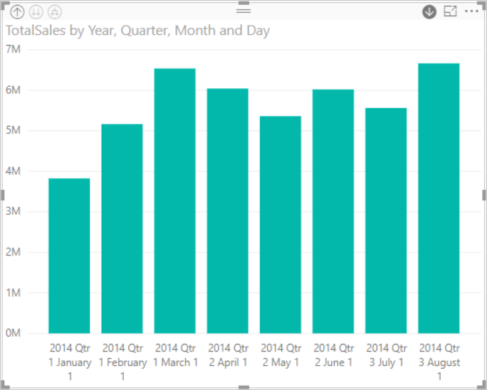

除了可视化效果，我们还可以看到每个报表呈现的数据中反映的层次结构。 依次选择右上角的省略号和“显示数据”  。 下表显示从一个月份或所有月份向下钻取的结果：

|展开模式|年份|季度|月份|日|
| --- |:---:|:---:|:---:|---|
|单向|||||
|全部|||||

请注意，“季度”  和“年”  报表的数据是相同的。 向下钻取到为“值”  指定的详细级别后，你就会明白“一个月份”报表如何变得更为具体，“所有月份”报表如何包含更多数据。

### 分层类别数据

从集合和子集合建模的数据是分层的。

位置数据就是一个很好的例子。 请考虑其列是“国家/地区”、“省/自治区/直辖市”、“城市”和“邮政编码”的数据源中的表。 共享相同的“国家/地区”、“省/自治区/直辖市”、“城市”的数据是分层的。

对于此示例：

1. 跟着[零售分析示例](../sample-datasets.md)一起操作。 创建研究以下字段的堆积柱形图可视化效果：

    | 井 | 字段 |
    | ---- | ----- |
    | 值 |销售额 \|\_ 今年总销售单位数 |
    | 轴 | 商店 \|\_ 区域 \|\_ 城市 - 可能需要将“城市”从“图例”  井拖到“轴”  井。 \|\_ 邮政编码 \|\_ 名称 |

    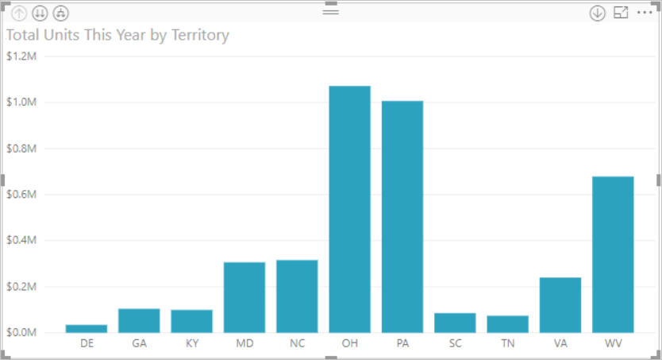

1. 启用向下钻取模式后，从左上角图标中，选择“展开层次结构的所有下一个级别”  三次。

    你将处于层次结构的最低级别，此级别显示“区域”、“城市”、“邮政编码”的结果。

    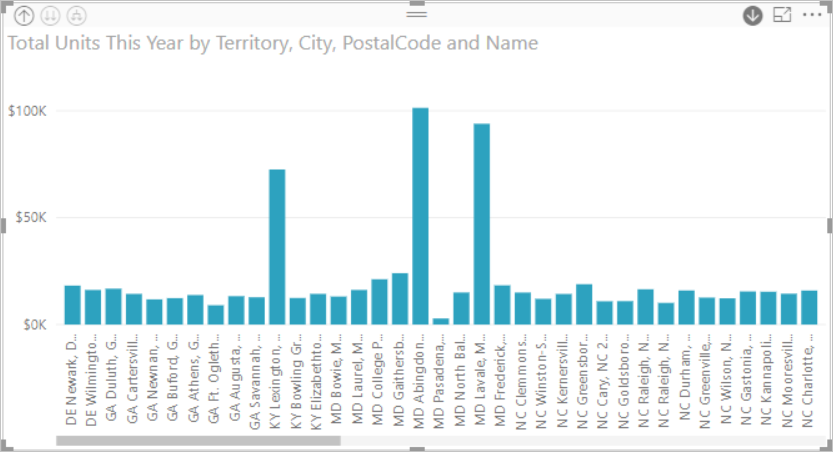

除了可视化效果，我们还可以看到每个报表呈现的数据中反映的层次结构。 依次选择右上角的省略号和“显示数据”  。 下表显示向下钻取一个区域或所有区域的结果。

| 展开模式|区域|城市|邮政|名称|
| ---|:---:|:---:|:---:|---|
|单向|||||
|全部|||||

 向下钻取时，你就会明白“一个区域”  报表如何变得更为具体，“所有区域”  报表如何包含更多数据。

## 注意事项和限制

如果在向可视化效果添加日期字段后无法创建层次结构，可能是因为日期字段实际上并未另存为日期。 如果拥有数据集：

1. 在 Power BI Desktop 的“数据”  视图中打开它。

1. 选择有日期的列。

1. 在“建模”  选项卡上，将“数据类型”  更改为“日期”  或“日期/时间”  。

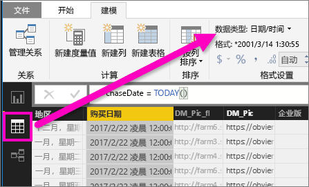

如果已与你共享该报表，则与所有者联系以请求更改。

## 后续步骤

[Power BI 报表中的可视化效果](../visuals/power-bi-report-visualizations.md)

[Power BI 报表](end-user-reports.md)

[Power BI - 基本概念](end-user-basic-concepts.md)

更多问题？ [尝试参与 Power BI 社区](http://community.powerbi.com/)
