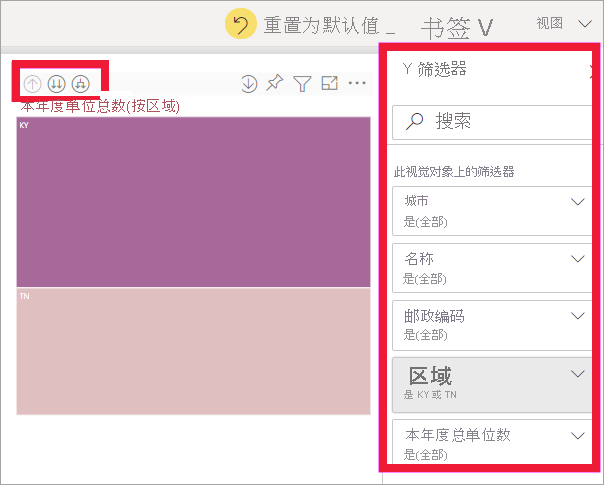
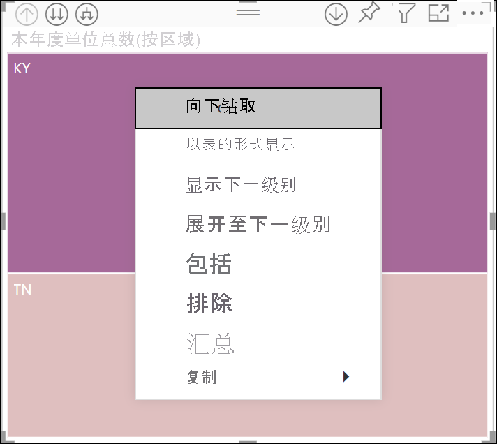
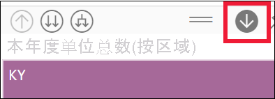
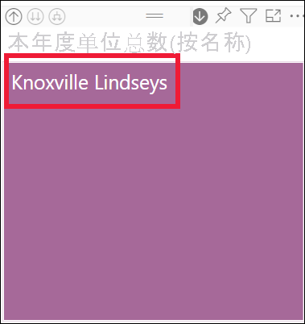
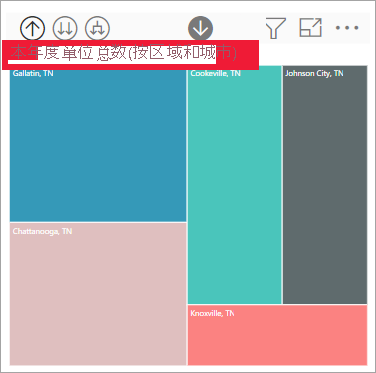
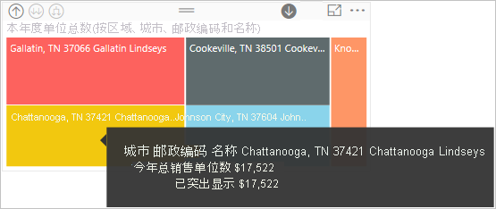
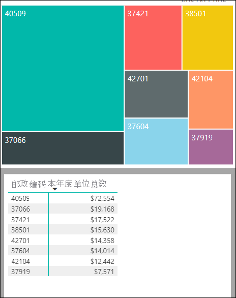

# Power BI 视觉对象中的钻取模式

[!INCLUDE[consumer-appliesto-yyny](../includes/consumer-appliesto-yyny.md)]

本文介绍了如何在 Microsoft Power BI 服务的视觉对象中向下钻取。 对数据点使用向下钻取和向上钻取，可以深入了解数据的详细信息。 

## 需要具有层次结构才能进行钻取

视觉对象具有层次结构时，可以向下钻取以显示其他详细信息。 假设有一个视觉对象，该视觉对象按由运动、专业和事件组成的层次结构查看奥运会奖牌数。 默认情况下，该视觉对象将按运动（体操、滑冰、水上项目等）显示奖牌数。 但是，因其具有层次结构，选择其中一个可视元素（如条形图、折线图或气泡图）将显示更多包含详细信息的图片。 选择“水上运动”元素将会显示游泳、潜水和水球的数据  。  选择“潜水”元素将会显示跳板、跳台和双人跳水活动项目的详细信息  。

日期是层次结构的唯一类型。  报表设计器通常会向视觉对象添加日期层次结构。 常见的日期层次结构包含年份、季度、月份和日。 

## 确定可钻取的视觉对象
不确定哪个 Power BI 视觉对象包含层次结构？ 请将鼠标悬停在视觉对象上。 如果顶部显示这些钻取控件的组合，则视觉对象具有层次结构。

  

## 了解如何向下钻取和向上钻取

在此示例中，我们使用的树状图具有由区域、城市、邮政编码和商店名称组成的层次结构。 钻取之前的树状图可按区域查看本年度总销量。 区域是层次结构的顶级。

  

### 访问钻取功能的两种方式

可以通过两种方式访问针对有层次结构的视觉对象的向下钻取、向上钻取及展开功能。 试一试这两种方式，并使用最喜欢的一种方式。

- 第一种方式：将鼠标悬停在视觉对象上，可查看并使用图标。 通过选择向下箭头，先启用向下钻取。 灰色背景表示向下钻取处于活动状态。   

    

- 第二种方式：右键单击视觉对象，可显示并使用菜单。

    

## 钻取路径

### 一次性向下钻取所有字段

可通过多种方法来钻取视觉对象。 选择双箭头“向下钻取”图标将转到层次结构中的下一个级别。 如果要查看肯塔基州和田纳西州的“区域”级别，则可以向下钻取到这两个州的城市级别，然后向下钻取到这两个州的邮政编码级别，最后向下钻取到这两个州的商店名称级别。 在这一路径中每向前一步，都会显示出新的信息。

选择“向上钻取”图标  直到返回到“本年度总销量(按区域)”。

### 一次性展开所有字段

**展开** 可向当前视图添加一个额外的层次结构级别。 因此，如果要查看“区域”级别，可以同时展开树中的所有当前叶。  第一次钻取会添加 KY 和 TN 的城市数据。 下一次钻取会添加 KY 和 TN 的邮政编码数据，并保留城市数据。 在这一路径中每向前一步，都会显示相同的信息并添加一级新的信息。

### 逐一向下钻取字段

1. 选择向下钻取图标以启用向下钻取： .

    现在，可以通过选择视觉对象元素逐一向下钻取字段。 视觉对象元素示例包括：条形图、气泡图和叶。

    

    如果不启用向下钻取，选择视觉对象元素（如条形、气泡或叶）不会向下钻取。 而是会交叉筛选报表页上的其他图表。

1. 选择“TN”对应的叶节点。 此时，树状图显示田纳西州有商店的全部城市和区域。

    

1. 此时可以：

    1. 继续向下钻取田纳西州。

    1. 向下钻取田纳西州的特定城市。

    1. 改为展开。

    让我们继续逐一向下钻取字段。  选择“诺克斯维尔，TN”。 此时，树状图显示诺克斯维尔市商店的邮政编码。

    

    请注意，标题随向下钻取和再次向上钻取而进行更改。

    向下钻取另一个字段。 选择邮政编码 37919，然后向下钻取到商店名称。 

        

    对于此特定数据，一次向下钻取所有级别可能无趣。 让我们来尝试展开。

### 全部展开和逐一展开

拥有仅显示邮政编码或仅显示商店名称的树状图并不能获取丰富信息。  因此，让我们展开层次结构中的下一级别。  

1. 首先，向上钻取到邮政编码级别。     
1. 当树状图处于活动状态时，选择“向下展开”图标。 此时，树状图显示层次结构的两个级别：邮政编码级别和商店名称级别。

    

1. 若要查看田纳西州全部四个级别层次结构的数据，请选择向上钻取箭头，直到钻取到第二个级别，即“今年总销售单位数(按区域和城市)”。

    

1. 请确保向下钻取仍处于启用状态 ， 并选择“向下展开”图标。 树状图现在显示相同数量的叶（框），但每个叶都有更多详细信息。 它不仅显示州和城市，现在还显示邮政编码。

    

1. 再选择“向下展开”图标一次，以在树状图中显示田纳西州全部四个级别层次结构的详细信息。 将鼠标悬停在叶节点上，可查看更多详细信息。

    

## 在钻取时显示数据
使用“以表的形式显示”了解内在情况。 每次钻取或展开时，“以表的形式显示”都可显示用于构建视觉对象的数据。 这有助于了解如何结合使用层次结构、钻取和展开以构建视觉对象。 

选择右上角的“更多选项”(…)，然后选择“以表的形式显示”。 

Power BI 打开树状图，以便填充画布。 构成树状图的数据显示在视觉对象下方。 

在画布中单独显示视觉对象后，继续钻取。 查看表中的数据发生变化，以反映用来创建树状图的数据。 下表显示了一次性向下钻取从区域到商店名称的所有字段的结果。 第一个表表示层次结构的顶级，树状图显示两个叶，一个用于 KY，一个用于 TN。 接下来的三个表表示树状图的数据，因为你可以一次向下钻取所有级别（从区域到城市，到邮政编码，再到商店名称）。

请注意，“城市”、“邮政编码”和“名称”的总数相同。 总数并非总是匹配。  但对于此数据，每个邮政编码和每个城市只对应一个商店。  

## 注意事项和限制
- 默认情况下，钻取不会筛选报表中的其他视觉对象。 但是，报表设计器可以更改此默认行为。 钻取时，查看页面上的其他视觉对象是交叉筛选还是交叉突出显示。

- 查看已与你共享的报表需要 Power BI Pro 或 Premium 许可证，或需要将报表存储在 Power BI Premium 容量中。 [我有哪种许可证？](end-user-license.md)

## 后续步骤

[Power BI 报表中的视觉对象](../visuals/power-bi-report-visualizations.md)

[Power BI 报表](end-user-reports.md)

[Power BI - 基本概念](end-user-basic-concepts.md)

更多问题？ [尝试参与 Power BI 社区](https://community.powerbi.com/)
