# 快速入门 - 使用 Power BI 服

[!INCLUDE [power-bi-service-new-look-include](../includes/power-bi-service-new-look-include.md)]

你现已掌握 Power BI 的基础知识，接下来了解 Power BI 服务  。 如前所述，团队中有人可能将所有时间都花在 Power BI Desktop 上，为其他人合并数据和创建报表  。 但在另一方面，你的时间可能都花在了 Power BI 服务上，用来查看其他人创建的内容并与他们交互（使用体验），  。 在此快速入门中，你将导入示例数据并使用该数据来了解 Power BI 服务的使用方式。 
 
## 先决条件

- 如果未注册 Power BI，请[免费注册](https://app.powerbi.com/signupredirect?pbi_source=web)后再进行操作。

- 了解 [Power BI 服务的基本概念](end-user-basic-concepts.md)

## 打开 Power BI 服务

首先，打开 Power BI 服务 (app.powerbi.com) 并导航到主页  。 
1. 如果左侧导航窗格已折叠，则请选择导航窗格图标  将其展开。 

1. 选择“主页”（如果它尚未打开）  。 

1. 获取示例数据。 我们将获取一些用于 Power BI 服务教程的示例数据。 我们提供了各种类型的示例数据供你浏览，这次我们将使用营销和销售数据。 

    要继续操作，请按照这些说明安装[“销售和市场营销示例”应用](end-user-app-marketing.md)。

1. 安装应用后，从导航窗格中选择“应用”  。 

   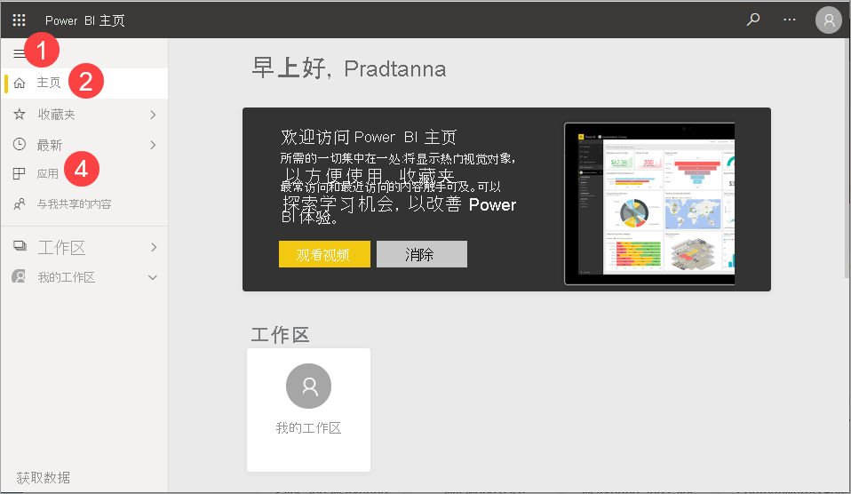

2. 在“应用”屏幕上，选择“销售和市场营销示例”应用   。

    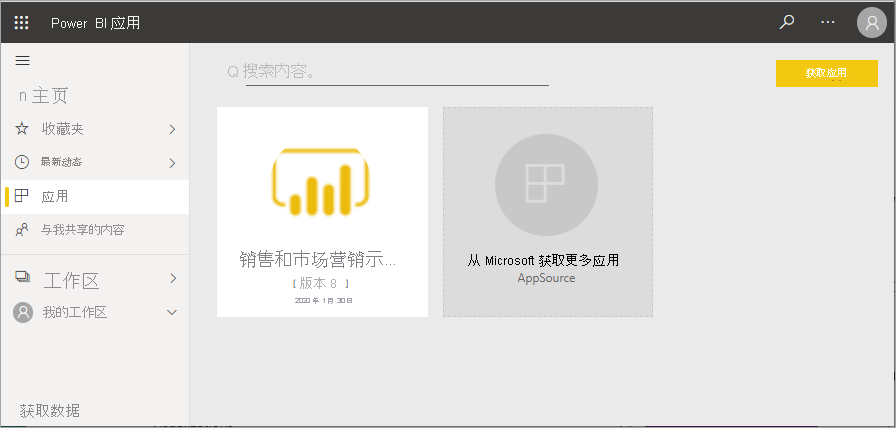

2. 选择“浏览应用”  。

    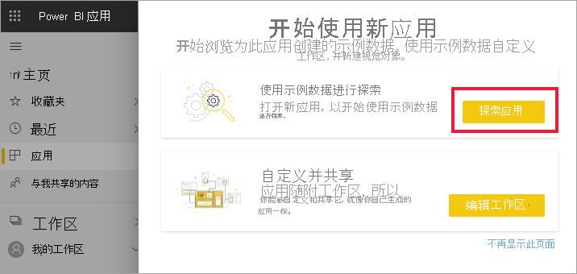

3. Power BI 服务会打开应用的仪表板。 仪表板可区分 Power BI 服务和 Power BI Desktop。 该示例还包含一个报表和数据库。 

    

    作为使用者，你收到的大部分应用都不包含对基础数据库的直接访问权限  。 由于 Power BI 示例是为所有 Power BI 使用者创建的，因此包含数据集。 你的设计者同事们可使用这些数据集来了解如何创建新的仪表板和报表  。 

## 查看内容（仪表板和报表）
让我们先来看看基本内容（仪表板、报表、应用）的组织方式。 在工作区的上下文中显示内容。 每个使用者都至少有一个工作区，叫做“我的工作区”  。 每次安装应用时，都会为该应用创建一个工作区。  由于我们安装了“销售和市场营销示例”应用，因此我们现在有两个工作区。 

从左侧导航栏中选择“工作区”来自行查看  。 

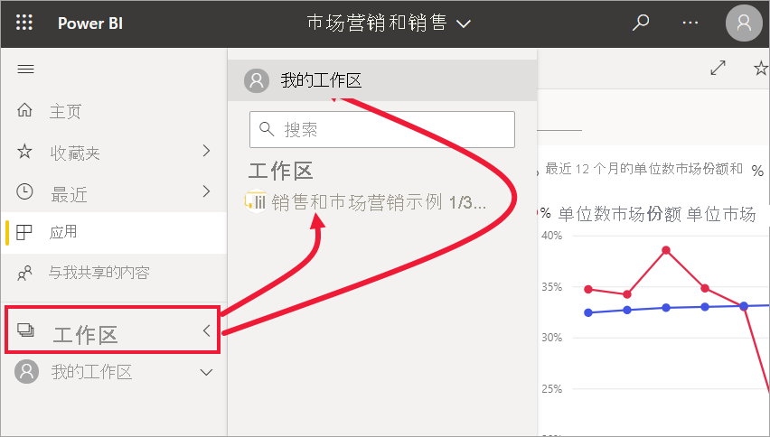

“我的工作区”存储了你拥有和创建的所有内容  。 可以将其作为你的个人沙盒或自己内容的工作区域。 对于很多 Power BI 使用者来说，“我的工作区”保持为空，因为你的作业并不涉及到创建新内容   。  根据定义，使用者会使用其他人创建的数据并使用该数据作出业务决策  。 如果你发现自己正在创建内容，不妨改为阅读[面向报表创建者  的 Power BI 文章](../index.yml)。

“应用工作区”包含该特定应用的所有内容  。  当设计人员创建一个应用时，他们会将使用该应用所必需的全部内容捆绑在一起  。  请选择“销售和市场营销”工作区，查看设计人员将哪些内容捆绑到了应用中  。 

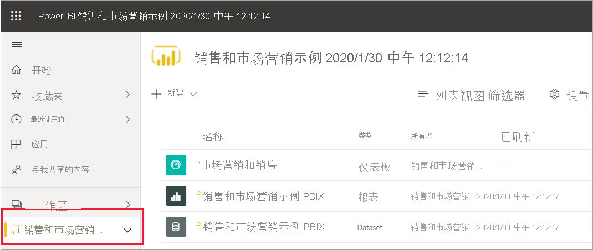

“销售和市场营销”应用工作区包含一个仪表板、一个报表和一个数据集。 并非每个应用都包含这三项内容。 一个应用可能只包含一个仪表板、每种内容类型中包含三个，或者甚至包含 20 个报表。 这一切都取决于设计人员在应用中随附的内容  。 由于销售和市场营销数据是一个示例，因此它包含一个数据集。 但更常见的是，面向使用者的应用工作区不包含任何数据集  。 

工作区不仅仅是一个简单的内容列表。 在本页上，你可详细了解工作区的仪表板和报表。 请花几分钟时间来确定内容所有者、上次刷新日期、相关内容和引导指南。 如果工作区有说明，则该说明可帮助你更好地了解该工作区的目标，以及你可如何使用它来实现你的业务目的。 而如果工作区中有大量内容，可使用搜索和排序选项快速找到你需要的内容。

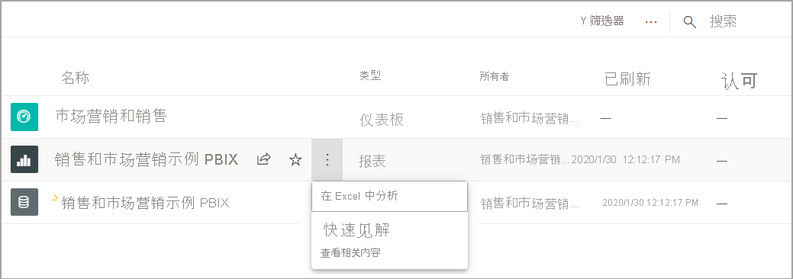

工作区也是指向数据的路径之一。 可从列表中选择仪表板或报表将其打开。  可将鼠标悬停在仪表板或报表上方并选择星形图标将其放入收藏夹。 如果设计人员向你授予了[共享权限](end-user-shared-with-me.md)，则悬停鼠标还会显示共享操作。 

通过选择仪表板名称打开仪表板。

## 收藏仪表板和报表
 利用收藏夹能快速访问你认为最重要的内容。 你刚才了解了如何将工作区中的仪表板放入收藏夹。 你还可直接从仪表板或报表创建收藏项。

1. 在打开的仪表板中，从菜单栏上选择“收藏夹”  。
   
   
   
   此时，“**收藏**”变为“**取消收藏**”，星标变为黄色。
   
   

2. 要显示已加入收藏夹的所有内容的列表，请从导航窗格中选择“收藏夹”右侧的箭头  。 导航窗格是 Power BI 服务的一项永久性功能，因此可在 Power BI 服务中的任何位置访问此列表。
   
    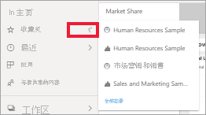
   
    截至目前，此 Power BI 用户有 4 个收藏项。 收藏夹可以是仪表板、报表或应用。  

要了解详细信息，请参阅[收藏](end-user-favorite.md)

## 查找最新内容

1. 与收藏夹类似，通过选择导航窗格中“最近访问的内容”旁边的箭头，可在 Power BI 服务中的任意位置快速查看最近访问的内容  。

   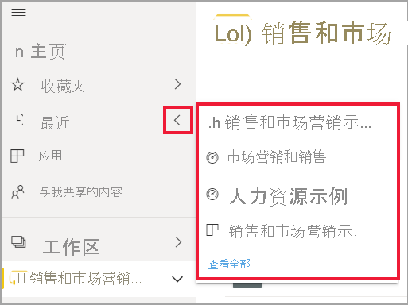

    在浮出控件中选择内容将其打开。

2. 有时，你不想只打开最近访问的内容，而是希望查看信息或执行其他操作，例如查看见解或导出到 Excel。 在此类情况下，可通过从导航窗格中选择“最近访问的内容”或其图标，打开“最近访问的内容”窗格   。 在本例中，Power BI 用户有多个工作区，因此此列表可能包含其所有工作区中的内容。

   

若要了解详细信息，请参阅[Power BI 中最近使用的项目](end-user-recent.md)

### 对内容进行搜索和排序
刚使用 Power BI 服务时，你只有少量的内容。 但随着同事开始与你共享内容以及你开始下载应用，你最终可能会有大量的内容。 那时你会发现搜索和排序非常有用。

几乎可以从 Power BI 服务的每个部分进行搜索。 只需查找搜索框或搜索放大镜图标即可。    

在“搜索”字段中，键入仪表板、报表、工作簿、应用或所有者的完整或部分名称。 Power BI 会搜索所有内容。

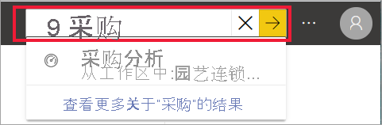

也有多种方式可对内容进行排序。 请将鼠标悬停在列标题上，查找表示可对列进行排序的箭头。 不是所有列都可以进行排序。 

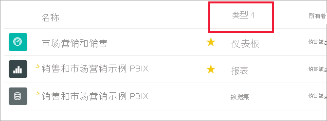

或者，查找在画布右上角附近的排序控件。 选择是按日期、名称还是所有者进行升序或降序排列。  

若要了解详细信息，请参阅 [Power BI 导航：搜索和排序](end-user-search-sort.md)

## Power BI 主页
我们最后将在此快速入门中讲讲一开始提到的内容，即 Power BI 主页  。 

“主页”将搜索和排序工具、导航窗格和画布汇聚在一起，有卡片供你选择来打开仪表板、报表和应用  。 最开始，“主页”画布上可能没有很多卡片，但随着你开始与同事一起使用 Power BI，这种情况将会发生改变。 “主页”画布也会更新推荐的内容和学习资源。

有关详细信息，请参阅 [Power BI 主页](end-user-home.md)

## 清理资源
完成本快速入门后，你可根据需要删除示例仪表板、报表和数据集。

1. 打开 Power BI 服务 (app.powerbi.com) 并登录。    
2. 打开 Power BI 主页、向下滚动到“工作区”，再选择“销售和市场营销”   。      

3. 将鼠标悬停在仪表板、报表或数据集上，然后选择“更多选项(...)” > “删除”。 重复此操作，直到三项内容均被删除。

    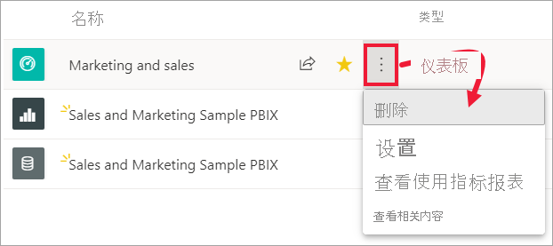

## 后续步骤

> [!div class="nextstepaction"]
> [Power BI 服务中的“阅读视图”](end-user-reading-view.md)
