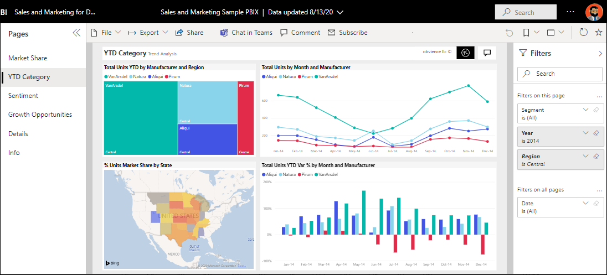

# 快速入门 - 使用 Power BI 服

[!INCLUDE [power-bi-service-new-look-include](../includes/power-bi-service-new-look-include.md)]

你现已掌握 [Power BI 的基础知识](end-user-basic-concepts.md)，接下来让我们了解 Power BI 服务。 如前一篇文章中所述，团队中的同事可能将所有时间都花在 Power BI Desktop 上，为其他人合并数据和创建报表、仪表板和应用。 他们是设计者。 另一方面，你的时间可能都花在了 Power BI 服务上，用来查看其他人创建的内容并与之交互（使用体验）。 你是企业用户。 本快速入门适用于企业用户。 

   
 
## 先决条件

- 如果未注册 Power BI，请[免费注册](https://app.powerbi.com/signupredirect?pbi_source=web)后再进行操作。

- 了解 [Power BI 服务的基本概念](end-user-basic-concepts.md)

- 查看设计者创建的 Power BI 内容（报表、仪表板、应用）需具备以下两种条件之一：
    - 一个 Power BI Pro 许可证
    - 你的组织要拥有一个 Power BI Premium 订阅，并从高级容量与你共享内容。    
    [了解许可证和订阅](end-user-license.md)。     

    为介绍本快速入门，我们不要求满足这些条件中的任何一个。 Microsoft 已直接在 Power BI 服务界面中提供了示例内容。 我们将使用此示例内容来了解 Power BI 服务。 

## 打开 Power BI 服务

若要开始，请打开 Power BI 服务 (app.powerbi.com)。 
1. 如果左侧导航窗格已折叠，则请选择导航窗格图标  将其展开。 

1. 在左下角，选择“获取数据”。 我们将获取一些用于 Power BI 服务教程的示例数据。 我们提供了各种类型的示例数据供你浏览，这次我们将使用营销和销售数据。 

   

1. “获取数据”屏幕打开后，选择“示例”。

   

1. 选择“销售和营销” > “连接”。 

   

5. Power BI 服务在“我的工作区”中安装示例。  “我的工作区”是用于学习和试验的专用沙盒。  只有你自己才能看到“我的工作区”中的内容。 示例包含一个仪表板、一个报表和一个数据集。 通常情况下，企业用户不会收到数据集，但由于此示例是为所有用户设计的，因此它包含一个数据集。

    

    作为企业用户，与你共享的大多数内容不会包括对基础数据集的直接访问。 由于 Power BI 示例是为所有 Power BI 使用者创建的，因此包含数据集。   

    若要了解有关示例的详细信息，请参阅[获取 Power BI 的示例](../create-reports/sample-datasets.md)。

## 查看内容（仪表板和报表）
在工作区的上下文中组织内容。 每个企业用户都至少有一个工作区，叫做“我的工作区”。 当设计者同事与你共享内容时，你可能会看到其他工作区。  例如，如果某位设计者向你分配对其中的某个工作区的访问权限，则该工作区将显示在你的 Power BI 站点中。  

“我的工作区”存储了你拥有和创建的所有内容。 可以将其作为你的个人沙盒或自己内容的工作区域。 对于很多 Power BI 企业用户来说，“我的工作区”仍然是空的，因为你的工作不涉及新建内容。  根据定义，企业用户会使用其他人创建的数据，并根据此数据做出业务决策。 如果你发现自己正在创建内容，不妨改为阅读[面向报表创建者  的 Power BI 文章](../index.yml)。

工作区不仅仅是一个简单的内容列表。 在本页上，你可详细了解工作区的仪表板和报表。 请花几分钟时间来确定内容所有者、上次刷新日期、数据敏感度和引导指南（如果有）。 选择“更多操作(...)”可显示仪表板和报表的操作列表。   

要了解详细信息，请参阅[工作区](end-user-workspaces.md)。

工作区也是指向数据的路径之一。 在工作区中，可从列表中选择仪表板或报表将其打开。  可将鼠标悬停在仪表板或报表上方并选择星形图标将其放入收藏夹。 如果设计者向你分配[共享权限](end-user-shared-with-me.md)，你也可以从此处共享。 

1. 选择仪表板的名称以将其打开。 仪表板可区分 Power BI 服务和 Power BI Desktop。 [了解仪表板](end-user-dashboards.md)

    

2. 可以在仪表板上执行的操作显示在顶部菜单栏中。    

    

3. 将鼠标悬停在仪表板磁贴上，然后选择“更多选项(...)”，以查看与该磁贴交互可执行的选项。

    

4. 选择仪表板磁贴，打开用于创建该磁贴的报表。 报表会打开包含该磁贴上的视觉对象的页面。 在此处，我选择了包含树状图的仪表板磁贴。 Power BI 服务将打开“YTD 类别”报表页面。

    

    报表包含多个部分。 左侧是可单击的报表页列表。 顶部是菜单栏，其中包含可对报表执行的操作。  可用选项将取决于报表设计者向你分配的角色和权限。 右侧是“筛选器”窗格。 中心画布包含报表本身。 与仪表板类似，此处包含可对整个报表、单个视觉对象以及单个报表页执行的操作。 

    了解报表 [Power BI 报表](end-user-reports.md)。

## 使用左侧导航窗格
当同事与你共享内容时，导航窗格会更有帮助。 在本部分的快速入门中，我们先将销售和营销示例放在一边，并查看拥有大量共享内容的 Power BI 企业用户的仪表板和报表。

1. “主页”是你登录到 Power BI 服务时的默认登录页面。 “主页”是一种很好的跳转点，也是导航内容的另一种方式。 “主页”上的内容按收藏夹、最近访问、最常访问和精选的方式组织在一起。 “主页”还显示最近访问的工作区和应用。 只需选择一个项目即可将其打开。

    “主页”将搜索和排序工具、导航窗格和画布汇聚在一起，有卡片供你选择来打开仪表板、报表和应用  。 最开始，“主页”画布上可能没有很多卡片，但随着你开始与同事一起使用 Power BI，这种情况将会发生改变。 “主页”画布也会更新推荐的内容和学习资源。

   

    要了解详细信息，请参阅 [Power BI 主页](end-user-home.md)

2. “收藏夹”和“最近访问”都有箭头。 选择一个箭头，快速查看前五个收藏夹或五个最近访问的内容。 在浮出控件中选择内容将其打开。 

   

    若要查看收藏夹或最近访问的完整列表，请选择单词或图标。 这些内容列表提供有关报表、应用和仪表板的其他详细信息。

    

    要了解详细信息，请参阅 [Power BI 中的最近访问](end-user-recent.md)和 [Power BI 中的收藏夹](end-user-recent.md)。

4. 选择“应用”可显示已与你共享或你已安装的所有应用。 选择“与我共享”可显示已与你共享的仪表板和报表。 由于你刚开始使用 Power BI 服务，因此这些内容区域是空的。 

    了解[应用](end-user-apps.md)和[与我共享](end-user-shared-with-me.md)。

### 对内容进行搜索和排序
刚使用 Power BI 服务时，你只有少量的内容。 但随着同事开始与你共享内容以及你开始下载应用，你最终可能会有大量的内容。 那时你会发现搜索和排序非常有用。

几乎可以从 Power BI 服务的每个部分进行搜索。 只需查找搜索框或搜索放大镜图标即可。    

在“搜索”字段中，键入仪表板、报表、工作簿、应用或所有者的完整或部分名称。 Power BI 会搜索所有内容。

也有多种方式可对内容进行排序。 请将鼠标悬停在列标题上，查找表示可对列进行排序的箭头。 不是所有列都可以进行排序。 

或者，查找内容列表右上角附近的搜索筛选器。 通过从内容类型、所有者或任何其他可用字段中进行选择来快速查找内容。

若要了解详细信息，请参阅 [Power BI 导航：搜索和排序](end-user-search-sort.md)

## 查找所有者
在本快速入门结尾，我们将提供一个有用的提示。 如果对仪表板、报表或应用有任何疑问，可以查找所有者。 打开内容后，选择标题下拉列表可显示所有者。 所有者可能是个人或团体。

## 清理资源
完成本快速入门后，你可根据需要删除示例仪表板、报表和数据集。

1. 打开 Power BI 服务 (app.powerbi.com) 并登录。    
2. 打开 Power BI 主页，向下滚动并选择“我的工作区”。      

3. 将鼠标悬停在仪表板、报表或数据集上，然后选择“更多选项(...)” > “删除”。 重复此操作，直到三项内容均被删除。

    

## 后续步骤

> [!div class="nextstepaction"]
> [Power BI 服务中的“阅读视图”](end-user-reading-view.md)
