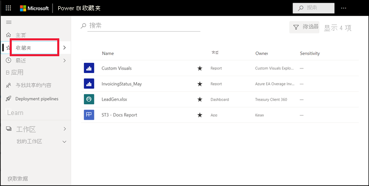
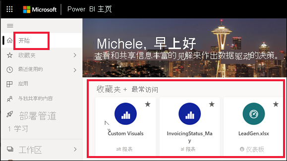
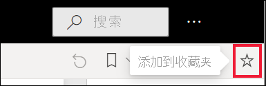
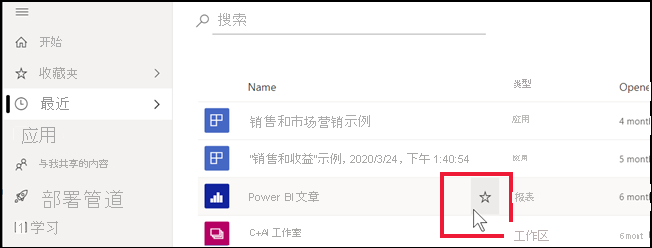
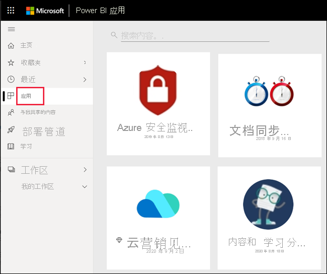
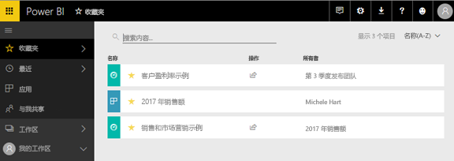
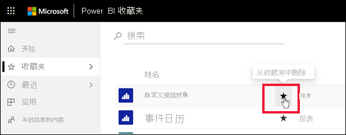

# 在 Power BI 服务中收藏仪表板、报表和应用

[!INCLUDE[consumer-appliesto-yyny](../includes/consumer-appliesto-yyny.md)]

将内容设为“收藏项”时，可从“收藏夹”内容列表以及从 Power BI **主页** > “收藏夹 + 最常访问”中快速访问该内容    。 收藏夹通常是最常访问的内容，并且标有实心星形。

   

   

## 将仪表板或报表添加为收藏项

1. 打开经常使用的仪表板或报表。 即使是与你共享的内容也可以成为收藏项。

2. 在 Power BI 服务的上方菜单栏中，选择“收藏夹”或星形  图标  。
   
   
   
   你还可以在看到星形图标的任意位置（例如，“主页”、“最近”、“应用”和“与我共享”）收藏仪表板或报表。 
   
   

## 将应用添加为收藏项

1. 从导航窗格中，选择“应用”  。

   

2. 将鼠标悬停在应用上，显示更多详细信息。 选择星形  图标设置为收藏。
   
   

## 使用收藏夹
1. 要访问收藏夹，请选择“收藏夹”右侧的浮出控件箭头  。 在此处可以选择一个收藏项来打开它。 最多列出五个收藏项（按字母顺序排列）。 如果收藏项超过五个，可选择“查看全部”，打开收藏夹内容列表  。 
   
   
2. 若要查看已添加为收藏项的所有内容，请在导航窗格中选择“收藏夹”或收藏夹图标。 来折叠导航窗格。 
   
    
   
   可在此处执行操作。 可以打开收藏项、确定所有者，甚至与同事共享收藏夹。

## 取消收藏内容
如果不再像以前那样频繁地使用某个报表，则可以取消收藏。 取消收藏内容时，会从“收藏夹”列表（而不是 Power BI）中删除该内容。

1. 在导航窗格中，选择“收藏夹”以打开“收藏夹”屏幕。
   
   
2. 选择想要取消收藏的内容旁边的黑色星号。

> [!NOTE]
> 还可以取消收藏仪表板、报表或应用。 打开并选择黑色星形，将它变回为白色星形即可。 
> 
> 
## 限制和注意事项
目前可以收藏应用，并自动收藏该应用的所有报表和仪表板。 无法收藏单个应用报表或仪表板。 

## 后续步骤
- [Power BI：基本概念](end-user-basic-concepts.md)
- 更多问题？ 尝试参与 [Power BI 社区](https://community.powerbi.com/)。

