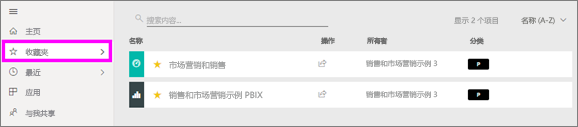
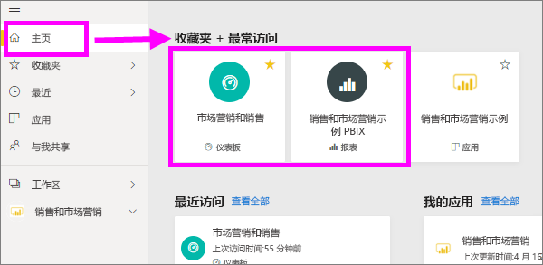
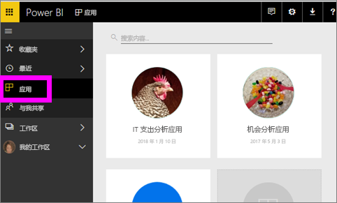
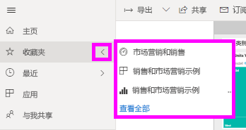
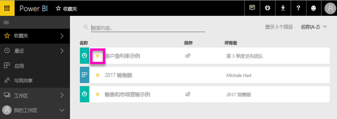

# 在 Power BI 服务中收藏仪表板、报表和应用
使内容*收藏*，你将能够访问它从快速**收藏夹**内容列表并从**主页 Power BI**  >  **收藏夹和最常访问**。  收藏夹是您最常访问和带有黄色星号标识通常内容。

   

   

您还可以选择单个仪表板作为[特色仪表板](end-user-featured.md)Power BI 服务中。

## 将仪表板或报表添加到收藏夹 

1. 打开经常使用的仪表板或报表。 即使是与你共享的内容也可以加入收藏夹  。

2. 从 Power BI 服务在上方功能区，选择**收藏**或星形图标。
   
   
   
   可以也最喜爱的仪表板或报表从任何位置看到星型图标，如家庭、 最近、 应用和共享与我。 
   
   

## 收藏应用 

1. 从导航窗格中，选择**应用**。

   

2. 将鼠标悬停在应用上，显示更多详细信息。  选择星形   图标设置为收藏。
   
   

## 使用*收藏夹*
1. 若要访问你的收藏夹，请选择右侧的箭头**收藏夹**。  在此处可以选择一个收藏来打开它。 仅列出五个收藏项（按字母顺序排列）。 如果超过五个，请选择**查看所有**以打开收藏夹内容列表 （请参阅下面的 #2）。 
   
   
2. 若要查看**所有**为收藏夹，在导航窗格中，选择已添加的内容**收藏夹**或收藏夹图标。  
   
    
   
   在此处可以进行的操作：打开、确定所有者，甚至与同事共享。

## 取消收藏内容
不再像以前那样频繁地使用报表？  你可以取消收藏。 取消收藏内容时，会从“收藏夹”列表（而不是 Power BI 中）删除该内容。

1. 在左侧导航窗格中，选择“收藏夹”  以打开“收藏夹”  屏幕。
   
   
2. 选择此内容旁边的黄色星号可取消收藏。

> [!NOTE]
> 还可以取消收藏仪表板、报表或应用本身。 只需打开并取消选中黄色图标。   
> 
> 
## 限制和注意事项
在当前时间，可以收藏应用和此自动收藏夹所有报表和仪表板为该应用。 不能向最喜欢的单个应用报表或仪表板。 

## 后续步骤
[Power BI - 基本概念](end-user-basic-concepts.md)

更多问题？ [尝试参与 Power BI 社区](http://community.powerbi.com/)

