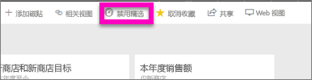

# Power BI 服务中的特色仪表板

[!INCLUDE [power-bi-service-new-look-include](../includes/power-bi-service-new-look-include.md)]

许多人都有一个访问次数最多的仪表板。 它可能是我们用于经营业务的仪表板， 也可能是聚合了来自许多不同仪表板和报表的磁贴的仪表板。

## 创建特色仪表板
在选择一个仪表板作为*特色*仪表板后，每次打开 Power BI 服务时，将同时显示并打开该仪表板。 

也可以选择几个仪表板，并将它们设置为收藏项。 请参阅[仪表板收藏](end-user-favorite.md)。

如果未设置特色仪表板，Power BI 会打开最近使用的仪表板或 Power BI **主页**。 

### 将仪表板设置为特色仪表板

1. 打开想要设置为特色仪表板的仪表板。 
2. 在顶部菜单栏中，依次选择“更多选项”(…) 和“设置为精选”   。 
   
    
3. 确认选择。
   
    

## 更改特色仪表板
如果稍后改变主意，则可以将新的仪表板设置为特色仪表板。

1. 按照前面的步骤 1 和 2 执行操作。
   
2. 选择“设置为特色仪表板”  。 取消将某个仪表板设置为特色仪表板并不会将它从 Power BI 中删除。 
   
    

## 重命名特色仪表板
如果决定不将任何仪表板指定为特色仪表板，下文介绍如何取消将某个仪表板设置为特色仪表板。

1. 打开最近设置为特色仪表板的仪表板。
2. 在顶部菜单栏中，依次选择“更多选项”(…) 和“禁用精选”   。

    
   
## 后续步骤
- [收藏仪表板](end-user-favorite.md)    
- 更多问题？ 尝试参与 [Power BI 社区](https://community.powerbi.com/)。

