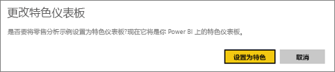
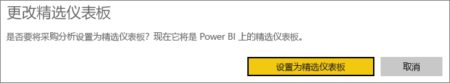
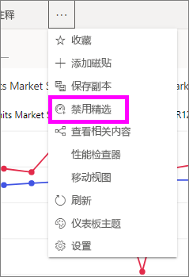

# Power BI 服务中的特色仪表板
## 创建特色仪表板
许多人都有一个访问次数最多的仪表板。  它可能是用于经营业务的仪表板，或者也可能是包含聚合了来自许多仪表板和报表的磁贴的仪表板。

当选择仪表板作为*特色*，每次打开 Power BI 服务，它会打开显示该仪表板。  

也可以选择几个仪表板，并将它们设置为收藏项  。 请参阅[仪表板收藏](end-user-favorite.md)。

如果你尚未设置精选仪表板，Power BI 将打开到您使用的最后一个仪表板或 Power BI 主页。  

### 将仪表板设置为**特色**项
观看 Amanda 创建特色仪表板，然后按照视频下面的说明自己进行尝试。

<iframe width="560" height="315" src="https://www.youtube.com/embed/G26dr2PsEpk" frameborder="0" allowfullscreen></iframe>

1. 打开想要设置为“精选”  的仪表板。 
2. 在顶部菜单栏中，选择省略号 （...） 并选择**设置为精选**。  
   
    
3. 确认选择。
   
    

## 更改特色仪表板
当然，如果你以后改变主意，则可以将新的仪表板设置为精选仪表板。

1. 按照上述步骤 1 和 2 执行操作。
   
    
2. 选择“设置为精选”  。 取消某个仪表板的“特色”并不会将它从工作区中删除。  
   
    

## 重命名特色仪表板
如果你决定不将任何仪表板指定作为精选仪表板，下面介绍了如何取消设置为精选的仪表板。

1. 打开最近设置为精选的仪表板。
2. 在顶部菜单栏中，选择省略号 （...） 并选择**禁用精选**。

    
   
## 后续步骤
[收藏仪表板](end-user-favorite.md)

更多问题？ [尝试参与 Power BI 社区](http://community.powerbi.com/)

