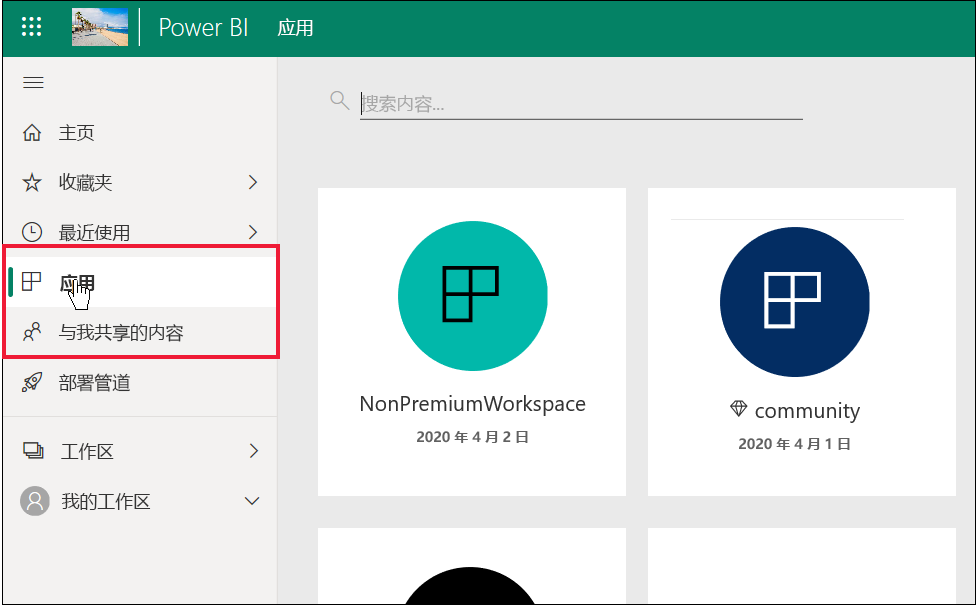
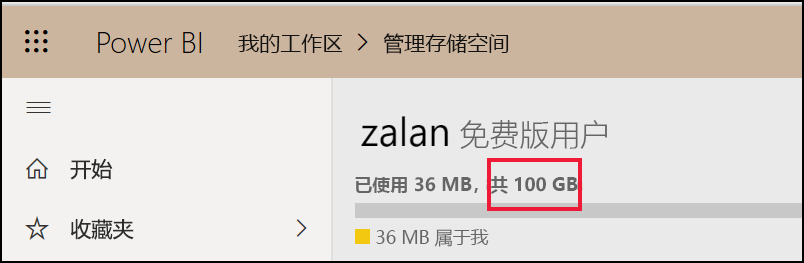
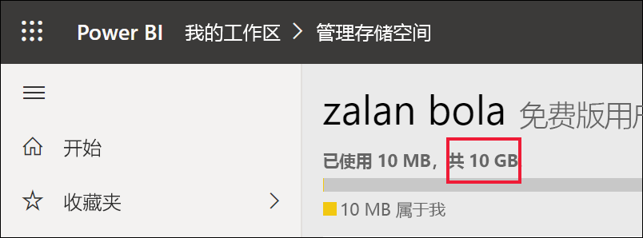

# 面向使用者和拥有免费许可证的其他用户的 Power BI 功能列表 

[!INCLUDE[consumer-appliesto-ynnn](../includes/consumer-appliesto-ynnn.md)]

作为业务用户，你可以使用 Power BI 服务来浏览报表和仪表板，以便做出业务决策。 这些报表和仪表板由拥有 Power BI Pro 许可证的设计人员创建   。 Pro 用户可以与同事共享内容，并控制同事可对该内容执行哪些操作。 有时，设计人员通过向你发送链接来共享内容，有时这些内容会自动安装并显示在 Power BI 的“应用”或“与我共享”下   。

设计人员可以通过多种方式共享内容。 但由于本文面向 Power BI 业务用户，因此将仅介绍业务用户如何接收内容并与内容交互。 有关共享内容的其他方式的详细信息，请参阅[在 Power BI 中共享工作的方式](../collaborate-share/service-how-to-collaborate-distribute-dashboards-reports.md)。

[上一篇文章](end-user-license.md)介绍了，你可以使用 Power BI 服务中的仪表板、报表和应用（内容）执行哪些操作取决于三件事：你的许可证、角色和权限以及内容的存储位置。

本文列出了 Power BI 服务中的哪些功能可供像你这样的业务用户使用。 根据定义，业务用户使用免费许可证在 Power BI 服务（不是 Power BI Desktop）中工作，并且是具有存储在高级容量中的内容的组织成员。

<art>

## 术语快速回顾
在了解这个列表之前，让我们先回顾一下 Power BI 的一些概念。 这将是一个快速回顾，如果需要更多详细信息，请访问[使用者的许可证](end-user-license.md)或 [Power BI 基本概念](end-user-basic-concepts.md)。

### 工作区和角色
有两种类型的工作区：“我的工作区”和“应用工作区”  。 只有你自己才有权访问“我的工作区”。 要进行协作和共享，拥有 Pro 许可证的内容设计者需要使用应用工作区  。 

在应用工作区中，设计者分配角色，用于管理谁可以在该工作区中执行哪些操作  。 业务用户通常分配有“查看者”角色。 

### 高级容量
当组织拥有高级容量订阅时，管理员和 Pro 用户可以将工作区分配给专用容量  。 在专用容量中的工作区内，Pro 用户可以与免费用户共享和协作，而不要求免费用户拥有 Pro 许可证。 在这些工作区中，免费用户拥有提升的权限（请参见下面的列表）。 

### 许可证 
每个 Power BI 服务用户都有免费许可证或 Pro 许可证。 业务用户拥有免费许可证。

- 免费许可证 - 通常分配给组织内的业务用户（见下面第一幅图）。 也可分配给任何以个人身份注册 Power BI 服务并想试用[独立模式下的 Power BI 服务](../fundamentals/service-self-service-signup-for-power-bi.md)的人使用（见下面第二幅图）。 

    

    对于免费版用户，成为拥有高级容量的组织的成员将获得更大的能力。 只要 Pro 同事使用高级容量工作区来共享内容，免费用户就可以查看这些内容并与这些 Pro 同事协作。  这样，免费用户就可以使用其他人创建的内容。**业务用户与他们的同事（包括 Pro 用户）一起，在相同仪表板和报表及应用上接收信息、共享和协作，以做出业务决策。** 
 
    

   

## 面向使用者和免费用户的 Power BI 功能列表 
下图确定与高级容量中的内容进行交互的业务用户可以执行哪些任务。    

第一列表示在“我的工作区”中处理内容的免费用户  。 此用户不能与 Power BI 服务中的同事协作。 同事无法直接与该用户共享内容，该用户也不能从“我的工作区”中共享  。 

第二列表示“业务用户”。  业务用户：

- 拥有免费的用户许可证
- 是拥有高级容量订阅的组织的成员
- 从 Pro 用户处获取内容（应用、仪表板、报表），这些用户使用专用高级容量的应用工作区共享该内容。
- 将“查看者”角色分配给这些应用工作区  。 

### 图例
功能在当前方案中可用    
 功能在当前方案中不可用    
 **** 功能仅限于“我的工作区”  。 “我的工作区”中的内容供所有者个人使用，不能由 Power BI 中的任何其他人共享或查看  。    
 \* Pro 用户或管理员可以打开或关闭对此功能的访问。    
   

### 功能列表

|功能   | 应用场景 1：Power BI 免费用户无法访问在专用容量中托管的内容。    | 应用场景 2：Power BI 免费用户对存储在专用容量中的内容拥有“查看者”权限  。 该用户是 Power BI 业务用户。 |
|---|---|---|
|**应用** 
|自动安装 |  | *| 
|打开 |  |   | 
|收藏夹 |  |   |
 |编辑、更新、重新共享、重新发布 |  |   |
 |创建新应用 |  |   |
 |AppSource：下载并打开 |   | | 
|组织存储：下载并打开|  |  |
 |**应用工作区**
| 创建、编辑或删除工作区或内容  |   | |
|添加认可 |   | | 
|打开和查看  |   |    | 
| 读取存储在工作区数据流中的数据 | ||
|**仪表板**
|接收、查看和与同事的仪表板交互 |  |    | 
| 向磁贴添加警报  |   |    | 
| 查看和回复他人的评论：添加自己的评论  |   |  *  | 
| 保存副本 |  | | 
|将视觉对象复制为图像？ | ||
|创建、编辑、更新、删除 |  | | 
|将磁贴导出到 Excel | | |
|收藏夹 || |
|功能 | ||
|全屏和焦点模式 | | |
|全局搜索 |* |* |
|对磁贴的见解 |     | *|
|  问答：在仪表板上使用  |* |* |
|问答：添加特别推荐的和已保存的问题 |   | |
|问答：查看提问 |   | |  
|性能检查器 |  | |
|固定来自问答或报表的磁贴 |  | | 
|打印 |* |* |
|刷新 |  | | 
|重新共享 |   | | 
|自己订阅 |* |*  |
|他人订阅 |   | | 
|**数据集**
|  添加、删除、编辑  |    |   |   
| 基于此工作区中的数据集在其他工作区中创建报表 |   | |  
|  对数据集的见解  |   || 
|计划刷新 |  || 
|**报表**
|接收同事发送的报表 |  |    | 
| 在同一版本的报表上与同事协作 | |    | 
| 在 Excel 中分析报表  |*  |*  | 
| 查看他人创建的书签，并添加自己的书签  | |  |
| 查看和回复他人的评论：添加新评论  | |  |
|更改显示尺寸   |  |   | 
| 保存副本 | |  
|将视觉对象复制为图像* |
| 交叉突出显示和交叉筛选报表视觉效果   | |  |
|  钻取   |  |  |
| 钻取 |* |* |
|  嵌入（发布到 Web、公共） | * | |  
|  从报表视觉对象导出汇总数据*  | | |
|从报表视觉对象导出基础数据* |  |  | 
|  收藏报表  | | |
|  筛选器：更改类型  |* |* |
|  筛选器：交互   || |
|  筛选器：永久性  |* |* |
| 在筛选器窗格中搜索 |* |* |
| 全屏和焦点模式   | | |
|  对报表的见解1  |   || 
| 世系视图  | | |
|PDF：从报表页创建 | |  |
|性能检查器 || |
| PowerPoint：从报表页创建*   | | |
|  向主页推广内容  |   | | 
| 打印报表页* | | |
|与问答视觉对象交互 | | |
|QR 码 | | |
|  刷新  | | |
|  与外部用户共享内容  |   | | 
| 共享：允许其他人重新共享项 |   | | 
|显示为表（显示数据）| | |
|  切片器：添加或删除  | | |
| 与切片器交互 | | |
|  为报表视觉对象排序  | | |
|  为自己订阅报表* | | |
|  为他人订阅报表  |   | | 
|  查看相关内容 | | |
|  视觉对象：更改报表中的类型  |* |* |
|  更改视觉对象交互  |  | |
|  视觉对象：新增  |  | |
|  视觉对象：添加新字段  |   | |
|视觉对象：更改类型 |  | |
| 视觉对象：悬停可显示详细信息和工具提示  |  | |

## 后续步骤
[适用于业务用户的 Power BI](end-user-consumer.md)    
