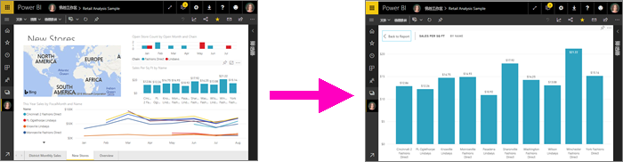
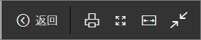
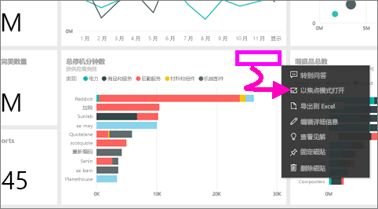
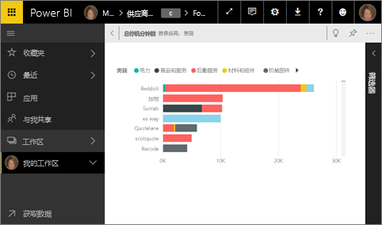
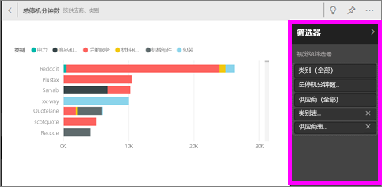
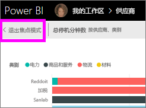
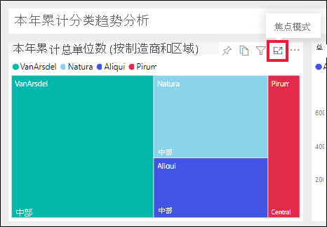
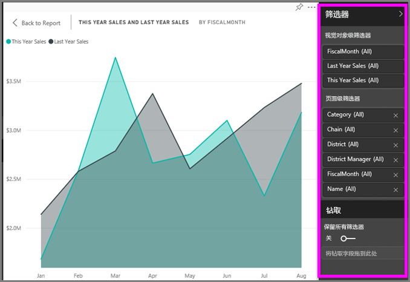
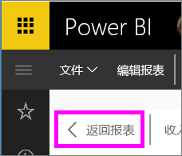

# 更详细地显示内容：焦点模式和全屏模式

<iframe width="560" height="315" src="https://www.youtube.com/embed/dtdLul6otYE" frameborder="0" allowfullscreen></iframe>

焦点模式和全屏模式是在视觉对象、报表和仪表板中查看更多详细信息的两种不同方式。  主要区别在于，全屏模式会删除内容周围的所有窗格，而焦点模式则允许仍然与视觉对象进行交互。 让我们仔细看看相似之处和不同之处。  

|内容    | 焦点模式  |全屏模式  |
|---------|---------|----------------------|
|仪表板     |   不可用     | 是 |
|报表页   | 不可用  | 是|
|报表可视化效果 | 是    | 是 |
|仪表板磁贴 | 是    | 是 |
|Windows 10 移动版 | 不可用 | 是 |

## 什么是全屏模式？

显示 Power BI 服务内容（仪表板、报表页、磁贴和可视化效果），不受菜单和导航栏的干扰。  可以随时快速获取内容的纯粹而完整的视图。 有时这也称为电视模式。   

要打开全屏模式，请从处于焦点模式的仪表板、报表、磁贴或处于焦点模式的视觉对象上方的 Power BI 服务菜单栏中选择“全屏”图标 。  你选择的内容将填满整个屏幕。
如果使用 Power BI 移动版，[全屏可用于 Windows 10 移动应用](./mobile/mobile-windows-10-app-presentation-mode.md)。 

全屏模式的一些用途包括：

* 在会议上展示你的仪表板、磁贴、视觉对象或报告
* 在办公室通过专用大屏幕或投影仪显示
* 在小屏幕上查看
* 在锁定模式下查看 -- 你可以触摸屏幕或将鼠标悬停在磁贴上，而不打开基础报表或仪表板

## 什么是焦点模式？
使用“焦点”模式可以展开（弹出）视觉对象或磁贴以查看更多详细信息。  你可能有一个有点拥挤的仪表板或报表，你只想在一个视觉对象上放大。  这时候最适合使用焦点模式。  

在焦点模式下，Power BI 使用者可以与创建此视觉对象时应用的任何筛选器进行交互。  在 Power BI 服务中，可以在仪表板磁贴或报表视觉对象上使用焦点模式。

## 在全屏幕模式下运行
要以全屏模式打开仪表板或报表页，请从顶部导航栏选择全屏图标  。 进入全屏模式后，移动鼠标或光标就会显示上下文菜单。 由于全屏可用于各种各样的内容，因此上下文菜单中的选项也都有所不同，但这些差异一目了然。  只需将鼠标悬停在图标上即可看到定义。

仪表板菜单    
    

报表页菜单    
    

  *     
  使用“返回”按钮导航到浏览器中的前一页。 如果前一页是 Power BI 页面，它也将以全屏模式显示。  全屏模式将一直保持，直到你退出。

  *     
  使用此按钮可以全屏模式打印仪表板或报表页。

  *     
    使用“适应屏幕”按钮来尽可能以最大大小显示仪表板，而无需使用滚动条。  

    

  *        
    有时你并不关心滚动条，但希望仪表板能横向填充整个可用空间。 选择“适应宽度”按钮。    

    

  *        
    在全屏显示的报表中，使用这些箭头在报表页之间移动。    
  * 若要退出全屏模式，请选择“退出全屏”图标。

      

## 在焦点模式下运行
打开焦点模式有两种方法：一种是仪表板磁贴，另一种是报表可视化效果。

### 仪表板中的焦点模式
1. 在 Power BI 服务中打开仪表板。

2. 将鼠标悬停在仪表板磁贴或报表可视化效果上，选择省略号 (...)，然后选择“以焦点模式打开”。

    。

2. 该磁贴随即打开并填充整个报表画布。

   

3. 展开“筛选器”窗格，查看应用于此视觉对象的所有筛选器。

   

4. 通过[修改筛选器](end-user-report-filter.md)并在数据中查找感兴趣的发现浏览更多内容。  

5. 通过选择“退出焦点模式”（位于视觉对象左上角），退出焦点模式并返回仪表板。

        

## 报表可视化效果的焦点模式
1. 在 Power BI 服务中打开报表。  在本例中，我们将演示如何使用零售分析示例。

1. 打开报表后，选择“地区每月销售额”选项卡。

2. 将鼠标悬停在左下角的区域图表上，并选择“焦点模式”图标 。  

   
2. 此可视化效果随即打开并填充整个画布。

   
3. 可以选择展开“筛选器”窗格，与应用于此视觉对象的筛选器进行交互。 深入探究数据，寻找新的见解和问题的答案。 作为使用者，无法添加新筛选器、更改可视化效果中使用的字段或创建新的可视化效果。  但是，退出 Power BI 时会保存对现有筛选器所做的任何修改。 如果不希望 Power BI 记住你的修改，可选择“重置为默认值”。   

   

5. 通过选择“返回报表”（位于视觉对象左上角），退出焦点模式并返回报表。

      

## 注意事项和疑难解答
* 在报表中将焦点模式用于可视化效果时，将能够查看以下所有筛选器并与其进行交互：视觉对象级别、页面级别、钻取以及报表级别。    
* 在仪表板上将焦点模式用于可视化效果时，将只能够查看视觉对象级别的筛选器并与其进行交互。

## 后续步骤
[报表的视图设置](end-user-report-view.md)