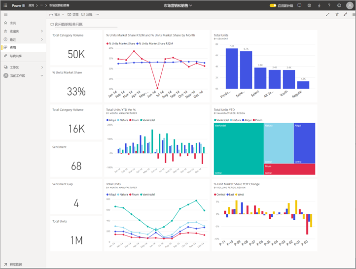
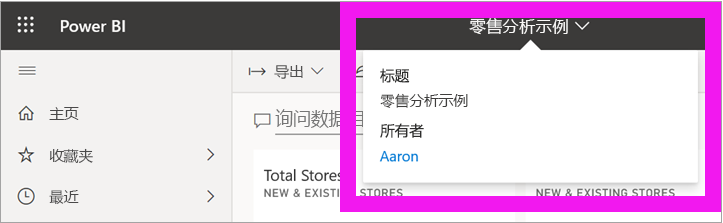
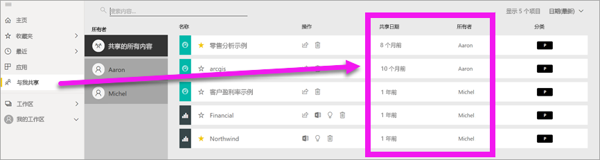
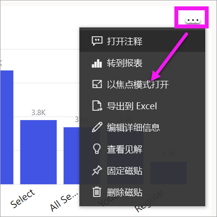
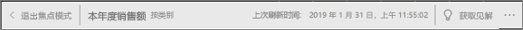
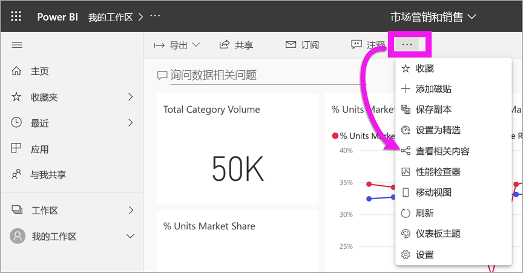
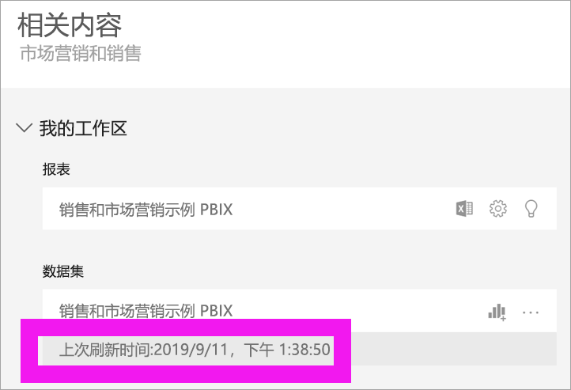

# 内容为最新内容

[!INCLUDE[consumer-appliesto-ynny](../includes/consumer-appliesto-ynny.md)]

[!INCLUDE [power-bi-service-new-look-include](../includes/power-bi-service-new-look-include.md)]

作为使用者，你可以与设计人员创建并与你共享的内容进行交互   。 你可能想知道该内容是否为最新内容，或者只是想了解该内容上次刷新的时间。 了解到自己使用的是最新内容可让人充满信心。  
 

确保使用的是最新数据对于制定正确决策通常是至关重要的。 如何确保使用的是最新内容？ 大多数情况下，完全无需执行任何操作。 已与你共享的应用会根据应用设计人员设置的时间表自动刷新和更新。 已与你共享的仪表板和报表也是如此 -- 设计人员可以手动，也可以使用自动刷新时间表来确保内容是最新内容。  

如果对数据新鲜度有疑问，请联系设计人员。

## 如何查找设计人员或所有者的姓名

### 仪表板或报表

可从仪表板和报表的标题栏中获取所有者的名称。 选择报表或仪表板名称以显示包括所有者在内的更多详细信息  。

### 应用

应用屏幕会同时显示设计人员姓名和应用上次更新日期。  

1. 从导航窗格中，选择“应用”  。

    

2. 将鼠标悬停在应用上可显示设计器的标题、新鲜度日期和名称。 

    

### 与我共享
“与我共享”屏幕显示内容所有者的姓名，以及该内容最近一次与你共享的日期  。

 

## 如何查找上次刷新日期
如果感兴趣，可以查找大多数内容的上次刷新日期。 

### 仪表板磁贴
对于仪表板磁贴，在焦点模式下查看磁贴，以查看上次刷新的时间戳。

1. 在仪表板磁贴上，选择“更多选项”(…)，然后选择“以焦点模式打开”   。

    

2. 右上角显示上次刷新日期。 如果未显示，请展开浏览器使其更宽。 

    

### 仪表板和报表
查找上次刷新日期的另一种方法是使用“相关视图”  。  可从 Power BI 上方菜单栏中选择“更多选项”(…) 以获取“相关视图”   。

“相关内容”窗格会显示仪表板或报表基础数据集的上次刷新信息  。

## 如果设计人员删除应用会发生什么

如果设计人员删除应用，与该应用相关的仪表板和报表也会自动从 Power BI 工作区中删除。 这些内容将不再可用，并且导航窗格的“应用”容器中或其他位置也不会显示该应用。

## 订阅以查看更改
保持最新内容的另一种方法是订阅报表或仪表板。 不必登录并打开报表或仪表板，只需告知 Power BI 按照设置的时间表发送快照即可。  有关详细信息，请参阅[订阅仪表板和报表](end-user-subscribe.md)。

## 设置数据警报
希望在数据更改超过所设置的限制时收到通知？ [创建数据警报](end-user-alerts.md)。  使用数据警报保持最新内容非常轻松。 借助数据警报，可指示 Power BI 在报表中某个值超出特定阈值时向你发送电子邮件。  例如，如果库存低于 25 个单位或销售超过目标。  

## 后续步骤
[创建数据警报](end-user-alerts.md)    
[订阅仪表板和报表](end-user-subscribe.md)    
[查看相关内容](end-user-related.md)    
