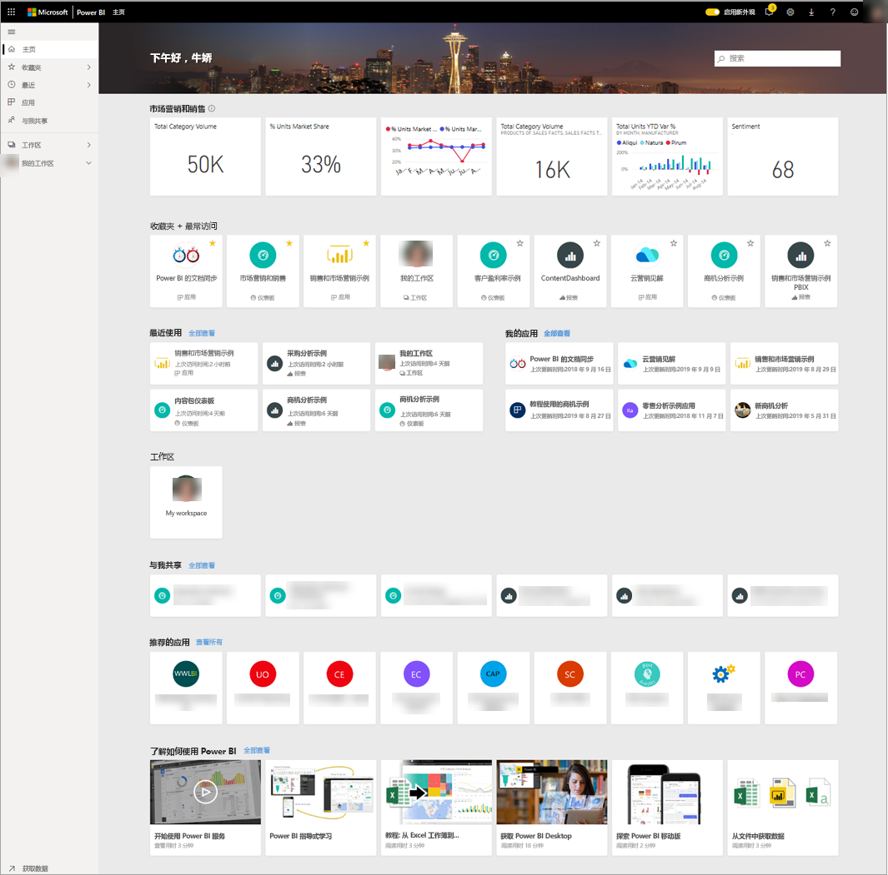
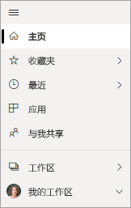
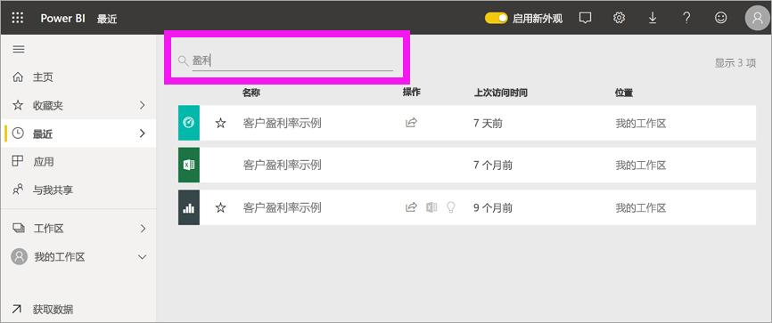

# 查找仪表板、报表和应用
在 Power BI 中，术语“内容”指的是应用、仪表板和报表  。 内容由 Power BI 设计师创建，他们与同事共享该内容  。 可以在 Power BI 服务中访问和查看内容，最好是从主页登陆页面，开始在 Power BI 中操作。

## 浏览 Power BI 主页
登录时，Power BI 会打开并显示“主页”画布，如下图所示。
 

Power BI 主页提供了三种不同的方式来查找和查看内容。 所有三种方式都访问相同的内容池，它们只是以不同的方式获取该内容。 有时，搜索是查找内容的最简单且最快捷的方法，但其他时候，选择“主页”画布上的卡片将是最佳选择  。

- “主页”画布显示并整理收藏夹和最近访问的内容，以及建议的内容和学习资源。 每条内容都以卡片形式显示，带有标题和图标  。 选择卡片将打开该内容。
- 左侧是导航窗格，它被称为导航栏。 在此窗格中，相同内容按“收藏夹”、“最近”、“应用”以及“与我共享”等不同方式整理。 在此处，你可以查看内容列表，并选择要打开的内容。
- 在右上角，使用“全局搜索”框可以按标题、名称或关键字搜索内容。

以下主题介绍用于查找和查看内容的每个选项。

## “主页”画布
在“主页”上，你可以看到有权使用的所有内容。 起初，“主页”画布上可能没有太多内容（请参见上图），但如果你开始与同事一起使用 Power BI，这种情况将会发生改变。

“主页”画布也会更新推荐的内容和学习资源。 
 
在 Power BI 服务中工作时，你将收到来自同事的仪表板、报表和应用，然后你的主页最终将填满。 随着时间的推移，它可能类似于下面的主页。

 
接下来的几个主题将全面介绍此主页。

## 最重要的内容便可唾手可得

### 收藏夹和最常访问
此重要部分包含指向最常访问的内容的链接，或已标记为[精选或收藏](end-user-favorite.md)内容的链接。 请注意，有几张卡片带有黄色星标；这两个应用和该仪表板已标记为收藏。
 
### 最近和我的应用
下一部分显示你最近访问过的内容。 请注意每张卡片上的时间戳。 “我的应用”部分列出了已与你共享的应用，或[从 AppSource 下载的](end-user-apps.md)应用；此处列出了最近使用的应用  。 可以选择“查看全部”以显示与你共享的所有应用的列表  。

### 工作区
作为 Power BI 使用者，你通常只有一个工作区，即“我的工作区”   。 

### 与我共享
同事可与你共享应用，但他们也可以共享所有仪表板和报表。 在“与我共享”部分中，请注意你的同事与你分享了三个仪表板和三个报表  。

### 推荐的应用
Power BI 会根据活动和帐户设置显示一系列推荐应用。 选择一个应用卡片，即可打开该应用。
 
### 学习资源
“主页”画布的底部提供了一系列学习资源。 根据活动和设置以及 Power BI 管理员显示确切资源。 
 
## 浏览导航窗格（导航栏）

左侧导航窗格（导航栏）用于在仪表板、报表和应用之间进行查找和移动。 有时，使用导航栏是获取内容的最快捷方式。
导航栏在打开主页登陆页面时出现，并在打开 Power BI 服务的其他区域时保持静态。
  
导航栏将内容整理到与你在“主页”画布上看到的内容类似的容器中：“收藏夹”、“最近”、“应用”、“与我共享”。 通过使用浮出控件，可以只查看其中每个容器中的最新内容，也可以导航到内容列表以查看每个容器类别的所有内容。
 
- 要打开其中某个内容节并显示所有项的列表，请选择标题。
- 要查看每个容器中的最新内容，请选择浮出控件（ **>** ）。

    

 
导航栏是可以快速查找所需内容的另一种方法。 内容的整理方式与“主页”画布类似，但内容会在列表中显示，而不是在卡片中显示。 

## 搜索所有内容
有时，查找内容的最快方法是搜索内容。 例如，你可能已发现在一段时间内未使用的仪表板没有显示在“主页”画布上。 或者，也许你还记得你的同事 Aaron 与你进行了共享，但不记得共享内容或共享的内容类型（无论它是仪表板还是报表）。
 
你可以输入该仪表板的完整名称或部分名称并进行搜索。 此外，还可以输入同事的姓名，并搜索他与你共享的内容。 搜索范围限定为在你拥有的所有内容或有权访问的所有内容中查找匹配项。

## 后续步骤
[Power BI 基本概念](end-user-basic-concepts.md)概述
