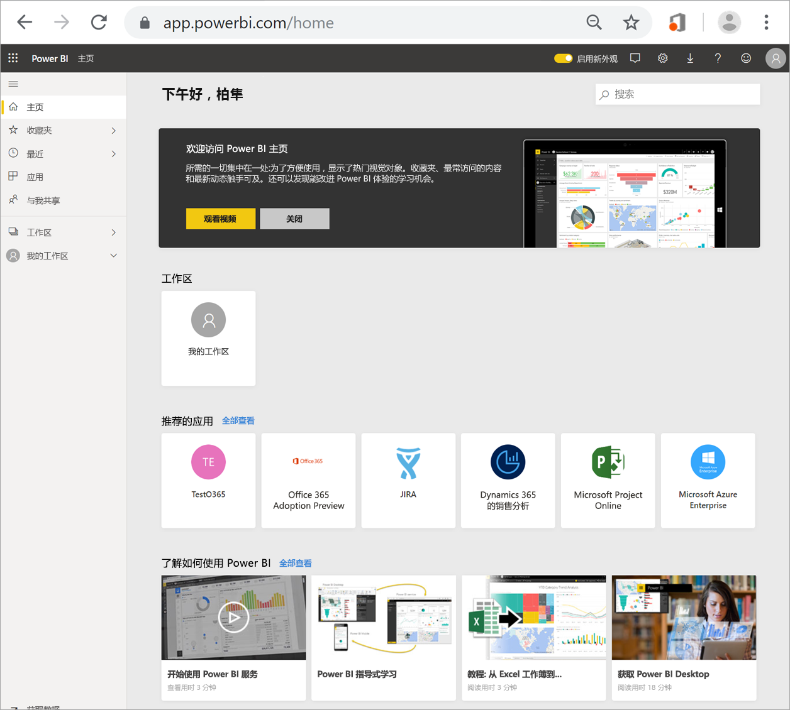
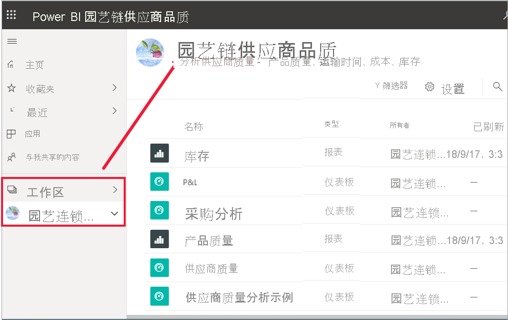
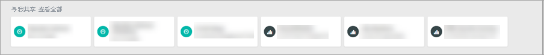
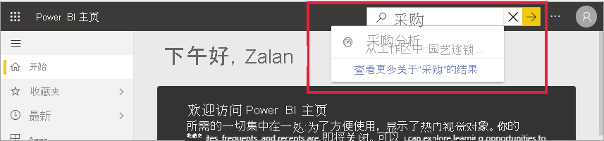

# 查找仪表板、报表和应用

[!INCLUDE[consumer-appliesto-yynn](../includes/consumer-appliesto-yynn.md)]
在 Power BI 中，术语“内容”指的是应用、仪表板和报表  。 内容由 Power BI 设计师创建，他们与同事共享该内容  。 可以在 Power BI 服务中访问和查看内容，最好是从 Power BI 主页  开始在 Power BI 中操作。

## 浏览 Power BI 主页
登录到 Power BI 服务后，从导航窗格中选择“主页”  。 

Power BI 会显示“主页”画布，如下图所示。
 

Power BI 主页提供了三种不同的方式来查找和查看内容。 所有三种方式都访问相同的内容池，它们只是以不同的方式获取此内容。 有时，搜索是查找内容的最简单且最快捷的方法，但其他时候，选择“主页”画布上的卡片将是最佳选择  。

- “主页”画布显示并整理收藏夹和最近访问的内容，以及建议的内容和学习资源。 每条内容都以卡片形式显示，带有标题和图标  。 选择卡片将打开该内容。
- 左侧是导航窗格，称为导航 (nav) 窗格。 在此窗格中，相同内容按“收藏夹”、“最近”、“应用”以及“与我共享”等不同方式整理。 在此处，你可以查看内容列表，并选择要打开的内容。
- 在右上角，使用“全局搜索”框可以按标题、名称或关键字搜索内容。

以下主题介绍用于查找和查看内容的每个选项。

## “主页”画布
在“主页”上，你可以看到有权使用的所有内容。 起初，“主页”画布上可能没有太多内容（请参见上图），但如果你开始与同事一起使用 Power BI，这种情况将会发生改变。

“主页”画布也会更新推荐的内容和学习资源。 
 
在 Power BI 服务中工作时，你将收到来自同事的仪表板、报表和应用，然后 Power BI 主页最终将填满。 随着时间的推移，它可能类似于下面的主页。

 
接下来的几个主题将全面介绍此“主页”画布。

## 最重要的内容便可唾手可得

### 收藏夹和最常访问
这一最上面的部分链接到最常访问内容或已标记为[精选或收藏](end-user-favorite.md)项的内容。 请注意，有几张卡片带有黄色星标；这两个应用和该仪表板已标记为收藏。 

此外，你可以将内容标记为[特色](end-user-featured.md)。 选取一个你希望经常查看的仪表板或报表，并将其设置为特色内容  。 每次打开 Power BI 服务时，会首先显示特色仪表板。 

### 最近和我的应用
下一部分显示你最近访问过的内容。 请注意每张卡片上的时间戳。 “我的应用”部分列出了已与你共享的应用，或[从 AppSource 下载的](end-user-apps.md)应用；此处列出了最近使用的应用  。 可以选择“查看全部”以显示与你共享的所有应用的列表  。

### 工作区
每个 Power BI 服务使用者都有一个“我的工作区”  。 仅当下载了 Microsoft 示例，或创建了自己的仪表板、报表或应用时，“我的工作区”  中才会包含内容。 对于许多使用者  ，“我的工作区”  将为空，并且将保留为空。  

每次[下载应用](end-user-app-marketing.md)或[与你共享应用](end-user-apps.md)时，都将创建新工作区。  若要打开应用工作区  ，请在“主页”画布上选择它。 

应用程序将在画布上打开，你可以看到导航窗格中列出的工作区的名称。 在工作区中，Power BI 服务按以下类型区分内容：仪表板和报表。 在某些情况下，还会有工作簿和数据集。 选择工作区时，可以看到这种组织形式。 在此示例中，园艺链  工作区包含四个仪表板和两个报表。

### 与我共享的内容
同事可与你共享应用，但他们也可以共享所有仪表板和报表。 在“与我共享”部分中，请注意你的同事与你分享了三个仪表板和三个报表  。

### 推荐的应用
Power BI 会根据活动和帐户设置显示一系列推荐应用。 选择一个应用卡片，即可打开该应用。
 
### 学习资源
“主页”画布的底部提供了一系列学习资源。 根据活动、设置以及 Power BI 管理员显示确切资源。 
 
## 浏览导航窗格

导航窗格将对内容进行分类，帮助你快速找到所需的内容。  

导航窗格用于在仪表板、报表和应用之间进行查找和移动。 有时，使用导航窗格是获取内容的最快捷方式。 导航窗格在打开主页登陆页面时出现，并在打开 Power BI 服务的其他区域时保留。 可以通过选择“隐藏”图标进行折叠  。
  
导航窗格将内容整理到与“主页”画布上类似的容器中：收藏夹、最近访问的内容、应用、与我共享和工作区。 通过使用浮出控件，可以只查看其中每个容器中的最新内容，也可以导航到内容列表以查看每个容器类别的所有内容。
 
- 要打开其中某个内容节并显示所有项的列表，请选择标题。
- 要查看每个容器中的最新内容，请选择浮出控件（ **>** ）。

    

 
导航窗格是可以快速查找所需内容的另一种方法。 内容的整理方式与“主页”画布类似，但内容会在列表中显示，而不是在卡片中显示。 

## 搜索所有内容
有时，查找内容的最快方法是搜索内容。 例如，你可能已发现在一段时间内未使用的仪表板没有显示在“主页”画布上。 或者，也许你还记得你的同事 Aaron 与你共享了一些内容，但不记得共享内容的名称或类型（是仪表板还是报表）。 或者你可能有太多的内容，搜索比滚动或排序更容易。 
 
搜索字段位于主菜单栏的右上角。 你可以输入该仪表板的完整名称或部分名称并进行搜索。 此外，还可以输入同事的姓名，并搜索他与你共享的内容。 搜索范围限定为在你拥有的所有内容或有权访问的所有内容中查找匹配项。

## 后续步骤
[Power BI 基本概念](end-user-basic-concepts.md)概述
