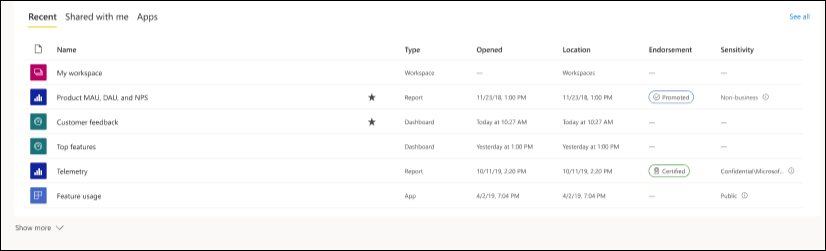

# 查找仪表板、报表和应用

[!INCLUDE[consumer-appliesto-yynn](../includes/consumer-appliesto-yynn.md)]
在 Power BI 中，术语“内容”指的是应用、仪表板和报表  。 内容由 Power BI 设计师创建，他们与同事共享该内容  。 可以在 Power BI 服务中访问和查看内容，最好是从 Power BI 主页  开始在 Power BI 中操作。

## 浏览 Power BI 主页
登录到 Power BI 服务后，从导航窗格中选择“主页”  。 

Power BI 会显示“主页”画布，如下图所示。 每个用户的“主页”上显示的布局和内容各不相同。 本文的后面部分将介绍为新用户和非常有经验的用户提供的“主页”。 
 

Power BI 主页提供了三种不同的方式来查找和查看内容。 所有三种方式都访问相同的内容池，它们只是以不同的方式获取此内容。 有时，搜索是查找内容的最简单且最快捷的方法，但其他时候，选择“主页”画布上的卡片将是最佳选择  。

- “主页”画布显示并整理收藏夹、经常访问的内容、最近访问的内容和推荐内容，以及应用和工作区。  如果你是初次使用 Power BI 服务，还会看到一个“入门指南”部分。 选择一个卡片或列表中的一个项以将其打开。
- 左侧是导航窗格，称为导航 (nav) 窗格。 Select  展开导航窗格。 在导航窗格中，相同内容按“收藏夹”、“最近”、“应用”以及“与我共享”等不同方式整理。 在此处，你可以查看内容列表，并选择要打开的内容。
- 在右上角，使用“全局搜索”框可以按标题、名称或关键字搜索内容。

以下主题介绍用于查找和查看内容的每个选项。

## “主页”画布
在“主页”上，你可以看到有权使用的所有内容。 “主页”画布也会更新推荐的内容和学习资源。 最开始，“主页”画布上可能没有太多内容，但随着你开始与同事一起使用 Power BI，这种情况将会发生改变。

 
在 Power BI 服务中工作时，你将收到来自同事的仪表板、报表和应用，然后 Power BI 主页最终将填满。 随着时间的推移，它可能类似于下面的主页。

 
接下来的几个主题将为有经验的用户全面介绍“主页”。

## 最重要的内容便可唾手可得

### 收藏夹和最常访问
这一最上面的部分链接到最常访问内容或已标记为[精选或收藏](end-user-favorite.md)项的内容。 请注意，多张卡片带有黑色星形；它们已标记为收藏夹。 

此外，你可以将内容标记为[特色](end-user-featured.md)。 选取一个你希望经常查看的仪表板或报表，并将其设置为特色内容  。 每次打开 Power BI 服务时，会首先显示特色仪表板。 

### 特别推荐
“特别推荐”部分包含管理员已推广到主页的内容。 通常，此内容对于你的工作非常重要或有用。 在此示例中，特别推荐的内容包括跟踪成功的指标。

### “最近”、“与我共享”和“我的应用”
下一部分是选项卡式列表。 
- “最近”是最近访问过的内容。 请注意每个项的时间戳。 
- 同事可与你共享应用，但他们也可以共享所有仪表板和报表。 在“与我共享”部分中，可以找到同事与你共享的仪表板和报表。 
- “我的应用”部分列出了已与你共享的应用，或[从 AppSource 下载的](end-user-apps.md)应用；此处列出了最近使用的应用  。 

### 工作区
每个 Power BI 服务用户都有一个“我的工作区”。 仅当下载了 Microsoft 示例，或创建了自己的仪表板、报表或应用时，“我的工作区”中才会包含内容。 对于许多业务用户，“我的工作区”将为空，并且将保留为空。 如果你是一位新用户，你将只有一个工作区，即“我的工作区” 

如果你选择了一个工作区，你会发现它为空。

每次[下载应用](end-user-app-marketing.md)或[与你共享应用](end-user-apps.md)时，都将创建新工作区。 随着时间的推移，你将有多个工作区。 若要打开应用工作区，请在“主页”画布上选择它。 

应用程序将在画布上打开，你可以看到导航窗格中列出的工作区的名称。 在工作区中，Power BI 服务按以下类型区分内容：仪表板和报表。 在某些情况下，还会有工作簿和数据集。 选择工作区时，可以看到这种组织形式。 在此示例中，园艺链工作区包含四个仪表板和两个报表。

### 推荐应用
Power BI 根据你的活动和帐户设置来显示一组推荐应用。 选择一个应用卡片，即可打开该应用。 带有蓝色图标的应用是[模板应用](../connect-data/service-template-apps-overview.md)。

 
### 学习资源入门
根据活动、设置以及 Power BI 管理员显示确切资源。 如果你是新用户，“入门指南”部分将显示在“主页”顶部。 如果你是新用户，不想在“主页”顶部看到“入门指南”，请选择“固定到底部”。
 
## 浏览导航窗格

导航窗格将对内容进行分类，帮助你快速找到所需的内容。  

导航窗格用于在仪表板、报表和应用之间进行查找和移动。 有时，使用导航窗格是获取内容的最快捷方式。 导航窗格在打开主页登陆页面时出现，并在打开 Power BI 服务的其他区域时保留。 可以通过选择“隐藏”图标进行折叠  .
  
导航窗格将内容整理到与“主页”画布上类似的容器中：收藏夹、最近访问的内容、应用、与我共享和工作区。 通过使用浮出控件，可以只查看其中每个容器中的最新内容，也可以导航到内容列表以查看每个容器类别的所有内容。
 
- 若要打开其中一个内容部分并显示所有项的列表，请选择标题。
- 要查看每个容器中的最新内容，请选择浮出控件（ **>** ）。

    

 
导航窗格是可以快速查找所需内容的另一种方法。 内容的整理方式与“主页”画布类似，但内容会在列表中显示，而不是在卡片中显示。 

## 搜索所有内容
有时，查找内容的最快速方法是进行搜索。 例如，你可能已发现在一段时间内未使用的仪表板没有显示在“主页”画布上。 或者，也许你还记得你的同事 Aaron 与你共享了一些内容，但不记得共享内容的名称或类型（是仪表板还是报表）。 或者你可能有太多的内容，搜索比滚动或排序更容易。 
 
搜索字段位于主菜单栏的右上角。 可以输入相应仪表板的完整或部分名称，并进行搜索。 此外，还可以输入同事的姓名，并搜索他与你共享的内容。 搜索仅限于在你拥有或有权访问的所有内容中查找匹配项。

## 后续步骤
[Power BI 基本概念](end-user-basic-concepts.md)概述

内容显示为“卡片”或列表。 卡片上有标题和图标。 选择卡片将打开该内容。