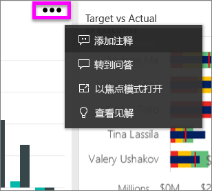
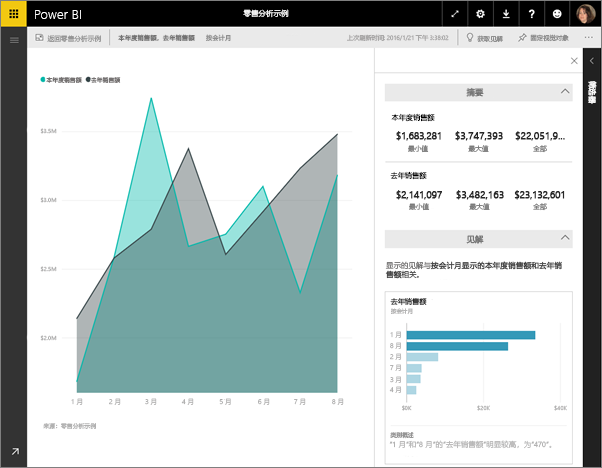
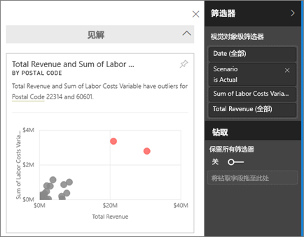
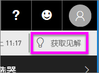

# 使用 Power BI 查看有关仪表板磁贴的数据见解
仪表板上的每个可视化效果磁贴都是数据探索的入口。 当选择磁贴时，它将打开一个报表，可以在其中筛选、排序以及深入挖掘此报表背后的数据集。 当运行见解时，Power BI 会为你进行数据探索。

运行快速见解便可基于你的数据生成有趣的交互式可视化效果。 快速见解可以在特定的仪表板磁贴上运行，你甚至可以在一个见解上运行见解！

见解功能以一组与 Microsoft Research 联合开发且数量不断增长的[高级分析算法](end-user-insight-types.md)为基础构建而成，我们将继续通过该功能让更多人以新颖直观的方式从其数据中寻找见解。

## 对仪表板磁贴运行见解
当在仪表板磁贴上运行见解时，Power BI 仅搜索用于创建该单个仪表板磁贴的数据。 

1. [打开仪表板](end-user-dashboards.md).
2. 将鼠标悬停在一个磁上。 选择省略号 (…)，然后选择“查看见解”。 

    

3. 该磁贴以[焦点模式](end-user-focus.md)打开，并在右侧显示见解卡片。    
   
        
4. 你是否对某个见解产生了兴趣？ 选择该见解卡片以深入进行了解。 选中的见解显示在左侧，而完全根据该见解中的数据获得的新见解卡片显示在右侧。    

 ## 与见解卡片交互
打开某个见解后，继续探索。

   * 筛选画布上的视觉对象。  若要显示筛选器，请选择右上角的箭头以展开“筛选器”窗格。

     
   
   * 在见解卡自身上运行见解。 这通常称为“相关见解”。 在右上角，选择灯泡图标 或选择“获取见解”。
     
     
     
     该见解显示在左侧，而完全根据该见解中的数据获得的新卡片显示在右侧。
     
     

若要返回到最初的见解画布，请从左上角选择“退出焦点模式”。

## 注意事项和疑难解答
- **查看见解**不适用于 DirectQuery - 仅适用于上传到 Power BI 的数据。
- **查看见解**不适用于所有仪表板磁贴类型。 例如，它不适用于自定义视觉对象。<!--[custom visuals](end-user-custom-visuals.md)-->

## 后续步骤
了解[可用的快速见解的类型](end-user-insight-types.md)

