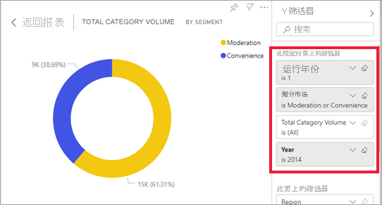

# 视觉对象如何在 Power BI 报表中彼此交叉筛选
Power BI 的强大功能之一是报表页上所有视觉对象的互连方式。 如果在某个视觉对象上选择一个数据点，此页面上包含该数据的其他所有视觉对象将根据所选内容而更改。 

## 视觉对象如何相互交互

默认情况下，选择报表页上一个视觉对象中的数据点将交叉筛选或交叉突出显示此页面上的其他视觉对象。 视觉对象在一个页面上进行确切交互的方式是由报表设计器设置的  。 设计器具有可以启用和关闭视觉对象交互以及更改默认的交叉筛选、交叉突出显示和[钻取](end-user-drill.md)行为的选项  。 

如果尚未遇到层次结构或钻取，则可以通过阅读 [Power BI 中的向下钻取](end-user-drill.md)来了解所有相关信息。 

### 交叉筛选和交叉突出显示

交叉筛选和交叉突出显示可用于确定数据中的一个值分配给另一个值的方式。 词语“交叉筛选”和“交叉突出显示”用于区分本文描述的行为与使用“筛选器”窗格来筛选和突出显示视觉对象的效果    。  

在下面的报表页中，我们将定义这些术语。 “按段划分的类别总量”圆环图有两个值：“审查”和“便利性”。 

1. 让我们看看选择“审查”会发生什么情况  。

    

2. “交叉筛选”  可删除不适用的数据。 选择圆环图中的“审查”会交叉筛选折线图  。 折线图现在只显示“审查”段的数据点。 

3. “交叉突出显示”  将保留所有原始数据点，但会使不适用于所选内容的部分变暗。 选择圆环图中的“审查”会交叉突出显示柱形图  。 柱形图将适用于“便利性”段的所有数据变暗，并突出显示适用于“审查”段的所有数据。 

## 注意事项和疑难解答
- 如果报表拥有支持[钻取](end-user-drill.md)的视觉对象，在默认情况下，钻取某个视觉对象不会对报表页上的其他视觉对象造成影响。     
- 当在报表页上交叉筛选和交叉突出显示其他视觉对象时，将保留视觉对象级筛选器。 因此，如果 VisualA 包含由报表设计者或你应用的视觉对象级筛选器，并且你使用 visualA 与 visualB 交互，则 visualA 中的视觉对象级筛选器将应用于 visualB。

    

## 后续步骤
[如何使用报表筛选器](../power-bi-how-to-report-filter.md)    

[关于筛选和突出显示](end-user-report-filter.md)。 
