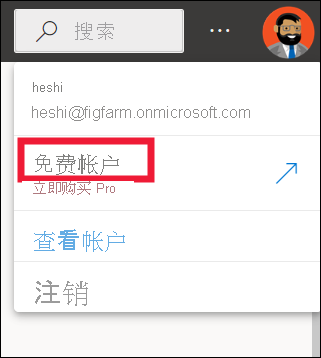
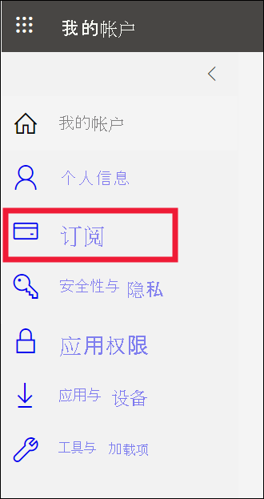

# 业务用户的许可证和订阅

[!INCLUDE[consumer-appliesto-ynnn](../includes/consumer-appliesto-ynnn.md)]

作为[业务用户](end-user-consumer.md)，你可以使用 Power BI 服务来浏览报表和仪表板，以便基于数据做出业务决策。 如果你使用 Power BI 已有一段时间，或与设计者同事聊过天，你可能会发现，有些功能只有在拥有特定类型的许可证、订阅或权限时才能使用。

在 Power BI 服务中能执行的操作取决于三个方面：
-    正在使用的许可证和订阅的类型，
-    内容的存储位置以及
-    分配的角色和权限。

在本文中，我们将介绍每种许可证类型的功能以及内容的存储位置如何影响它的使用 。 你还将了解如何查找许可证和订阅，并找出内容的存储位置。 有关角色和权限的详细信息，请参阅[工作区角色](end-user-workspaces.md)。

## 许可证

Power BI 服务的每个用户都使用免费许可证、Pro 许可证或 Premium per-user* 许可证。 如果你是 Power BI 商务用户，你可能使用的是由 Power BI 管理员管理的免费许可证。

你可以同时拥有多个许可证。  该服务会始终为你提供与你目前拥有的最宽松的许可证等同的体验。

## Power BI Premium 容量订阅

Premium 是一种组织订阅，它提供了另一种存储内容的方式 - 将内容存储在称为“容量”的虚拟容器中。 借助 Premium 容量，组织内外具有权限的任何人都可以查看存储在此 Premium 容量中的内容，而无需购买个人 Power BI Pro 或 Premium per-user 许可证。 

Premium 容量允许 Pro 用户广泛分发内容，且不要求查看内容的收件人提供 Pro 许可证。 在 Premium 容量中创建内容的用户使用 Pro 许可证来连接到数据源，为数据建模，并创建保存到 Premium 容量中的工作区的报表和仪表板。 如果向用户分配了[ Power BI Premium 容量的工作区中的角色](end-user-workspaces.md)，即使用户没有 Pro 许可证仍可访问该工作区。 如果工作区所有者基于该工作区中的内容创建一个应用，则没有 Pro 许可证的用户仍可在 Premium 容量中查看该应用，前提是这些用户已被授予该应用的权限。 

在这些工作区中，设计者分配查看者、参与者、成员和管理员等角色。    这些角色决定了同事可与内容交互的程度。 有关详细信息，请参阅[工作区权限和角色。](end-user-workspaces.md) 

当设计者创建并发布应用时，他们将对整个组织或个人授予访问权限。 可以与应用内容交互的程度取决于提供给你的特定访问权限。 例如，可能会给予你查看应用、连接到基础数据集、创建报表副本或共享内容的访问权限。

有关高级容量的详细信息，请参阅[什么是 Microsoft Power BI Premium？](../admin/service-premium-what-is.md)。

## 了解你拥有哪些许可证
选择你的个人资料图片以显示帐户信息。 Zalan 使用的是免费许可证。 其他类型的许可证包括：Pro 和 Premium per user。 

若要查看帐户的其他详细信息，请选择“查看帐户”。 

<!-- [Your Microsoft **My account** page](https://portal.office.com/account) opens in a new browser tab.  To see what licenses are assigned to you.  Select the tab for  **Subscriptions**.

This first user, Pradtanna, has Office 365 E5, which includes a Power BI Pro license.

This second user, Zalan, has a Power BI free license. 

 

## Find out if you have access to Premium capacity

Next, check to see if you're part of an organization that has Premium capacity. Either of the users above, Pro or free, could belong to an organization that has Premium capacity.  Let's check for our second user, Zalan.  

We can determine whether Zalan's organization has Premium capacity by looking up the amount of storage available. 

- In the Power BI service, select **My workspace** and then select the cog icon from the upper right corner. Choose **Manage personal storage**.

    

    If you see more than 10 GB, then you're a member of an organization that has a Premium subscription. The image below shows that Zalan's organization has up to 100 GB of storage. Zalan, personally, doesn't own 100GB as indicated by the heading **Owned by us**.  

    

    Notice that a Pro user has already shared a workspace with Zalan. The diamond icon shows that this workspace is stored in Premium capacity. 

    If you see any amount of storage, the words **Pro user** next to your name, and the heading **Owned by me**, then you have a Premium per-user license.  

    -->

## 识别高级容量中托管的内容

可以通过多种方式标识存储在 Premium 容量中的内容。 其中一种方法是查找带有菱形图标的应用和应用工作区。 菱形表明，此内容存储在高级容量中。 

在下图中，三个应用存储在高级容量中。

如果你是拥有免费许可证的用户，则只要设计者将工作区置于 Premium 容量中，你就可在该工作区中查看共享内容、与同事协作、使用应用仪表板和报表等等。 权限范围由 Power BI 管理员和内容设计者设定。

## 汇总

组织可通过多种不同的方式组织其 Power BI 订阅和许可证。 从业务用户角度来看，最常见的一种情况是组织购买 Premium 订阅时，管理员会将 Pro 许可证分配给一小部分用户，而所有其他用户使用免费许可证。 通常，管理员会将 Pro 许可证分配给将要创建和共享内容的员工。 Pro 用户可创建[工作区](end-user-workspaces.md)，并将内容（仪表板、报表、数据集、应用）添加到这些工作区。 为了使免费版用户能够在这些工作区中进行协作，管理员或 Pro 用户将这些工作区分配到 Premium 容量中。  

|许可证类型  |不在 Premium 容量中 | 高级容量  |
|---------|---------|---------|
|**免费**     |  用作个人沙盒，你可以在其中为自己创建内容并与该内容进行交互。 免费许可证是试用 Power BI 服务的好方法。 你不能使用来自其他人的内容，也不能与他人共享你的内容 1     |   与分配至高级容量的内容进行交互，并与你共享。 免费、Premium per-user 和 Pro 用户可以进行协作，而无需免费用户拥有 Pro 帐户。      |
|**Pro**     |  通过创建和共享内容与 Premium per-user 和 Pro 用户协作。        |  通过创建和共享内容与免费、Premium per-user 和 Pro 用户协作。       |

1 请参阅[注意事项和疑难解答](#considerations-and-troubleshooting)。

在下图中，左侧表示在应用工作区中创建和共享内容的 Pro 用户。

- 工作区 A 不是在 Premium 容量中创建的。

- 工作区 B 在 Premium 容量中创建并保存。 此工作区有菱形图标。  

    

Power BI Pro 设计者可以在任何一个工作区中与其他 Pro 用户共享和协作。 但是，Power BI Pro 用户只能使用 Premium 容量中的工作区 B 与免费版用户进行共享和协作。  在此工作区中，设计者向协作者分配以下角色。 角色决定了可以在此工作区中执行什么操作。 Power BI 业务用户通常分配有查看者角色。 若要详细了解角色，请参阅 [Power BI 业务用户的工作区](end-user-workspaces.md)。

## 注意事项和疑难解答

- 可以有多个 Power BI 许可证。 Power BI 服务将始终提供与你当前拥有的最佳许可证等同的体验。 例如，如果你有 Pro 和免费许可证，Power BI 服务将使用 Pro 许可证。

- 如果想要创建和共享内容（仪表板、报表、应用），或打开其他人与你共享的内容，则需要拥有 Pro 用户许可证或 Premium per user 许可证。 可以注册可免费使用 60 天的 Power BI Pro 个人试用版。 每次尝试使用 Pro 功能时，选择 Power BI 服务中显示的“升级”对话框。

    

  60 天试用期到期后，你的许可证将恢复为 Power BI 免费许可证。 许可证恢复后，你无法再使用需要 Power BI Pro 许可证的功能。 如果你想继续使用 Pro 许可证，请联系管理员或 IT 技术支持购买 Power BI Pro 许可证。 如果你没有管理员或 IT 技术支持，请访问 [Power BI 定价页](https://powerbi.microsoft.com/pricing/)。

- 对于通过选择“免费试用”类型按钮自行注册的免费许可证，永远不会过期。 因此，如果你升级到 Pro 试用版或你的组织提供了 Pro 许可证，在试用版结束或组织删除 Pro 许可证后，你仍可重新使用免费许可证 - 除非你取消了该许可证。

- 1 Power BI 服务的免费用户许可证非常适合使用“我的工作区”探索该服务或使用该服务进行个人数据分析和可视化的用户。 免费的独立用户不使用 Power BI 与同事协作。 拥有免费许可证的独立用户不能查看其他用户共享的内容，也不能与其他 Power BI 用户共享自己的内容。

## 后续步骤

- [我是 Power BI 业务用户吗？](end-user-consumer.md)    
- [了解工作区](end-user-workspaces.md)    
- [查看按许可证类型列出的 Power BI 业务用户功能](end-user-features.md)
