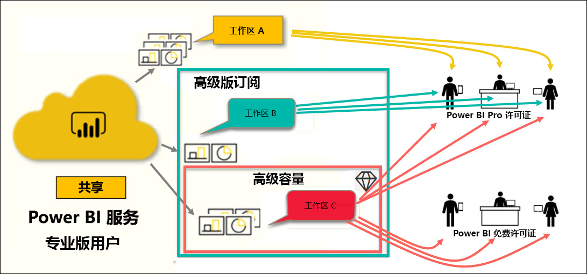
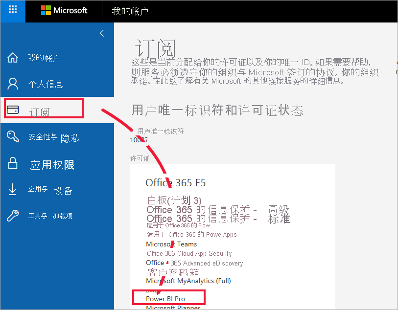
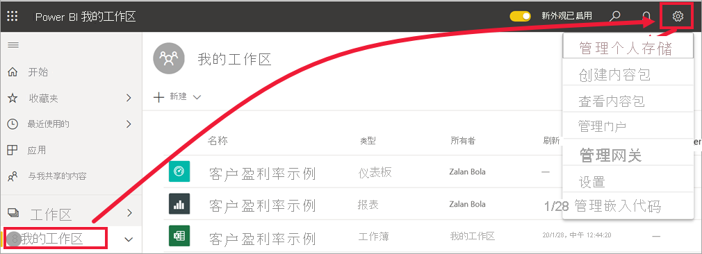
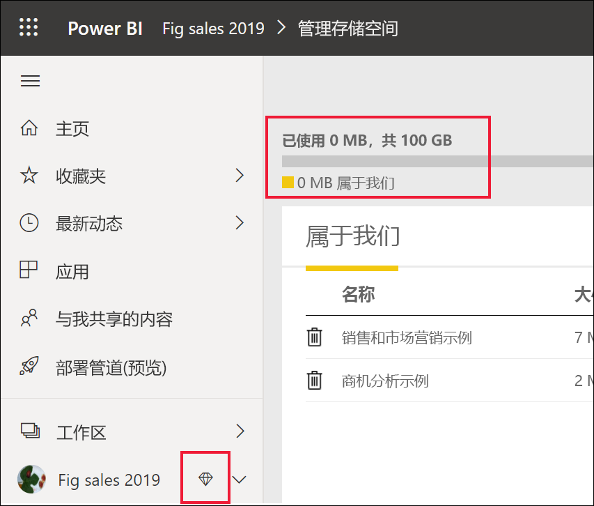

# Power BI 许可证的类型

[!INCLUDE[consumer-appliesto-ynnn](../includes/consumer-appliesto-ynnn.md)]

作为“使用者”，你可以使用 Power BI 服务来浏览报表和仪表板，以便做出业务决策  。 如果你使用 Power BI 已有一段时间，或与设计人员  同事聊过天，你可能已经发现，有些功能只有在你拥有特定类型的许可或订阅时才能使用。 

本文介绍了用户许可证与组织订阅的区别，以及如何结合使用它们：免费许可证、Pro 许可证、Premium 订阅和 Premium 容量。 你还将了解如何确定自己使用的是哪种许可证和订阅组合。  

首先来看看两类许可证：每用户许可证和组织订阅。 我们将从它们各自的默认功能入手。 接下来将介绍 Power BI 管理员和内容所有者如何使用角色和权限来修改许可证和订阅的默认功能。 

例如，即使你的许可证允许，管理员也可以限制你执行一些操作，如导出数据、使用问答自然语言查询或发布到 Web。 报表设计人员  在将内容分配到[工作区](end-user-workspaces.md)时，可以向你分配工作区角色。 此类角色决定了你在相应工作区中可以做什么，不可以做什么。 设计人员  可以使用权限设置来进一步调整你的许可证限制。 换句话说...这是很复杂的。 但愿本文能够尽可能（即便不是完全）解惑。

## 每用户许可证
第一种类型的许可证是每用户  许可证。 每个 Power BI 服务用户都有免费许可证或 Pro 许可证。 某些功能是为拥有 Pro 许可证的用户预留的。  

- **Power BI Pro 许可证（无 Premium 订阅）** ：可便于用户通过创建和共享内容与其他 Pro 用户协作。 只有具有 Pro 许可证的用户才能发布报表、订阅仪表板和报表、在工作区中与同事协作。 

    

    Power BI Pro 是一种单独的用户许可证，使用户能够读取他人已发布到 Power BI 服务的报表和仪表板并与之进行交互。 具有此许可证类型的用户可以与 Power BI Pro 用户共享内容并开展协作。 只有 Power BI Pro 用户才能发布内容或与其他用户共享内容，或使用其他用户创建的内容。 在 [Power BI 高级容量](#understanding-premium-and-premium-capacity)中托管的内容除外。 （有关详细信息，请参阅下面的 [Power BI Premium 容量](#understanding-premium-and-premium-capacity)。）Pro 许可证通常由报表设计人员  和开发人员使用。 

- **独立 Power BI 免费许可证（无 Premium 订阅）** ：尽管功能仍然很强大，但适用于刚刚开始接触 Power BI 的用户或为自己创建内容的用户。 请参阅[以个人身份注册 Power BI 服务](../service-self-service-signup-for-power-bi.md)。   

    独立的免费用户许可证非常适合使用 Microsoft 示例了解 Power BI 的用户。 拥有独立的免费许可证的用户不能查看其他用户共享的内容，也不能与其他 Power BI 用户共享自己的内容。 

    

    所有拥有免费独立许可证的客户都可以升级到[免费 Power BI Pro 许可证试用版](../service-self-service-signup-for-power-bi.md)。 借助此试用版，可以使用 Power BI Pro 用户的所有权限和功能。

    

- **含 Premium 订阅的 Power BI 免费许可证**：如果组织拥有 Premium 订阅，管理员和 Pro 用户可以将工作区分配到 Premium 容量  ，并向免费用户授予对这些工作区的访问权限。 在高级容量中的工作区内，Pro 用户可以与免费用户共享和协作，而不要求免费用户拥有 Pro 帐户。 在这些工作区中，免费用户拥有提升的权限；他们可以协作和共享、导出数据、订阅、与筛选器交互等。 

到目前为止清楚吗？  OK. 让我们来进一步了解 Premium 容量  。

## 了解 Premium 和高级容量
Premium 订阅是组织  订阅。 可以将它看作是在组织中的所有 Power BI 每用户  许可证的基础之上添加一层特性和功能。 

在组织购买 Premium 许可证后，管理员通常会将 Pro 许可证分配给将创建和共享内容的员工。 管理员会将免费许可证分配给将使用该内容的每个人。 Pro 用户可以创建[应用工作区](end-user-workspaces.md)，并将内容（仪表板、报表、应用）添加到这些工作区。 为了允许免费用户在这些工作区中协作，管理员或 Pro 用户将这些工作区保存在 Premium 容量  中。 

在组织购买 Premium 许可证后，他们会收到 Power BI 服务中专门分配给他们的容量。 它不会被其他组织共享。 该容量受完全由 Microsoft 管理的专用硬件支持。 组织可以选择广泛应用自己的专用容量，也可以将它分配到特定工作区。 组织可以将所有工作区都保存在容量中，也可以只保存部分工作区。 可以通过钻石形图标来识别 Premium 容量中的工作区 。  在高级容量中的工作区内，Pro 用户可以与免费用户共享和协作，而不要求免费用户拥有 Pro 帐户。 

在高级容量中，内容设计人员仍必须拥有 Pro 许可证。 设计人员创建应用工作区、连接到数据源、建模数据，并创建直接共享或打包作为应用共享的报表和仪表板。 没有 Pro 许可证的用户仍可以访问 Power BI Premium 中的应用工作区，只要工作区位于 Premium 容量  中，且工作区所有者授予他们权限即可。

在下图中，左侧表示在应用工作区中创建和共享内容的 Pro 用户。 

- 工作区 A  是在没有 Premium 订阅的组织中创建的。 

- 工作区 B  是在有 Premium 订阅的组织中创建的，尽管此特定工作区没有保存在 Premium 容量中。 此工作区没有菱形图标。

- 工作区 C  是在有 Premium 订阅的组织中创建的，且已保存在 Premium 容量中。 此工作区有菱形图标。  

Power BI Pro 设计人员  可以在这三个工作区的任何一个中与其他 Pro 用户共享和协作。 只要设计人员与整个组织共享工作区，或向 Pro 用户分配工作区角色即可。 

Power BI Pro 用户只能使用工作区 C 与免费用户共享和协作。必须将工作区分配到 Premium 容量，这样免费用户才能访问工作区。 在此工作区中，设计人员向协作者分配以下角色：管理员  、成员  、参与者  或查看者  。 角色决定了可以在此工作区中执行什么操作。 Power BI 使用者  通常分配有查看者  角色。 若要了解详细信息，请参阅 [Power BI 使用者的工作区](end-user-workspaces.md)。

## 确定你使用的是哪种何种许可证和订阅组合
查找 Power BI 许可证和订阅信息的方式有多种。 

首先，确定你所拥有的用户许可证类型  。

- 某些版本的 Microsoft Office 包含 Power BI Pro 许可证。  要查看你的 Office 版本是否包含 Power BI，请访问 [Office 门户](https://portal.office.com/account)并选择“订阅”  。

    第一位用户 Pradtanna 具有 Office 365 E5，其中包含 Power BI Pro 许可证。

    

    第二个用户 Zalan 具有 Power BI 免费许可证。 

    

接下来，检查你的帐户是否也属于 Premium 订阅。 上述任一用户（无论是 Pro 还是免费）都可能属于有 Premium 许可证的组织。  我们来看一下第二个用户 Zalan。  

- 在 Power BI 服务中，选择“我的工作区”，然后选择右上角的齿轮图标  。 选择“管理个人存储”  。

    

    每用户  许可证（无论是 Pro 还是免费）都在云中提供 10GB 存储空间，可用于托管 Power BI 报表或 Excel 工作簿。 如果容量超过 10GB，表明你是有 Premium 许可证的组织帐户的成员。

    

    请注意，在 Office 门户页上，Zalan 的用户许可证为 Power BI（免费）。 不过，由于他的组织购买了 Premium 订阅，因此在 Power BI 服务中，Zalan 不受 10GB 存储空间限制；他有 100GB 可用空间。 作为有 Premium 许可证的组织中的使用者  ，只要设计人员  将工作区置于高级容量中，Zalan 就能查看共享内容、与同事协作、使用应用等。 他的权限范围由 Power BI 管理员和内容设计人员设定。 请注意，有位 Pro 用户已与 Zalan 共享工作区。 菱形图标指明，此工作区存储在高级容量中。 

   
## 了解工作区角色
至此，我们已讨论了每用户许可证、Premium 订阅、应用工作区和 Premium 容量。 现在来看看工作区角色  。

由于这是一篇面向 Power BI 使用者  的文章，因此场景如下：

-  你是有 Power BI Premium 订阅的组织中的免费  用户。 
- Power BI Pro 用户创建了仪表板和报表的集合，并将此集合作为应用  发布给整个组织。  
- 应用位于工作区  中，此工作区位于 Premium 容量中。    
- 此应用工作区包含一个仪表板和两个报表。
- Pro 用户向我们分配了查看者  角色。

### 查看者角色
借助角色，Power BI 设计人员  可管理谁能在工作区中执行什么操作，以便实现团队协作。 其中一个角色就是查看者  。 

如果工作区位于 Power BI 高级容量中，具有查看者角色的用户可以访问工作区，即使没有 Power BI Pro 许可证，也不例外。 由于查看者角色无法访问或导出基础数据，因此这是一种与仪表板、报表和应用进行交互的安全方式。

> [!TIP]
> 若要了解其他角色（管理员、成员和参与者），请参阅[新建工作区](../service-new-workspaces.md)。

## 后续步骤
[我是 Power BI 使用者吗  ？](end-user-consumer.md)    
[了解工作区](end-user-workspaces.md)    
<!--[View Power BI features by license type](end-user-features.md) -->

