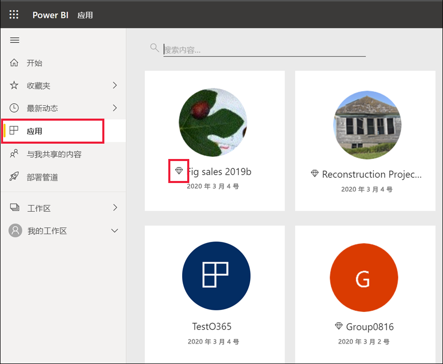
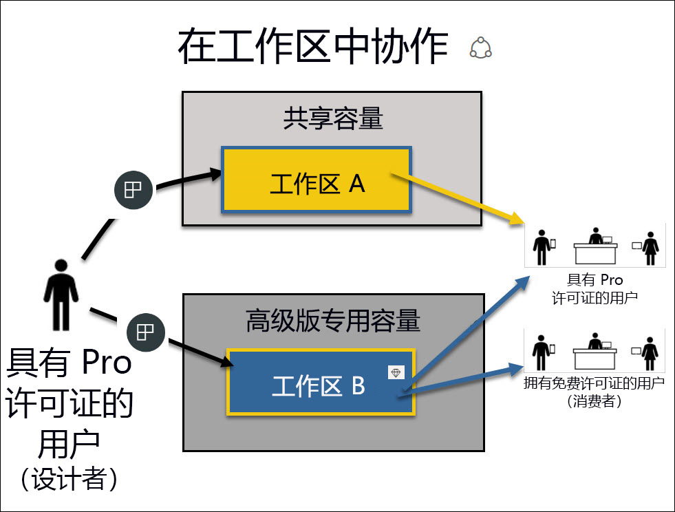

# 以使用者的身份使用 Power BI 服务 

[!INCLUDE[consumer-appliesto-ynnn](../includes/consumer-appliesto-ynnn.md)]

作为[使用者](end-user-consumer.md)，你可以使用 Power BI 服务来浏览报表和仪表板，以便基于数据做出业务决策  。 如果你使用 Power BI 已有一段时间，或与设计者同事聊过天，你可能已经发现，有些功能只有在你拥有特定类型的许可证、订阅或权限时才能使用  。 

在 Power BI 服务中能执行的操作取决于三个方面：
-    正在使用的许可证和订阅的类型
-    内容的存储位置
-    分配的角色和权限

在本文中，我们将介绍每种许可证类型的功能以及内容的存储位置如何影响它的使用   。 你还将了解如何查找许可证和订阅，并找出内容的存储位置。 有关角色和权限的详细信息，请参阅[工作区角色](end-user-workspaces.md)。

## 许可证

Power BI 服务的每个用户都使用免费许可证或 Pro 许可证   。 如果你是 Power BI 使用者，则可能使用的是管理员管理的免费许可证  。 

你可以同时拥有多个许可证。  该服务会始终为你提供与你目前拥有的最佳许可证等同的体验。 

## Power BI 高级容量

Premium 是一种组织订阅，它提供了另一种存储内容的方式 - 将内存存储在专用容量中。 借助 Premium，组织内外的任何人都可以查看 Power BI 内容，而无需购买个人 Power BI Pro 许可证。 

Premium 允许 Pro 用户广泛分发内容，且不要求查看内容的收件人提供 Pro 许可证。 内容设计者需要提供 Pro 许可证。 设计人员连接到数据源、模型数据，并创建打包为工作区应用的报表和仪表板。 如果用户拥有“查看者”角色，即使没有 Pro 许可证仍可访问 Power BI Premium 容量的工作区。

在这些工作区中，设计者分配角色（如“观看者”、“参与者”、“成员”和“管理员”），用于确定同事可与内容交互的程度     。 有关详细信息，请参阅[工作区权限和角色。](end-user-workspaces.md) 

有关高级容量的详细信息，请参阅[什么是 Microsoft Power BI Premium？](../admin/service-premium-what-is.md)。

## 了解你拥有哪些许可证

访问 [Microsoft“我的帐户”](https://portal.office.com/account)页，查看分配给你的许可证  。  选择“订阅”选项卡  。

第一位用户 Pradtanna 具有 Office 365 E5，其中包含 Power BI Pro 许可证。

第二个用户 Zalan 具有 Power BI 免费许可证。 

## 了解你是否有权访问高级容量

接下来，检查你是否属于具有高级容量的组织。 上述任一用户（无论是 Pro 还是免费许可证用户）都可能属于具有高级容量的组织。  我们来看一下第二个用户 Zalan。  

通过查阅可用存储量，我们可以确定 Zalan 的组织是否具有高级容量。 

- 在 Power BI 服务中，选择“我的工作区”，然后选择右上角的齿轮图标  。 选择“管理个人存储”  。

    

    如果容量超过 10 GB，表明你是拥有高级订阅的组织中的成员。 下图显示 Zalan 的组织具有高达 100 GB 的存储空间。  

    

请注意，有位 Pro 用户已与 Zalan 共享工作区。 菱形图标表明，此工作区存储在高级容量中。 

## 识别高级容量中托管的内容

查明你的组织是否具有高级容量的另一种方法是查找具有菱形图标的应用和应用工作区。 菱形表明，此内容存储在高级容量中。 

在下图中，三个应用存储在高级容量中。

    
作为使用者，只要设计者将工作区置于高级专用容量中，便可在工作区中查看共享内容、与同事协作、使用应用仪表板和报表，等等    。 权限范围由 Power BI 管理员和内容设计者设定。 

   

## 汇总

组织购买高级订阅时，管理员通常会将 Pro 许可证分配给将使用高级容量以及创建和共享内容的员工。 管理员会将免费许可证分配给将使用该内容的每个人。 Pro 用户可以创建[应用工作区](end-user-workspaces.md)，并将内容（仪表板、报表、应用）添加到这些工作区。 为了允许免费用户在这些工作区中协作，管理员或 Pro 用户将这些工作区分配到专用容量中  。    
 

|许可证类型  |共享容量  |专用容量  |
|---------|---------|---------|
|**免费**     |  用作个人沙盒，你可以在其中为自己创建内容并与该内容进行交互。 这是试用 Power BI 服务的好方法。 你不能使用来自其他人的内容，也不能与他人共享你的内容 1     |   与分配给专用容量的内容进行交互，并与你共享。 免费和 Pro 用户可以进行协作，而无需免费用户拥有 Pro 帐户。      |
|**Pro**     |  通过创建和共享内容与其他 Pro 版用户协作。        |  通过创建和共享内容与免费版和 Pro 版用户协作。       |

1 请参阅[注意事项和疑难解答](#considerations-and-troubleshooting)。 

在下图中，左侧表示在应用工作区中创建和共享内容的 Pro 用户。 

- 工作区 A 是在没有高级容量许可证的组织中创建的  。 

- 工作区 B 是在具有 Premium 订阅的组织中创建的，且该工作区保存在专用容量中  。 此工作区有菱形图标。  

    

Power BI Pro 设计者可以在这三个工作区的任何一个中与其他 Pro 用户共享和协作  。 但是，Power BI Pro 用户可以与免费版用户共享和协作的唯一方法是使用高级专用容量中的工作区 B。  在此工作区中，设计者向协作者分配以下角色。 角色决定了可以在此工作区中执行什么操作。 Power BI 使用者  通常分配有查看者  角色。 若要详细了解角色，请参阅 [Power BI 使用者的工作区](end-user-workspaces.md)。

## 注意事项和疑难解答
- 可能有多个 Power BI 许可证。 Power BI 服务将始终提供与你当前拥有的最佳许可证等同的体验。 例如，如果你有 Pro 和免费许可证，Power BI 服务将使用 Pro 许可证。

- 如果要共享和创建内容（仪表板、报表、应用），则你可能不是 Power BI 使用者，而是设计者   。 请考虑更改为 Pro 用户许可证。 每当尝试使用 Pro 功能时，你都可以通过选择 Power BI 服务中显示的升级对话框，来注册免费 60 天的 Power BI Pro 个人试用版。

    

  60 天试用期到期后，你的许可证将恢复为 Power BI 免费许可证。 此后，无法再使用需要 Power BI Pro 许可证的功能。 如果你想继续使用 Pro 许可证，请联系管理员购买 Power BI Pro 许可证。 如果你没有管理员，请访问 [Power BI 定价页](https://powerbi.microsoft.com/pricing/)。     

- 如果注册了免费许可证，它将永不过期。 因此，如果你升级到 Pro 试用版或你的组织提供 Pro 许可证，然后试用版结束或组织删除了 Pro 许可证，则你仍可重新使用免费许可证 - 除非你或管理员取消了该许可证。 

- 1 Power BI 服务的免费用户许可证非常适合使用“我的工作区”探索该服务或使用该服务进行个人数据分析和可视化的用户  。 免费用户不使用 Power BI 与同事协作。 拥有免费许可证的用户不能查看其他用户共享的内容，也不能与其他 Power BI 用户共享自己的内容。 

    

## 后续步骤
- [我是 Power BI 使用者吗  ？](end-user-consumer.md)    
- [了解工作区](end-user-workspaces.md)    
- [查看按许可证类型列出的 Power BI 使用者](end-user-features.md)
