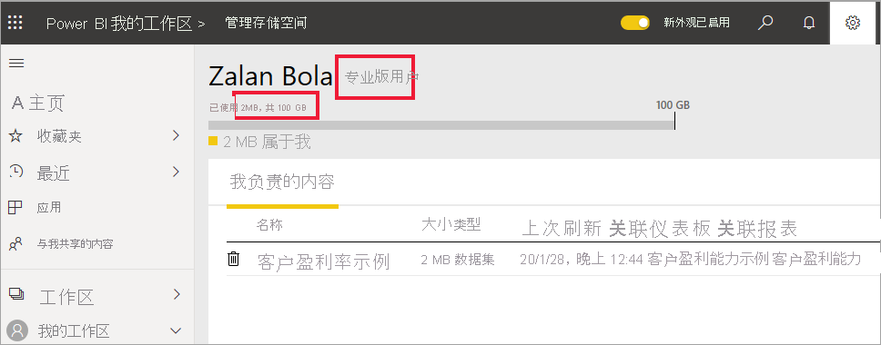

# Power BI 许可证的类型
作为“使用者”，你可以使用 Power BI 服务来浏览报表和仪表板，以便做出业务决策。 如果你使用 Power BI 已有一段时间，或与设计师同事聊过天，你可能已经发现只有在拥有某种类型的许可证时才能使用某些功能。 

本文介绍许各种可证类型（免费版、Pro 版、具有高级容量的免费版和具有高级容量的 Pro 版）之间的差异。 你还将了解如何判断自己使用的是哪种许可证。  

首先，我们将了解两个许可证类别 - 用户许可证和组织许可证。 

## 用户许可证
第一种类型的许可证是“用户”许可证。 每个 Power BI 用户都有免费许可证或 Pro 许可证。 某些功能仅限于具有 Pro 许可证的用户。  

- 拥有 Power BI Pro 许可证的用户可以通过创建和共享内容与其他 Pro 用户协作。 只有具有 Pro 许可证的用户才能发布报表、订阅仪表板和报表、在工作区中与同事协作。 Pro 许可证通常由报表设计师、开发者、分析师和管理员使用。

- 尽管 Power BI 免费许可证功能很强大，但其适用于 Power BI 入门级用户或创建内容供自己使用的用户。 免费用户许可证非常适合使用 Microsoft 示例了解 Power BI 的人员。 拥有免费许可证的用户不能查看其他用户共享的内容，也不能与其他 Power BI 用户共享自己的内容。  

到目前为止清楚吗？  OK. 让我们再添加一个层，即“高级容量”。

## Power BI Premium 的作用是什么？ 工作原理
高级容量是一种组织许可。 可以将其视为在组织中的所有 Power BI 用户许可证之上添加一层特征和功能。 高级容量可以为使用者带来众多益处，其中之一是拥有免费用户许可证的组织成员可以拥有更丰富的体验。 如果你的公司有高级容量许可证，则 Pro 用户可以与组织中的所有成员共享内容，不要求查看内容的用户具有 Power BI Pro 许可证。   

当组织购买高级容量许可证时，管理员通常会将 Pro 许可证分配给将要创建和共享内容的员工。 管理员会将免费许可证分配给将使用该内容的每个人。  

想要了解有关高级容量的更多详细信息？ 请继续阅读。 如果不想了解该内容，请跳到下面的[了解你拥有哪些许可证](#find-out-which-license-you-have)。

组织购买高级容量许可证时，会分配到 Power BI 服务中的专属容量。 该容量不与其他组织共享。 该容量受完全由 Microsoft 管理的专用硬件支持。 组织可以选择在整个企业范围内不受限制地应用专用容量，也可以基于用户数量、工作负荷需求或其他因素将专用容量分配给指定工作区，然后根据需求变化增加或减少容量。

Power BI Premium 提供专用容量，在 Power BI 中具有更高的一致性并支持更大的数据量。 

## 了解你拥有哪种许可证
可以通过多种方式查阅 Power BI 许可证信息。 

首先，确定你所拥有的用户许可证类型。

- 某些版本的 Microsoft Office 包含 Power BI Pro 许可证。  要查看你的 Office 版本是否包含 Power BI，请访问 [Office 门户](https://portal.office.com/account)并选择“订阅”。

    第一位用户 Pradtanna 具有 Office 365 E5，其中包含 Power BI Pro 许可证。

    

    第二个用户 Zalan 具有 Power BI 免费许可证。 

    

接下来，检查你的帐户是否还具有高级容量许可证。 上述任一用户（无论是 Pro 还是免费许可证用户）都可能属于具有高级容量许可证的组织。  我们来看一下第二个用户 Zalan。  

- 在 Power BI 服务中，选择“我的工作区”，然后选择右上角的齿轮图标。 选择“管理个人存储”。

    

    用户许可证，无论是 Pro 还是免费版，都在云中提供 10 GB 的存储空间，可用于托管 Power BI 报表或 Excel 工作簿。 如果你看到的容量超过 10 GB，则你是具有高级容量许可证的组织帐户的成员。

    请记住，在Office 门户页上，Zalan 的用户订阅为 Power BI（免费）。 但由于他的组织购买了高级容量许可证，因此在 Power BI 服务中，Zalan 是 Pro 用户。 作为具有高级容量许可证的组织中的使用者，他可以查看共享内容、与同事协作和使用应用等。 其权限的范围由其 Power BI 管理员设置。 大多数使用者都有权执行以下操作：使用问答、导出内容、重新共享应用和创建订阅。  但是，创建和发布新内容的功能仅限于设计师、分析师、开发者和管理员等同事。   <!-- how can he be Pro if I assigned him a Free account in the O365 portal?  Is he a Pro user with consumer permissions? -->

    
