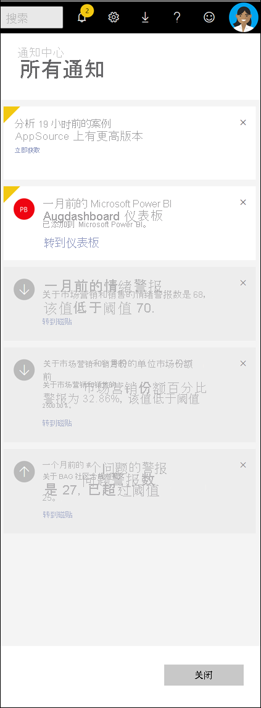

# 查看 Power BI 通知

[!INCLUDE[consumer-appliesto-yynn](../includes/consumer-appliesto-yynn.md)]

[!INCLUDE [power-bi-service-new-look-include](../includes/power-bi-service-new-look-include.md)]

通知中心是与 Power BI 体验相关的依序信息提要。 打开通知中心，将能看到与你共享的新仪表板、Power BI 事件和会议的相关消息、设置的警告等。 可以[在 Power BI 服务中设置警报](end-user-alerts.md)，也可以在 Power BI 移动应用中进行设置。

观看 Amanda 介绍如何查看、管理和回应通知。 然后按照视频下的说明来亲自尝试。    

> [!NOTE]
> 此视频显示较旧版本的 Power BI 服务。 

<iframe width="560" height="315" src="https://www.youtube.com/embed/bZMSv5KAlcE" frameborder="0" allowfullscreen></iframe>

## 查看通知
1. 登录到 Power BI 时，在脱机时发送给你的任何新通知会添加到你的源中。 如果有新通知，Power BI 会显示带有新通知数量的黄色气泡。
   
   
2. 在 Power BI 菜单栏中，选择“通知”图标  。
   
   
3. 最新的通知显示在顶部，未读的通知将突出显示。 通知将保留 90 天，除非你在此之前将其删除，或通知数量超过 100 条的最大限制。
   
   
4. 若要消除通知，请选择“X”图标。

## 后续步骤
* [Power BI 服务中的数据警报](end-user-alerts.md)
* [在 iPhone 应用中设置数据警报 (Power BI for iOS)](mobile/mobile-set-data-alerts-in-the-mobile-apps.md)
* [在适用于 Windows 10 的 Power BI 移动应用中设置数据警报](mobile/mobile-set-data-alerts-in-the-mobile-apps.md)
* 更多问题？ [尝试参与 Power BI 社区](https://community.powerbi.com/)

