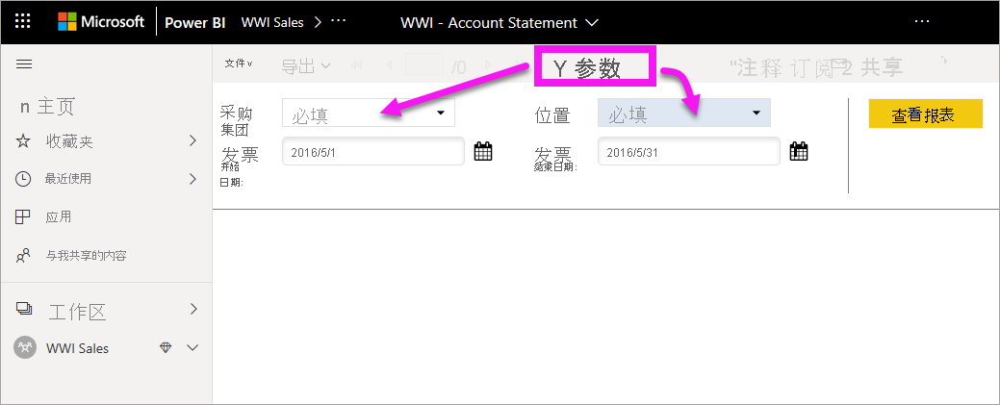
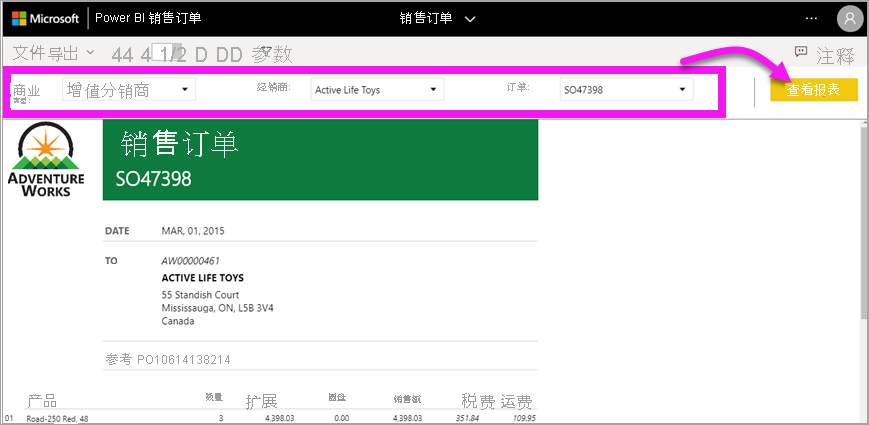
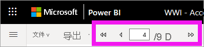
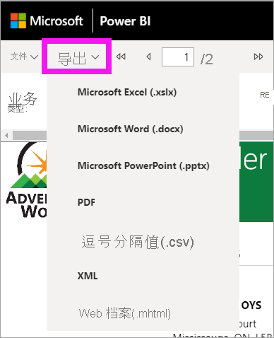
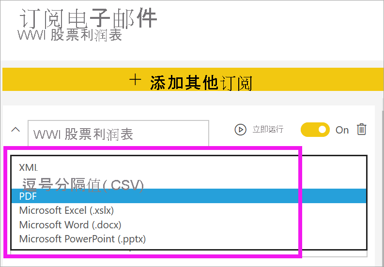

# Power BI 服务中的分页报表

[!INCLUDE[consumer-appliesto-yyny](../includes/consumer-appliesto-yyny.md)]

你已经了解了 [Power BI 报表](end-user-reports.md)，以下是你最有可能遇到的报表类型。 然而还有另一种称作“分页报表”的报表  。 报表设计器可在具有高级容量的工作区或该工作区中的应用中与你共享分页报表  。 

## 什么是分页报表？

这些报表被称为“分页”，因为它们已进行了格式化，以适应打印页面  。 其中一项优势在于，即使某个表跨多个页面，分页报表也能显示表中的所有数据。 分页报表有时被称为“像素完美”，因为报表设计器可以准确地控制其报表页面布局  。

当报表设计器创建分页报表时，实际上是要创建报表定义   。 它不包含数据。 它指定获取数据的位置、要获取的数据以及如何显示数据。 运行报表时，报表处理器将获取报表定义、检索数据，并将其与报表布局组合以生成报表。 有时，报表显示默认数据。 其他时候需要输入参数，报表才能显示数据。 

   

这通常是交互的程度，即设置参数。 如果你是帐单分析师，则可以使用分页报表来创建或打印发票。 如果你是销售经理，则可以使用分页报表按商店或销售人员查看订单。 

选择“年份”参数后，此简单分页报表将生成按年份排列的利润  。 

与分页报表相比，Power BI 报表更具交互性。 Power BI 报表可用于特别报告，并支持更多类型的视觉对象，包括 Power BI 视觉对象。

## 标识分页报表

在内容列表和主页登陆页面中，可通过分页报表的图标  来标识分页报表。  分页报表可直接与你共享，也可作为 [Power BI 应用](end-user-apps.md)的一部分进行共享。 如果报表设计器授予你权限，则你可重新共享分页报表并为自己和他人订阅  。

## 与分页报表进行交互

与分页报表进行交互的方式与其他报表不同。 可以执行打印、书签、导出和注释等操作，但交互性较差。 通常，分页报表需要你的输入才能填充报表画布。  其他情况下，报表将显示默认数据，你可输入参数以查看其他数据。

### 打印分页报表

分页报表的格式设置为适应可以打印或共享的页面  。 在浏览器中所见的内容即为打印所得的内容。 另外，如果报表中有一个长表，即使整个表跨越多个页面，也会打印整个表。 

分页报表可以有很多页。 例如，此报表有 563 页。 每页都采用精准布局，每个发票占一页，重复页眉和页脚。 打印此报表时，需在发票之间设置分页符。

   

### 导航分页报表

在此销售订单报表中，有三个参数：业务类型、经销商和订单号。 

若要更改显示的信息，请为这三个参数输入新值并选择“查看报表”  。 此处我们选择了“专业自行车店”、“Alpine Ski House”和订单号“SO46085”    。 选择“查看报表”将刷新报表画布并显示该新销售订单  。

将使用所选参数显示新的销售订单。 

某些分页报表可以有很多页。  使用页面控件在报表中进行导航。 

### 导出分页报表
可以使用多种不同的选项来导出分页报表，包括 PDF、Word、XML、PowerPoint、Excel 等。 导出时，将保留尽可能多的格式设置。 例如，导出到 Excel、Word、PowerPoint、MHTML 和 PDF 的分页报表将保持“像素完美”格式设置。 

### 订阅分页报表
订阅分页报表时，Power BI 会向你发送一封电子邮件，其中包含作为附件的报表。 设置订阅时，可以选择想要接收电子邮件的频率：每日、每周、每小时或每月。 订阅包含整个报表输出的附件，最大为 25 MB。 导出整个报表或提前选择参数。 从多种不同的附件类型（包括 Excel、PDF、PowerPoint 等）中进行选择。  

## 注意事项和疑难解答

- 在选择参数并选择“查看报表”之前，分页报表可能会显示为空白  。

- 如果没有任何分页报表，可能是因为没有人与你共享此类型的报表。 这也可能表示系统管理员尚未启用分页报表。 

 

## 后续步骤
- [Power BI 报表](end-user-reports.md)
- [Power BI 中的分页报表：常见问题解答](../paginated-reports/paginated-reports-faq.md)
- 更多问题？ 尝试参与 [Power BI 社区](https://community.powerbi.com/)。
