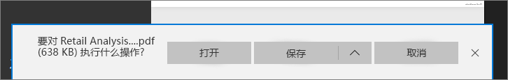

# 从 Power BI 将报表导出为 PDF
借助 Power BI，可以将报表发布为 PDF 格式，并根据 Power BI 报表轻松地创建文档。 如果选择“导出为 PDF”，则 Power BI 报表中的每页都将变为 PDF 文档中的单独页。

## 如何将 Power BI 报表导出为 PDF
在 Power BI 服务中，选择要在画布上显示的报表。 还可以从左侧导航窗格上的“主页”页面、“应用”或任何其他部分中选择报表。

1. 选择菜单栏中的“文件” > “导出为 PDF”。

    

    右上角将显示一个进度栏。 导出可能需要几分钟的时间。在导出报表的同时，可以在 Power BI 中继续进行操作。

    

    导入完成后，通知横幅会发生变化以通知你 Power BI 服务已完成导出过程。

2. 在浏览器显示下载文件的位置，文件是可用的。 在下图中，它显示为浏览器窗口底部的下载横幅。

    

以上是其中包含的全部内容。 可以下载文件并使用任何 PDF 查看器打开，例如 Microsoft Edge 中所提供的查看器。

## 限制和注意事项
在使用“导出为 PDF”功能时，有几个注意事项和限制需要牢记。

- 导出为 PDF 时，尚不支持会话内交互性，例如突出显示和筛选、向下钻取等功能。 已导出的 PDF 显示原始视觉对象，因为它们已保存在报表中。 如果已应用筛选器和切片器并希望在导出时保留，请保存报表，然后执行导出。

* 目前不支持 R 视觉对象。 在 PDF 中，这些视觉对象将为空，并显示一条错误消息。  

* 支持已取得认证的自定义视觉对象。 有关已取得认证的自定义视觉对象的详细信息（包括如何完成自定义视觉对象认证），请参阅[获取自定义视觉对象认证](../power-bi-custom-visuals-certified.md)。 不支持尚未取得认证的自定义视觉对象。 在 PDF 中，它们将显示一条错误消息。   

* 暂无法导出报表页超过 30 个的报表。

* 将报表导出为 PDF 的过程可能需要几分钟才能完成，请耐心等待。 影响所需时间的因素包括报表的结构和 Power BI 服务的当前负载。

* 如果 Power BI 服务中没有“导出为 PDF”菜单项，很可能是因为租户管理员已禁用此功能。 有关详细信息，请联系租户管理员。

* 会根据图表的边界区域裁剪背景图像。 强烈建议在导出为 PDF 之前删除背景图像。

* Power BI 租户域之外的用户拥有的报表（如组织外部人员拥有且与你共享的报表）无法发布到 PDF。

* 如果与组织外部人员（即位于 Power BI 租户之外的用户）共享仪表板，此用户将无法把共享仪表板的关联报表导出为 PDF。 例如，如果你是 aaron@contoso.com，虽然可以与 cassie@cohowinery.com 共享内容， 但 cassie@cohowinery.com 无法将关联报表导出为 PDF。

* Power BI 服务将你的 Power BI 语言设置用作 PDF 导出的语言。 若要查看或设置语言首选项，请选择齿轮图标 >“设置” > “常规” > “语言”。

## 后续步骤
[打印报表](end-user-print.md)