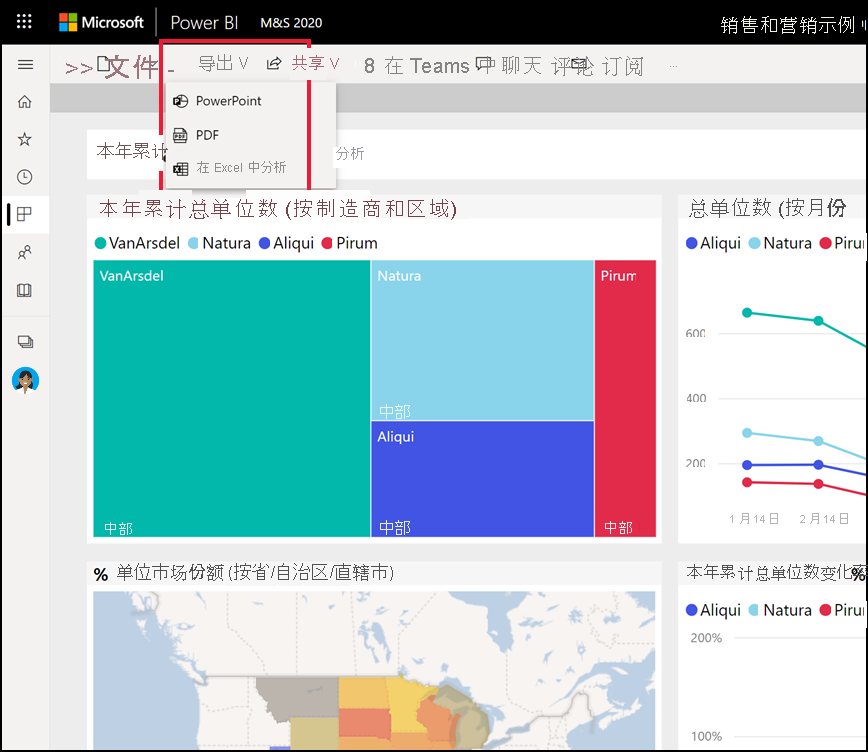
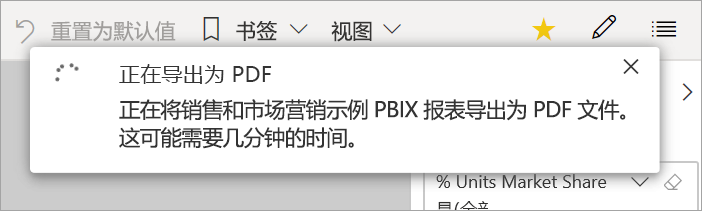

# 从 Power BI 将报表导出为 PDF

[!INCLUDE[consumer-appliesto-yyny](../includes/consumer-appliesto-yyny.md)]

[!INCLUDE [power-bi-service-new-look-include](../includes/power-bi-service-new-look-include.md)]

借助 Power BI，可以将报表发布为 PDF 格式，并根据 Power BI 报表轻松地创建文档。 如果导出为 PDF，则 Power BI 报表中的每个页面都会成为 PDF 文档中的单独页面。

## 将 Power BI 报表导出为 PDF
在 Power BI 服务中，选择要在画布上显示的报表。 还可以从导航窗格上的“主页”页面、“应用”或任何其他容器中选择报表   。

1. 从菜单栏中选择“导出”   > “PDF”  。

    

    此时会显示弹出窗口，可在其中选择“当前值”或“默认值”   。 “当前值”以当前状态导出报表，其中包括对切片器和筛选器值所做的有效更改  。 大多数用户选择此选项。 或者，选择“默认值”以原始状态导出报表（在设计者共享此报表时），且不反映对该原始状态所做的任何更改。
    
    此外，还有一个复选框，用于选择是否导出报表的隐藏选项卡。 如果只想导出浏览器中对你可见的报表选项卡，请选中此复选框。 如果希望将所有隐藏选项卡作为导出的一部分，则不选中此选复选框。 如果该复选框显示为灰色，则报表中没有隐藏选项卡。 完成选择后，选择“导出”以继续  。
    
    还可以通过选中“仅导出当前页面”选项，来选择仅导出在报表中查看的当前页面。  默认情况下，此选项处于未选中状态，所有页面都将从报表中导出。
    
    右上角将显示一个进度栏。 导出可能需要几分钟。 在导出报表的同时，可以在 Power BI 中继续进行操作。

    

    Power BI 服务完成导出过程后，通知横幅会发生变化以通知你。

2. 在浏览器显示下载文件的位置，文件是可用的。 在下图中，它显示为浏览器窗口底部的下载横幅。

    

以上是其中包含的全部内容。 可以下载文件并使用任何 PDF 查看器打开，例如 Microsoft Edge 中所提供的查看器。

## 限制和注意事项
在使用“导出为 PDF”功能时，有几个注意事项和限制需要牢记  。

* PDF 将包含 Power BI 画布上可见的数据和可视化效果。 如果视觉对象包含滚动条，则 PDF 会在其未滚动默认状态下包含视觉对象。  
* 目前不支持 R 视觉对象和 Python 视觉对象。 在 PDF 中，这些视觉对象为空白，并会显示一条错误消息。 
* 支持经认证的 Power BI 视觉对象。 有关经认证的 Power BI 视觉对象的详细信息（包括如何完成 Power BI 视觉对象认证），请参阅[获取 Power BI 视觉对象认证](../developer/visuals/power-bi-custom-visuals-certified.md)。 不支持尚未认证的 Power BI 视觉对象。 在 PDF 中，它们会显示一条错误消息。
* ESRI 视觉对象不受支持。
* 目前不能导出包含 50 个以上报表页的报表。
* 将报表导出为 PDF 的过程可能需要几分钟才能完成，请耐心等待。 影响所需时间的因素包括报表的结构和 Power BI 服务的当前负载。
* 如果 Power BI 服务中没有“导出为 PDF”菜单项，则可能是因为 Power BI 管理员已禁用该功能。 有关详细信息，请联系管理员。
* 背景图像会根据图表的边界区域进行裁剪。 我们建议在导出为 PDF 之前删除背景图像。
* Power BI 租户域之外的用户拥有的报表（例如组织外部人员拥有并与你共享的报表）无法发布为 PDF。
* 如果与组织外部人员（即不属于 Power BI 租户的用户）共享仪表板，该用户将无法将共享仪表板的关联报表导出为 PDF。 例如，如果你是 aaron@contoso.com，虽然可以与 cassie@northwinds.com 共享内容， 但 cassie@northwinds.com 无法将关联报表导出为 PDF。
* 将包含背景图像的报表导出为 PDF 时，如果使用“页面背景”的“正常”或“填充”选项，可能会在导出内容中看到扭曲的图像    。 为了获得最佳效果，请使用“调整”选项以避免导出文档出现问题  。
* Power BI 服务将你的 Power BI 语言设置用作 PDF 导出的语言。 若要查看或设置语言首选项，请选择齿轮图标  > “设置” > “常规” > “语言”。
* 如果为导出选择“当前值”，当前不遵循 URL 筛选器  。
* 自定义页面大小异常的报表在导出方案中可能会出现问题。 为获得最佳结果，请考虑切换为报表的标准页面大小。
* 导出到 PDF 时，使用带有自定义字体的主题的报表会将自定义字体替换为默认字体。
* 尽管我们希望提供一致的体验，但我们无法保证从 Power BI 服务导出的 PDF 文件始终与从本地 Power BI Desktop 文件导出的 PDF 文件匹配。
* 当导出为 PDF 时，我们不能保证 PBIX 报表的像素完美保真度。

## 后续步骤
[打印报表](end-user-print.md)
