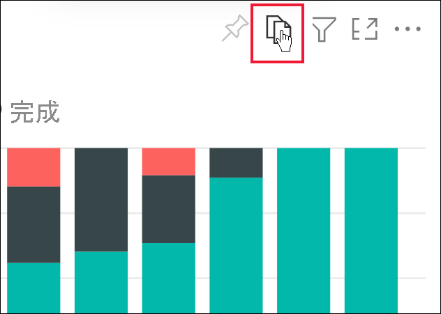
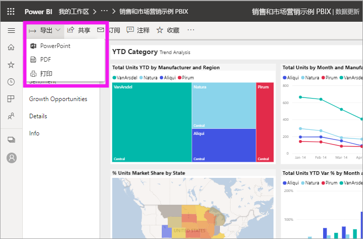
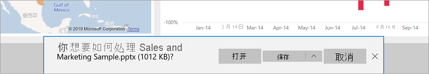
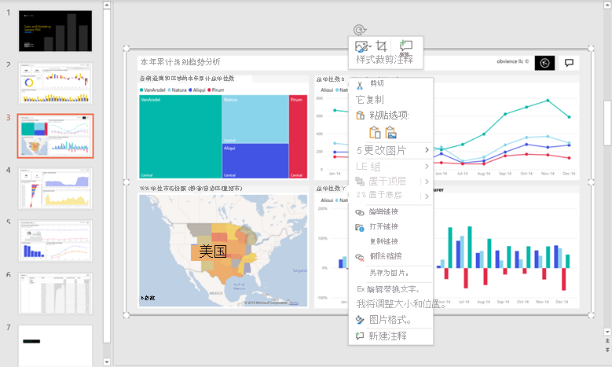

# 将报表导出到 PowerPoint

[!INCLUDE[consumer-appliesto-yynn](../includes/consumer-appliesto-yynn.md)]

借助 Power BI 服务(app.powerbi.com)，可以将报表发布到 Microsoft PowerPoint，并根据 Power BI 报表轻松创建幻灯片组。 导出到 PowerPoint 时，会发生以下情况：

* Power BI 报表中的每个页面成为 PowerPoint 中单独的幻灯片。
* Power BI 报表中的每个页面导出为 PowerPoint 中的单张高分辨率图像。
* 可以保留添加到报表中的筛选器和切片器设置。
* PowerPoint 中会创建链接回 Power BI 报表的链接。

将 Power BI 报表导出到 PowerPoint 非常快速。 按照下一部分中所述的步骤执行操作。

还可以一次从 Power BI 服务复制一个视觉对象，然后将其粘贴到 PowerPoint（或支持粘贴的任何其他程序）。 选择“复制为图像”图标，将视觉对象复制到剪贴板。 然后，打开 PowerPoint 并粘贴该视觉对象。 有关更多信息，请参阅[复制视觉对象为镜态图像](../visuals/power-bi-visualization-copy-paste.md)。

## 将 Power BI 报表导出到 PowerPoint
在 Power BI 服务中，选择要在画布上显示的报表。 你还可以从导航窗格上的“主页”、“应用”或任何其他容器中选择报表 。

[!INCLUDE [power-bi-service-new-look-include](../includes/power-bi-service-new-look-include.md)]

想要导出到 PowerPoint 的报表显示在画布上时，在菜单栏中选择“文件” > “导出到 PowerPoint” 。

此时会显示弹出窗口，可在其中选择“当前值”或“默认值” 。 “当前值”以当前状态导出报表，其中包括对切片器和筛选器值所做的有效更改。  大多数用户选择此选项。 如果已滚动，则“当前值”不包括视觉对象的滚动状态，而是导出数据的顶部部分。 或者，选择“默认值”以原始状态导出报表（在设计者共享此报表时），且不反映对该原始状态所做的任何更改。

 
此外，还有一个复选框，用于选择是否导出报表的隐藏选项卡。 如果只想导出浏览器中对你可见的报表选项卡，请选中此复选框。 如果希望将所有隐藏选项卡作为导出的一部分，则不选中此选复选框。 如果该复选框显示为灰色，则报表中没有隐藏选项卡。 工具提示选项卡是隐藏选项卡的一个示例。[自定义工具提示](../create-reports/desktop-tooltips.md)由报表设计者创建，且不向业务用户显示为 Power BI 服务的报表选项卡。 

还可以通过选中“仅导出当前页面”选项，来选择仅导出在报表中查看的当前页面。  默认情况下，此选项处于未选中状态，所有页面都将从报表中导出。

完成选择后，选择“导出”以继续。 将看到 Power BI 服务浏览器窗口右上角的通知横幅，显示报表正在导出到 PowerPoint。 

导出可能需要几分钟。 影响所需时间的因素包括报表的结构和 Power BI 服务的当前负载。 在导出报表的同时，可以在 Power BI 中继续进行操作。

Power BI 服务完成导出过程后，通知横幅会发生变化以通知你。 在浏览器显示下载文件的位置，文件是可用的。 在下图中，它显示为浏览器窗口底部的下载横幅。

以上是其中包含的全部内容。 可以下载该文件，使用 PowerPoint 将其打开，然后像对任何其他 PowerPoint 幻灯片组一样对其进行修改或增强。

## 打开 PowerPoint 文件
打开 Power BI 导出的 PowerPoint 文件时，会发现几个很酷且很有用的元素。 请看一看下图，查看介绍其中一些很酷的功能的编号元素。 PowerPoint 页始终以标准的 9:16 尺寸创建，无论 Power BI 报表页的原大小或原尺寸如何。

1. 幻灯片组的第一页包括报表名称和链接，以便能 **在 Power BI 中查看** 幻灯片组所基于的报表。
2. 还可以获得有关报表的一些有用信息。 **上次数据刷新** 显示导出的报表所基于的日期和时间。 **下载时间** 显示 Power BI 报表导出到 PowerPoint 文件中的日期和时间。 将“下载时间”设置为导出时计算机的时区。

3. 每个报表页面都是单独的幻灯片，如导航窗格所示。 
4. 已发布的报表根据 Power BI 设置或者根据你所用浏览器的区域设置以相应的语言呈现。 若要在浏览器中查看或设置语言首选项，请选择齿轮图标  > “设置” > “常规” > “语言”。 有关区域设置信息，请参阅 [Power BI 支持的语言和国家/地区](../fundamentals/supported-languages-countries-regions.md)。

查看各个幻灯片时，会发现每个报表页都是独立的图像。 PowerPoint 中的滚动功能不可用，因为每张幻灯片都是静态图像。

如何处理 PowerPoint 幻灯片组或任何一张高分辨率图像，这取决于你自己。

## 注意事项和疑难解答
在使用“导出到 PowerPoint”功能时，有几个注意事项和限制需要牢记。
 

* 如果看不到“导出”选项，请确保已启用“新外观”并且查看的是报表（而非仪表板）。

    

* 如果为导出选择“当前值”，当前不遵循 [URL 筛选器](../collaborate-share/service-url-filters.md)。

* 导出到 PowerPoint 时，如果报表采用自定义字体，则该字体将被替换为默认字体。

* 下列视觉对象类型不受支持，将不会导出到 PowerPoint：
   - 不支持[未经认证的自定义视觉对象](../developer/visuals/power-bi-custom-visuals-certified.md)。 
   - 不支持 [ESRI ArcGIS 视觉对象](../visuals/power-bi-visualizations-arcgis.md)
   - 不支持 R 和 Python 视觉对象。
   - 背景图像会根据图表的边界区域进行裁剪。 我们建议在导出到 PowerPoint 之前删除背景图像。

* 无法导出某些报表。 其中包括：
    - 如果与组织外部人员（即不属于 Power BI 租户的用户）共享仪表板，该用户无法将共享仪表板的关联报表导出到 PowerPoint。 例如，如果你是 aaron@contoso.com，虽然可以与 david@cohowinery.com 共享内容， 但 david@cohowinery.com 无法将关联报表导出到 PowerPoint。
    - 包含 50 个以上报表页的报表。 将仅导出前 50 页。
    - 将报表导出到较旧版本的 PowerPoint。
    - 处理时间超过一小时的报表。 
    - 加载时间超过 6 分钟的报表页。 

* 如果 Power BI 服务中没有“导出到 PowerPoint”菜单项，则可能是因为 Power BI 管理员或报表所有者已禁用该功能。 有关详细信息，请联系管理员或所有者。
* Power BI 服务将你的 Power BI 语言设置用作 Power BI 导出的语言。 若要在浏览器中查看或设置语言首选项，请选择齿轮图标  > “设置” > “常规” > “语言”。

## 后续步骤
[将视觉对象复制为静态图像](../visuals/power-bi-visualization-copy-paste.md)    
[打印报表](end-user-print.md)
