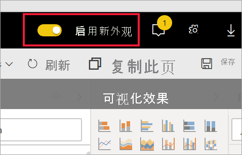
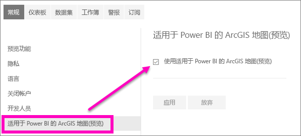

# 选择使用 Power BI 服务预览功能

[!INCLUDE[consumer-appliesto-yynn](../includes/consumer-appliesto-yynn.md)]

## 什么是 *预览功能* ?
在改进 Power BI 服务期间，我们将以预览功能的形式发布一些新功能  。 预览功能可以启用和禁用，让你有机会试试这些功能。

可以通过 Power BI 仪表板、主页或报表本身打开或关闭某些预览功能。 可以通过在主页、报表和仪表板上方显示的 Power BI 菜单栏打开和关闭“新外观”预览功能。 

   

可通过“设置”菜单使用其他预览功能**。 本文介绍如何通过“设置”菜单访问预览功能。

## 查找预览并将其打开（和关闭）
1. 在 Power BI 屏幕右上角，依次选择齿轮图标和“设置”，打开“设置”菜单****。
   
   .
2. 选择“常规”选项卡。如果预览存在，你将看到“预览功能”选项，或者看到左侧列出的预览功能。  在此示例中，为 ArcGIS 地图列出了预览功能。 
   
   
3. 选中“开”单选按钮或勾选相应的复选框，尝试新体验****。 然后，选择“应用”。
4. 若要关闭预览功能，请执行上述第 1-3 步，在步骤 3 中，选择“关闭”或取消选中复选框并选择“应用”********。

有问题或反馈？ [请访问 Power BI 社区论坛](https://community.powerbi.com/t5/Navigation-Preview-Forum/bd-p/NavigationPreview)。

