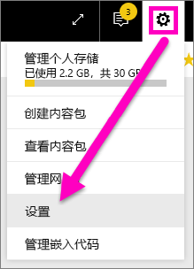

# 选择使用 Power BI 服务预览功能
## 什么是 *预览功能* ?
在改进 Power BI 服务期间，我们将以预览功能的形式发布一些新功能  。 预览功能可以启用和禁用，让你有机会试试这些功能。

## 查找预览并将其打开（和关闭）
1. 在 Power BI 屏幕右上角，依次选择齿轮图标和“设置”，打开“设置”菜单  。
   
   。
2. 选择“常规”选项卡  。如果预览存在，你将看到“预览功能”选项，或者看到左侧列出的预览功能  。  在此示例中，为 ArcGIS 地图列出了预览功能。 
   
   
3. 选中“开”单选按钮或勾选相应的复选框，尝试新体验  。 然后选择“应用”  。
4. 若要关闭预览功能，请执行上述第 1-3 步，在步骤 3 中，选择“关闭”或取消选中复选框并选择“应用”   。

有疑问或反馈吗？ [请访问 Power BI 社区论坛](http://community.powerbi.com/t5/Navigation-Preview-Forum/bd-p/NavigationPreview)。

